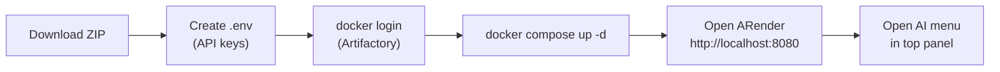
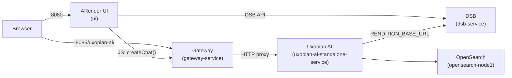

This guide deploys a full Uxopian AI stack alongside an ARender document viewer using Docker Compose. The result is a working local environment where ARender's top panel includes an AI menu connected to uxopian-ai.

:::warning Development stack only
This quickstart uses `DevProvider` and the `dev` Spring profile. Authentication is disabled. Do not use this configuration in production.
:::

## Prerequisites

- Docker and Docker Compose installed
- Access to a Uxopian AI Docker registry (Cloudsmith public or Arondor Artifactory). See [Registry access](./registry_access.md).
- Access to the Arondor Artifactory registry for ARender images (`artifactory.arondor.cloud:5001`).
- At least one LLM provider API key

## Step flow



*Figure: Steps from download to a running ARender + Uxopian AI stack.*

## Steps

### 1. Download the example package

:::tip[Download]
**<a href={require('./uxopian-ai_docker_example_arender.zip').default} download="uxopian-ai_docker_example_arender.zip">uxopian-ai_docker_example_arender.zip</a>**
:::

The archive contains:

```
uxopian-ai-stack.yml              # Docker Compose: ARender + OpenSearch + uxopian-ai + gateway
gateway-application.yaml          # Gateway config — routes /uxopian-ai/** to uxopian-ai
custom-opensearch.yml             # OpenSearch node configuration
config/                           # uxopian-ai configuration files
arender/
  configurations/
    arender-plugins.xml           # Imports the AI top-panel configuration
    arender-custom-client.properties  # ARender client settings + uxopian.ai.host
    toppanel-arender-ai-configuration.xml  # AI menu buttons (summarize, compare, translate, chat)
  public/
    web-components.js             # JS loaded by ARender — included from the example, enables comparison button logic
```

### 2. Create the `.env` file

The ZIP generation script injects a pre-configured `.env` with image versions into the archive. Open it and add at least one LLM API key:

```bash
OPENAI_API_KEY=sk-your-openai-key
# ANTHROPIC_API_KEY=your-key
# AZURE_OPENAI_API_KEY=your-key
# GEMINI_API_KEY=your-gemini-key
```

To override the gateway URL if the stack is not running on localhost:

```bash
UXOPIAN_AI_HOST=http://your-host:8085/uxopian-ai
```

### 3. Log in to the registries

The ARender images are hosted exclusively on the Arondor Artifactory registry and require credentials:

```bash
docker login artifactory.arondor.cloud:5001
```

For the uxopian-ai and gateway images, you can use either registry:
- **Cloudsmith (public preview):** no login required. Edit `uxopian-ai-stack.yml` to uncomment the `docker.uxopian.com` image lines for the `gateway` and `uxopian-ai-standalone` services.
- **Artifactory:** already covered by the login above.

See [Registry access](./registry_access.md) for details on switching registries.

### 4. Start the stack

```bash
docker compose -f uxopian-ai-stack.yml up -d
```

This starts 8 containers:

| Container | Description |
|---|---|
| `ui` | ARender document viewer |
| `dsb-service` | ARender Document Service Broker |
| `drn-service` | ARender document renderer |
| `dth-service` | ARender text handler |
| `dcv-service` | ARender document converter |
| `opensearch-node1` | OpenSearch index |
| `gateway-service` | Uxopian AI gateway (port 8085) |
| `uxopian-ai-standalone-service` | Uxopian AI backend (via gateway at `/uxopian-ai/`) |

The `uxopian-ai-standalone` service waits for OpenSearch to pass its health check before starting. The `ui` service connects to uxopian-ai through the gateway.

### 5. Verify the stack

Check that all containers are healthy:

```bash
docker compose -f uxopian-ai-stack.yml ps
```

Test the gateway:

```bash
curl http://localhost:8085/uxopian-ai/actuator/health
```

Expected response:

```json
{"status":"UP"}
```

### 6. Open ARender and use the AI menu

Open ARender at `http://localhost:8080`. Load a document. The top panel includes an **AI** button (robot icon) with the following actions:

| Action | Description |
|---|---|
| Summarize in text format | Summarizes the current document as plain text |
| Summarize in MD format | Summarizes the current document as Markdown |
| Detailed comparison | Compares all documents in the current layout with structured analysis |
| Generic comparison | Side-by-side comparison of two documents |
| Translate in french | Translates the current document to French |
| Translate in english | Translates the current document to English |
| Open chat with AI | Opens a free chat panel with document context |

## Architecture in this stack



*Figure: Service connections in this stack. All uxopian-ai traffic is routed through the gateway at `/uxopian-ai/`.*

## How `UXOPIAN_AI_HOST` propagates

The AI menu buttons call `window.createChat()` in JavaScript. The host URL reaches ARender through two distinct paths:

1. **Server-side (XML config):** `arender-custom-client.properties` sets `uxopian.ai.host=${UXOPIAN_AI_HOST:}`. ARender injects this value into `toppanel-arender-ai-configuration.xml` at startup, which uses `${uxopian.ai.host}` as the `endpoint` and `wsEndpoint` in each button's JS handler.

2. **Browser-side (comparison buttons):** `arender/public/web-components.js` is loaded by ARender in the browser. It contains a hardcoded `UXOPIAN_AI_HOST` constant used by the comparison buttons. If you deploy to a host other than `localhost:8085`, edit this constant in `web-components.js` before starting the stack.

## Stopping the stack

```bash
docker compose -f uxopian-ai-stack.yml down
```

To also remove data volumes:

```bash
docker compose -f uxopian-ai-stack.yml down -v
```

## ARender image versions

The ARender images in this stack are pinned to version `2023.16.0`. These versions are managed independently from the Uxopian AI version and are not configured via `uxopian-ai-version.json`.

## Related pages

- [Integrate with ARender](../how_to/integrate_with_arender.mdx)
- [Registry access](./registry_access.md)
- [Quickstart with Docker Compose](./quickstart.mdx)
