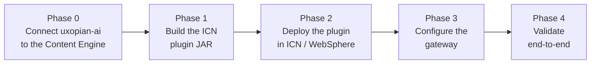

Unlike the other getting-started guides, there is **no local Docker Compose demo stack** for FileNet. FlowerDocs, Alfresco, and ARender all ship as containers you can pull and run in minutes; IBM FileNet P8 (Content Platform Engine) and Content Navigator (ICN) do not — they assume an existing enterprise deployment.

There is also no dev-mode shortcut to "just try it": every FileNet Content Engine call is authenticated as the **real end user**, with no fallback to a shared service account (see [No shared service account](../how_to/integrate_with_filenet.mdx#03-configure-the-filenet-connection)). That impersonation depends on a signed JWT issued by the ICN plugin and trusted by the Content Platform Engine — so a live search or document read only works once the full chain below is in place. This page tells you what to check before you start and links straight to the guide that walks through it.

## What you need

- **IBM FileNet P8 + ICN 3.0+**, with **Content Engine 5.5.9 or later** (required for the `OpenTokenCredentials` bearer-token authentication used for per-caller impersonation).
- Access to the CPE's **Liberty configuration**, to register OIDC trust for the plugin's signed JWT.
- To build the plugin from source: **Java 8**, **Maven 3.6+**, and access to the Arondor Artifactory.
- A running `uxopian-ai` + `uxopian-gateway` stack — the [Docker Compose quickstart](./quickstart.mdx) works as a base; you will point it at your FileNet deployment instead of using it standalone.

## The integration path

*Figure: Every phase is required — there is no partial setup that produces a working chat or search action in ICN.*

1. **Connect uxopian-ai to the Content Engine.** Enable the `filenet` tool tag, set `filenet.ce-api-url` and `filenet.oidc-realm`, and confirm the four FileNet tool services register at startup — no ICN plugin or gateway work needed yet.
2. **Build the ICN plugin JAR** from the downloadable Maven source project (below), supplying IBM's `navigatorAPI.jar` from your own Navigator installation.
3. **Deploy the plugin** into WebSphere/ICN and register it in the ICN Admin Console.
4. **Configure the gateway**: register the plugin's public key with `FileNetProvider`, declare the route, and trust the plugin's JWT on the Content Platform Engine (Liberty `openidConnectClient`).
5. **Validate**: fetch a token from the plugin service, call the gateway route with it, and confirm the context-menu action and toolbar buttons appear in ICN.

:::tip[Download — ICN plugin source]
**<a href={require('../how_to/uxopian-icn-plugin.zip').default} download="uxopian-icn-plugin.zip">uxopian-icn-plugin.zip</a>** — Maven source project to build for your environment. Does not bundle IBM's proprietary `navigatorAPI.jar` (see [Phase 1.1](../how_to/integrate_with_filenet.mdx#11-supply-navigatorapijar)).
:::

## Next step

Follow **[Integrate with FileNet](../how_to/integrate_with_filenet.mdx)** for the full, phase-by-phase guide — connector configuration, plugin build and deployment, gateway setup, OIDC trust on the Content Platform Engine, and a validation checklist for each phase.

## Related pages

- [Integrate with FileNet](../how_to/integrate_with_filenet.mdx)
- [Downloads](./downloads.mdx) — the ICN plugin source package
- [Registry access](./registry_access.md)
- [Quickstart with Docker Compose](./quickstart.mdx) — base stack to point at your FileNet deployment
