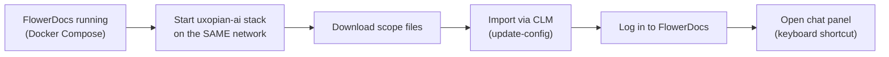
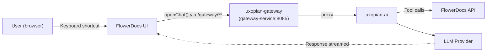

This guide adds the Uxopian AI chat panel to a FlowerDocs deployment running locally with Docker Compose. The result is a FlowerDocs instance where users can open an AI chat panel via keyboard shortcut, with document context provided by the FlowerDocs tools.

:::warning Development configuration only
This quickstart uses `DevProvider` (authentication disabled) and is intended to validate the scope file installation quickly. **It is not suitable for production.** For a production deployment — with `FlowerDocsProvider`, token validation, and a proper LLM check before UI integration — follow the phased [Integrate with FlowerDocs](../how_to/integrate_with_flowerdocs.mdx) guide instead.
:::

## Prerequisites

- **A running FlowerDocs deployment with Docker Compose**, with a scope already created. Follow FlowerDocs' own [Docker installation](/docs/flowerdocs/install/docker) guide if you don't have one yet — this quickstart doesn't repeat it. You'll need the **Docker network name** that stack uses (`flowerdocs-net` in FlowerDocs' documented compose file) and the **scope id** you created (e.g. `DEFAULT`).
- Docker and Docker Compose.
- At least one LLM API key (see [Quickstart with Docker Compose](./quickstart.mdx)).

## Step flow



*Figure: Steps from a running FlowerDocs to a working AI chat panel.*

## Steps

### 1. Start the uxopian-ai stack on FlowerDocs' network

Download `uxopian-ai-stack.yml` and `gateway-application.yaml` from [Quickstart with Docker Compose](./quickstart.mdx#steps) — same files, no FlowerDocs-specific variant needed. Two changes to that compose file before starting it:

1. **Join FlowerDocs' own Docker network** instead of creating a new one — replace the `networks:` block at the bottom with the network FlowerDocs is already running on, marked external:

   ```yaml
   networks:
     flowerdocs-net: # the network name your FlowerDocs compose stack uses
       external: true
   ```

   and point every service's `networks:` list at `flowerdocs-net` instead of `uxopian-ai-net`.

2. **Name the gateway service/container `gateway-service`.** The scope files downloaded in the next step ship a FlowerDocs Route pointing at `http://gateway-service:8085` — the gateway container must resolve under that exact name on the shared network for FlowerDocs' internal proxy to reach it:

   ```yaml
   services:
     gateway-service: # renamed from uxopian-gateway
       container_name: gateway-service
       # ...unchanged otherwise
   ```

Then start it:

```bash
docker compose -f uxopian-ai-stack.yml up -d
```

### 2. Download the scope files

:::tip[Download]
**<a href={require('../how_to/uxopian-ai_flowerdocs_scope.zip').default} download="uxopian-ai_flowerdocs_scope.zip">uxopian-ai_flowerdocs_scope.zip</a>**
:::

Extract the ZIP. See [Configure FlowerDocs scope files](../how_to/configure_flowerdocs_scope.mdx) for what each file does; you don't need to edit anything for this quickstart.

### 3. Import the scope files with CLM

Run the same `flower-docs-clm` image your FlowerDocs deployment uses, on its network, targeting your scope (replace `DEFAULT`, the password, and the core URL with your own):

```bash
docker run --rm --network=flowerdocs-net \
  --volume="$PWD/conf:/clm/uxopian-ai-scope/conf" \
  artifactory.arondor.cloud:5001/flower-docs-clm:{{version}} \
  update-config --template=uxopian-ai-scope --scope=DEFAULT --password=<yourPassword> \
  --ws.url=http://flower-docs-core:8081/core/rest --data.dir=/clm/
```

`update-config` only touches configuration components (Routes, Scripts) — it never touches documents, so it's safe to re-run any time you update the scope files. `--ws.url` must end in `/core/rest` (not `/core/services` — an older path that no longer works on the 2026 line).

### 4. Verify

1. Log in to FlowerDocs.
2. Use the keyboard shortcut assigned to `OpenChatShortcut`.
3. The Uxopian AI chat panel should appear embedded in the FlowerDocs UI.
4. Type a question and verify a response is returned from uxopian-ai.

If the chat panel does not appear, check the uxopian-ai logs:

```bash
docker compose -f uxopian-ai-stack.yml logs uxopian-ai gateway-service
```

## Architecture in this stack



*Figure: Chat panel traffic flow from FlowerDocs through the gateway to uxopian-ai — both stacks share one Docker network.*

## Related pages

- [Integrate with FlowerDocs](../how_to/integrate_with_flowerdocs.mdx) — production setup with `FlowerDocsProvider`
- [Configure FlowerDocs scope files](../how_to/configure_flowerdocs_scope.mdx) — customize buttons and shortcuts
- [Quickstart with Docker Compose](./quickstart.mdx) — the uxopian-ai stack used here
- [FlowerDocs Docker installation](/docs/flowerdocs/install/docker)
- [Prompts and templating](../understanding/prompts_and_templating.md)
