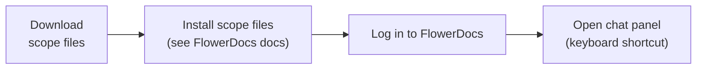
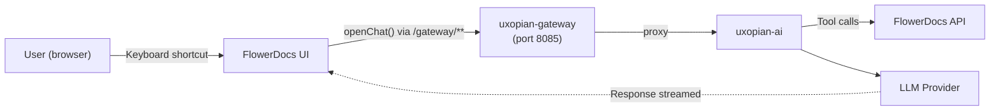

This guide adds the Uxopian AI chat panel to a running FlowerDocs deployment. The result is a FlowerDocs instance where users can open an AI chat panel via keyboard shortcut, with document context provided by the FlowerDocs tools.

:::warning Development configuration only
This quickstart uses `DevProvider` (authentication disabled) and is intended to validate the scope file installation quickly. **It is not suitable for production.** For a production deployment — with `FlowerDocsProvider`, token validation, and a proper LLM check before UI integration — follow the phased [Integrate with FlowerDocs](../how_to/integrate_with_flowerdocs.mdx) guide instead.
:::

## Prerequisites

- A running Uxopian AI stack. See [Quickstart with Docker Compose](./quickstart.mdx).
- A FlowerDocs deployment with a Maven-based scope build.
- The Uxopian AI gateway URL reachable from the FlowerDocs server.

## Step flow



*Figure: Steps from scope file download to a working AI chat panel in FlowerDocs.*

## Steps

### 1. Download the scope files

:::tip[Download]
**<a href={require('../how_to/uxopian-ai_flowerdocs_scope.zip').default} download="uxopian-ai_flowerdocs_scope.zip">uxopian-ai_flowerdocs_scope.zip</a>**
:::

The archive contains:

```
conf/
  Route/
    Gateway.xml             # Route definition pointing to uxopian-gateway
  Script/
    consts/                 # Constants including the gateway URL
    openChat/               # openChat() helper function
    refreshToken/           # Token refresh helper
    web-comp/               # Web component loader
    OpenChatShortcut/       # Keyboard shortcut implementation
    UxoAiAdminShortcut/     # Admin UI shortcut implementation
    translate/              # Translation helper
    uxoai-utils/            # Utility functions
    *.xml                   # Scope file descriptors
```

### 2. Install the scope files into FlowerDocs

The scope files are installed via the FlowerDocs CLM service. Refer to your FlowerDocs documentation for the scope installation procedure.

### 3. Verify

1. Log in to FlowerDocs.
2. Use the keyboard shortcut assigned to `OpenChatShortcut`.
3. The Uxopian AI chat panel should appear embedded in the FlowerDocs UI.
4. Type a question and verify a response is returned from uxopian-ai.

If the chat panel does not appear, check the uxopian-ai logs:

```bash
docker compose -f uxopian-ai-stack.yml logs uxopian-ai
```

## Architecture in this stack



*Figure: Chat panel traffic flow from FlowerDocs through the gateway to uxopian-ai.*

## Related pages

- [Integrate with FlowerDocs](../how_to/integrate_with_flowerdocs.mdx) — production setup with `FlowerDocsProvider`
- [Configure FlowerDocs scope files](../how_to/configure_flowerdocs_scope.mdx) — customize buttons and shortcuts
- [Quickstart with Docker Compose](./quickstart.mdx) — start the uxopian-ai stack
- [Prompts and templating](../understanding/prompts_and_templating.md)
