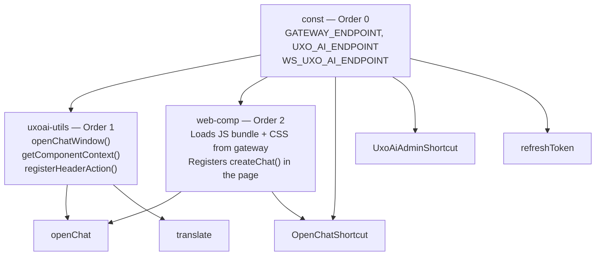

FlowerDocs scope files inject the Uxopian AI chat panel and keyboard shortcuts into the FlowerDocs UI. This guide explains each scope file and how to customize them.

## Download the scope files

:::tip[Download]
**<a href={require('./uxopian-ai_flowerdocs_scope.zip').default} download="uxopian-ai_flowerdocs_scope.zip">uxopian-ai_flowerdocs_scope.zip</a>**
:::

Extract the ZIP. The directory structure is:

```
conf/
  Route/
    Gateway.xml                 # Route pointing to the uxopian-gateway
  Script/
    const.xml                   # [Order 0] Constants — gateway URL, tenant
    uxoai-utils.xml             # [Order 1] Utility functions
    OpenChatShortcut.xml        # [Order 2] Keyboard shortcut: open chat panel
    UxoAiAdminShortcut.xml      # [Order 2] Keyboard shortcut: open admin UI
    openChat.xml                # [Order 2] openChat() helper function
    refreshToken.xml            # [Order 2] Token refresh helper
    translate.xml               # [Order 2] Translation helper
    web-comp.xml                # [Order 2] Web component loader — REQUIRED
    OpenChatShortcut/           # Script implementation files
    UxoAiAdminShortcut/
    consts/
    openChat/
    refreshToken/
    translate/
    uxoai-utils/
    web-comp/
```

## Loading order and prerequisites

FlowerDocs loads scripts in `RegistrationOrder` sequence. Three scripts are **mandatory prerequisites** that every other script depends on:



:::danger[web-comp is a hard dependency]
`web-comp` fetches the Uxopian AI JavaScript bundle and stylesheet from the gateway and injects them into the FlowerDocs page. This bundle is what registers the `createChat()` function. **If `web-comp` is missing or fails to load, no chat panel will open and no error will appear in the UI** — every script calling `createChat()` will fail silently.

Always verify that:
1. `web-comp` is present in the scope.
2. The gateway URL in `consts/` is reachable from the user's browser.
3. The gateway exposes `/api/web-components/chat/script` and `/api/web-components/chat/style`.
:::

## Scope file descriptions

### const.xml / consts/ — Order 0 · Required

Defines all URL constants used by every other script:

```javascript
const BASE_URL = window.location.origin + '/gui';
const GATEWAY_PATH = '/gateway/uxopian-ai';

// Route through FlowerDocs Zuul (session ping only — Zuul cannot stream)
const GATEWAY_ENDPOINT   = `${BASE_URL}/plugins/${JSAPI.get().getUserAPI().getScope()}${GATEWAY_PATH}`;

// Direct route to uxopian-gateway bypassing Zuul (all LLM calls, streaming, WebSocket)
const UXO_AI_ENDPOINT    = `${BASE_URL}${GATEWAY_PATH}`;
const WS_UXO_AI_ENDPOINT = `${BASE_URL}${GATEWAY_PATH}`;
```

| Constant | Default resolved path | How it reaches the gateway |
|---|---|---|
| `GATEWAY_ENDPOINT` | `/gui/plugins/<scope>/gateway/uxopian-ai` | Through FlowerDocs Zuul |
| `UXO_AI_ENDPOINT` | `/gui/gateway/uxopian-ai` | Direct (same origin as FlowerDocs) |
| `WS_UXO_AI_ENDPOINT` | `/gui/gateway/uxopian-ai` | Direct WebSocket (same origin) |

#### Session cookie and the same-origin requirement

The browser only sends the FlowerDocs session cookie to requests that share the **same origin** (scheme + host + port) as the page. For uxopian-gateway to receive that cookie on direct calls, it must be reachable under the same origin as FlowerDocs.

**Routing via FlowerDocs Zuul** always satisfies this — the request stays on the same origin, and Zuul forwards the cookie automatically. This is `GATEWAY_ENDPOINT`. The drawback is that **Zuul is an HTTP/1.1 buffering proxy and cannot stream SSE responses** — it collects the full response before forwarding it to the browser.

**Direct routing at the same origin** satisfies the cookie requirement *and* supports streaming. This requires a reverse proxy (Traefik, nginx, Apache) that serves both FlowerDocs and uxopian-gateway under the same hostname, with path-based routing:

```
Same hostname: demo.flower.cloud
  /gui/gateway/**  →  uxopian-gateway   (higher priority, direct, streaming ✓)
  /gui/**          →  FlowerDocs GUI    (lower priority, Zuul inside)
```

The default `UXO_AI_ENDPOINT = ${BASE_URL}${GATEWAY_PATH}` assumes this setup. If the gateway is not exposed at the same origin, override the constants with the direct gateway URL (and configure CORS if cross-origin is unavoidable).

For example, with Traefik, assign a higher priority to the gateway route so it intercepts `/gui/gateway/**` before FlowerDocs GUI handles `/gui/**`:

```yaml
# gateway-service labels
- "traefik.http.routers.gateway-service.rule=Host(`demo.flower.cloud`) && PathPrefix(`/gui/gateway`)"
- "traefik.http.routers.gateway-service.priority=20"   # higher — direct, bypasses Zuul

# flower-docs-gui labels
- "traefik.http.routers.flower-docs-gui.rule=Host(`demo.flower.cloud`) && PathPrefix(`/gui`)"
- "traefik.http.routers.flower-docs-gui.priority=10"   # lower — everything else
```

Any path-based reverse proxy (nginx `location` blocks, Apache `ProxyPass`) achieves the same result.

#### What goes through Zuul vs direct

| Constant | Used for | Streaming needed |
|---|---|---|
| `GATEWAY_ENDPOINT` | Session warm-up ping, loading JS bundle + CSS | No — standard HTTP responses |
| `UXO_AI_ENDPOINT` | All LLM API calls (`/api/v1/requests`) | **Yes — SSE** |
| `WS_UXO_AI_ENDPOINT` | WebSocket connection | **Yes — persistent connection** |

`GATEWAY_ENDPOINT` is called once at chat open to let `FlowerDocsProvider` validate and cache the session in Hazelcast. All subsequent calls use `UXO_AI_ENDPOINT` / `WS_UXO_AI_ENDPOINT` directly, authenticating from the Hazelcast cache.

```javascript
fetch(GATEWAY_ENDPOINT)                      // Zuul — session warm-up
  .then(() => createChat({
    endpoint:   UXO_AI_ENDPOINT,             // direct — SSE streaming
    wsEndpoint: WS_UXO_AI_ENDPOINT,          // direct — WebSocket
  }));
```

#### Required gateway routes

When the gateway receives requests from both paths, two routes are needed in `gateway-application.yaml`: one for the Zuul path (which arrives with a different path prefix than `CONTEXT_PATH`, so `rewritePath` is required) and one for the direct path. See [Configure gateway routes](./configure_gateway_routes.md) for the step-by-step derivation.

**Before importing**, update the `GATEWAY_PATH` value in `consts/` to match the route name defined in `Gateway.xml`.

### uxoai-utils.xml / uxoai-utils/ — Order 1 · Required

Provides three shared functions used by `openChat` and `translate`:

- `openChatWindow(requestPayload)` — performs the session warm-up ping (`GATEWAY_ENDPOINT`), then calls `createChat()` with the given payload routed through `UXO_AI_ENDPOINT`.
- `getComponentContext()` — builds a `SYSTEM` role input containing the current FlowerDocs component ID and the ARender document ID (see [Contextual input](#contextual-input) below).
- `registerHeaderAction({ label, icon, onExecute })` — registers a contextual action in the component header bar, re-evaluated on every component navigation.

### web-comp.xml / web-comp/ — Order 2 · Required

Fetches the Uxopian AI chat bundle from the gateway and inserts it as a `<script>` and `<link>` tag into the page `<head>`. The bundle registers `createChat()` globally.

The two endpoints it loads:
- `GATEWAY_ENDPOINT + /api/web-components/chat/script` — the JavaScript bundle
- `GATEWAY_ENDPOINT + /api/web-components/chat/style` — the companion stylesheet

The script is idempotent: it checks whether the tags already exist before inserting them, so reloading the page or navigating within FlowerDocs will not load the bundle twice.

### openChat.xml / openChat/

Adds a **"Start a conversation"** action to the component header bar (visible when a document or folder is open). When clicked, it calls `openChatWindow()` with the contextual input:

```javascript
openChatWindow({
  inputs: [getComponentContext()],
});
```

The LLM receives the FlowerDocs component ID and ARender document ID before the user types anything, so it can immediately call the appropriate tools (fetch document content, metadata, etc.).

### OpenChatShortcut.xml / OpenChatShortcut/

Registers a circled shortcut icon in the FlowerDocs shortcut bar (bottom-left). Clicking it opens a **blank chat panel with no document context**:

```javascript
createChat({
  endpoint: UXO_AI_ENDPOINT,
  wsEndpoint: WS_UXO_AI_ENDPOINT,
  // no request payload — no contextual input
});
```

Use this when the user wants a free-form conversation not tied to a specific document. The LLM will not know which document is open until the user mentions it explicitly.

### UxoAiAdminShortcut.xml / UxoAiAdminShortcut/

Adds an entry in the FlowerDocs application switcher menu pointing to the Uxopian AI admin panel (`GATEWAY_ENDPOINT/admin`). The entry is only injected for users with the `ADMIN` or `SYSTEM_ADMIN` profile.

### refreshToken.xml / refreshToken/

Registers a `registerForComponentChange` listener that pings `GATEWAY_ENDPOINT` on every component navigation. This keeps the gateway session cache warm and prevents the `FlowerDocsProvider` from evicting the session between navigations.

### translate.xml / translate/

Adds a **"Translate"** action to the component header bar. When triggered:

```javascript
openChatWindow({
  inputs: [
    getComponentContext(),
    InputBuilder.promptAsUser("translate", {
      documentId: arenderJSAPI.getCurrentDocumentId(),
      language: getLocale(),
    }),
  ],
});
```

Two inputs are sent: the contextual input (so the LLM knows which document) and a pre-built `translate` prompt that passes the ARender document ID and the user's browser locale as template variables. The LLM fetches the document content via the ARender tool and returns the translation.

## Contextual input

A **contextual input** is a `SYSTEM` role text input prepended to the request before the user's first message. It tells the LLM which FlowerDocs document or folder is currently open, so it can immediately call the right tools without asking the user.

`getComponentContext()` builds it at the moment the chat panel opens:

```javascript
{
  flowerdocId: {
    value: "<component-id>",
    description: "The ID of the Flowerdoc document"
  },
  arenderDocId: {
    value: "<base64-encoded-rendition-id>",
    description: "The ID of the Arender document (BASE64 encoded)"
  }
}
```

- **`flowerdocId`** — read from `JSAPI.get().getLastComponentFormAPI().getComponent().getId()`. Used by FlowerDocs tools to fetch metadata or content for that component.
- **`arenderDocId`** — read from `arenderJSAPI.getCurrentDocumentId()` (BASE64 encoded). Used by ARender tools to extract the document text via the DSB rendition API.

The values are captured at the instant the button is clicked, reflecting whatever component is currently active in the FlowerDocs UI.

### When contextual input is injected

| Script | Inputs sent | Context included |
|---|---|---|
| `openChat` | `[getComponentContext()]` | ✓ FlowerDocs ID + ARender ID |
| `translate` | `[getComponentContext(), promptAsUser("translate", {…})]` | ✓ FlowerDocs ID + ARender ID |
| `OpenChatShortcut` | *(none)* | ✗ — blank panel, no document context |

`openChat` and `translate` are triggered from the component header bar — a document is always open when they fire. `OpenChatShortcut` is a global shortcut that can be triggered from anywhere in FlowerDocs, including pages where no document is open.

### How the LLM uses context

When the LLM receives the contextual input, it extracts the IDs and passes them to tool calls. For example, to summarize the open document:

1. LLM reads `arenderDocId` from the context.
2. Calls the ARender document extraction tool with that ID.
3. Receives the document text and generates the summary.

Without the contextual input (`OpenChatShortcut`), the LLM has no document reference until the user provides one in the chat.

### Gateway.xml (Route)

Defines a FlowerDocs reverse-proxy route that forwards `/gateway/**` requests to the uxopian-gateway:

```xml
<ns2:tags name="Path">
    <ns2:value>/gateway/**</ns2:value>
</ns2:tags>
<ns2:tags name="URL">
    <ns2:value>http://gateway-service:8085</ns2:value>
</ns2:tags>
```

Update the `URL` value to match the hostname and port of your `uxopian-gateway` as seen from the FlowerDocs server.

## Installation

Copy the `conf/` directory contents into the FlowerDocs scope Maven module. The exact target directory depends on your FlowerDocs project structure. In a standard FlowerDocs Maven build, scope files go into the scope resources directory that gets imported during the build.

After importing, rebuild and redeploy the FlowerDocs application.

## Customization checklist

Before importing the scope files into FlowerDocs, update the following:

1. `conf/Route/Gateway.xml` — set the `URL` tag to the URL of your uxopian-gateway as seen by the **FlowerDocs server**.
2. `conf/Script/consts/` — verify `GATEWAY_PATH` matches the route path defined in `Gateway.xml`.
3. Confirm that `GATEWAY_ENDPOINT` resolves to a URL reachable from **user browsers** (not just the server), because `web-comp` fetches the JS bundle client-side.

## Related pages

- [Integrate with FlowerDocs](./integrate_with_flowerdocs.mdx)
- [Configure gateway routes](./configure_gateway_routes.md) — rewritePath, prefix, YAML anchors
- [Authentication and gateway](../understanding/authentication.md)
