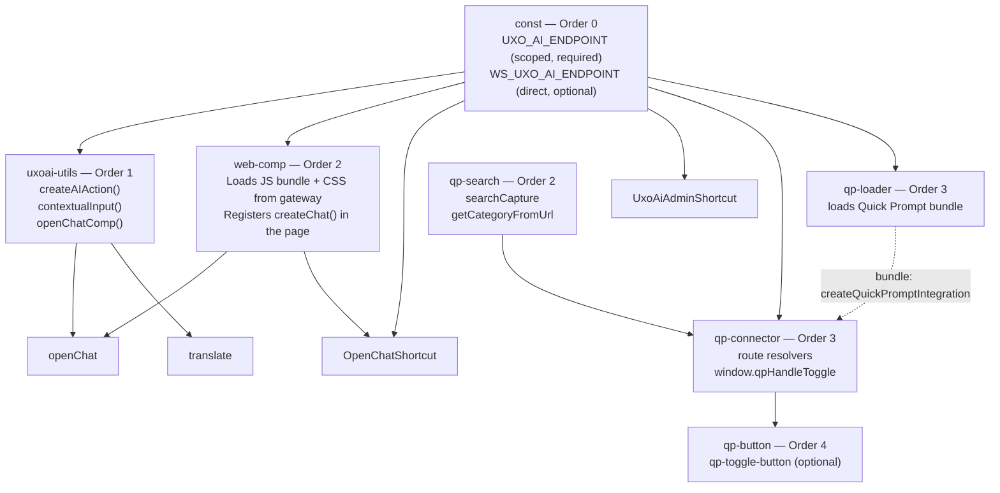

FlowerDocs scope files inject the Uxopian AI chat panel, the [Quick Prompt](../understanding/quick_prompt.md) assistant, and keyboard shortcuts into the FlowerDocs UI. This guide explains each scope file and how to customize them.

## Download the scope files

:::tip[Download]
**<a href={require('./uxopian-ai_flowerdocs_scope.zip').default} download="uxopian-ai_flowerdocs_scope.zip">uxopian-ai_flowerdocs_scope.zip</a>**
:::

Extract the ZIP. The directory structure is:

```
conf/
  Route/
    Gateway.xml                 # Route pointing to the uxopian-gateway
  Script/
    const.xml                   # [Order 0] Constants — gateway URL, tenant
    uxoai-utils.xml             # [Order 1] Utility functions
    OpenChatShortcut.xml        # [Order 2] Keyboard shortcut: open chat panel
    UxoAiAdminShortcut.xml      # [Order 2] Keyboard shortcut: open admin UI
    openChat.xml                # [Order 2] openChat() helper function
    translate.xml               # [Order 2] Translation helper
    web-comp.xml                # [Order 2] Web component loader — REQUIRED
    qp-search.xml               # [Order 2] Quick Prompt — search capture
    qp-connector.xml            # [Order 3] Quick Prompt — FlowerDocs context connector
    qp-loader.xml               # [Order 3] Quick Prompt — bundle loader
    qp-button.xml               # [Order 4] Quick Prompt — header toggle button (optional)
    OpenChatShortcut/           # Script implementation files
    UxoAiAdminShortcut/
    consts/
    openChat/
    translate/
    uxoai-utils/
    web-comp/
    qp-search/
    qp-connector/
    qp-loader/
    qp-button/
```

## Loading order and prerequisites

FlowerDocs loads scripts in `RegistrationOrder` sequence. Three scripts are **mandatory prerequisites** that every other script depends on. The Quick Prompt scripts (`qp-*`) layer on top of the same `consts` prerequisite — see [Wire Quick Prompt into FlowerDocs](#wire-quick-prompt-into-flowerdocs).



:::danger[web-comp is a hard dependency]
`web-comp` fetches the Uxopian AI JavaScript bundle and stylesheet from the gateway and injects them into the FlowerDocs page. This bundle is what registers the `createChat()` function. **If `web-comp` is missing or fails to load, no chat panel will open and no error will appear in the UI** — every script calling `createChat()` will fail silently.

Always verify that:
1. `web-comp` is present in the scope.
2. The gateway URL in `consts/` is reachable from the user's browser.
3. The gateway exposes `/api/web-components/chat/script` and `/api/web-components/chat/style`.
:::

## Scope file descriptions

### const.xml / consts/ — Order 0 · Required

Defines all URL constants used by every other script:

```javascript
const BASE_URL = window.location.origin + '/gui';
const GATEWAY_PATH = '/gateway/uxopian-ai';
const SCOPE = JSAPI.get().getUserAPI().getScope();

// Through FlowerDocs' own internal proxy (the /gateway/** Route). Used for the JS/CSS
// bundle, REST calls and SSE streaming — this proxy forwards plain HTTP fine.
const UXO_AI_ENDPOINT = `${BASE_URL}/plugins/${SCOPE}${GATEWAY_PATH}`;

// Direct, browser-reachable address of uxopian-gateway's OWN Ingress, bypassing
// FlowerDocs' proxy entirely. Optional: only needed for the WebSocket channel.
// Set this to the gateway's public URL by hand before deploying the scope
// (e.g. https://ai-gateway.<your-domain>) — leave it blank to degrade
// gracefully: chat/Quick Prompt keep working, only server-to-client push
// actions stay silent.
const WS_GATEWAY_URL_RAW = '';
const WS_UXO_AI_ENDPOINT = WS_GATEWAY_URL_RAW
  ? `${WS_GATEWAY_URL_RAW}/gui${GATEWAY_PATH}`
  : '';
```

| Constant | Default resolved path | How it reaches the gateway |
|---|---|---|
| `UXO_AI_ENDPOINT` | `/gui/plugins/<scope>/gateway/uxopian-ai` | Through FlowerDocs' internal proxy |
| `WS_UXO_AI_ENDPOINT` | `<wsGatewayUrl>/gui/gateway/uxopian-ai` | Direct, cross-origin, own Ingress — empty if unset |

#### Why WebSocket needs a separate, direct endpoint

FlowerDocs' internal proxy (the one behind the `/gateway/**` Route) forwards plain HTTP requests fine — REST calls and SSE streaming both work through it on FlowerDocs 2026. **It cannot forward a WebSocket upgrade at all**, on any FlowerDocs version:

- **Legacy FlowerDocs (Zuul-based proxy):** Zuul 1 has no WebSocket proxying support.
- **FlowerDocs 2026 (Spring Cloud Gateway Server MVC):** this proxy variant has no WebSocket support either — it is built on `HandlerFunctions.http()`, a blocking request/response forwarder with no concept of a protocol upgrade. This is an open, unimplemented upstream limitation: [spring-cloud/spring-cloud-gateway#3442](https://github.com/spring-cloud/spring-cloud-gateway/issues/3442).

So unlike REST/SSE, the WebSocket channel needs `uxopian-gateway` to be reachable **directly**, on its own address, bypassing FlowerDocs' proxy layer entirely — see `uxopian-gateway/ops/helm/gateway-service`'s `ingress.*` values for exposing it. This is necessarily a **different origin** from the FlowerDocs page (a same-origin reverse-proxy merge is not required and not assumed):

- **No cookie is involved.** The gateway's WebSocket routes (`uxopian-ai-ws`, `uxopian-ai-plugin-ws` in `gateway-service`'s `application.yml`) are declared fully public (`security: *secPublicAll`) — no `FlowerDocsProvider` validation happens on them, so there is nothing for a same-origin cookie to carry. The channel is gated only by the (unguessable) conversation id, checked downstream by `uxopian-ai`.
- **CORS is still required**, because the browser enforces it independently of authentication: list the FlowerDocs GUI's own origin (e.g. `https://fd.<env>.uxopian.com`) in the gateway's `cors.allowedOrigins`. This is a Helm value on `gateway-service`, not on this scope.

If `wsGatewayUrl` is left unset, `WS_UXO_AI_ENDPOINT` is empty and the chat/Quick Prompt panels degrade gracefully: they keep working over `UXO_AI_ENDPOINT` (REST/SSE), only the server→client action-push channel stays silent.

```javascript
fetch(UXO_AI_ENDPOINT).then(() =>
  createChat({
    endpoint:   UXO_AI_ENDPOINT,       // through FlowerDocs' proxy — REST/SSE
    wsEndpoint: WS_UXO_AI_ENDPOINT,    // direct, own Ingress — WebSocket (or '' — degrades)
  })
);
```

#### Required gateway routes

`gateway-service`'s `application.yml` already declares both the scoped, FlowerDocs-proxied routes (`uxopian-ai-plugin`, `uxopian-ai-plugin-ws`) and the direct, unscoped ones (`uxopian-ai`, `uxopian-ai-ws`) — nothing to add there. See [Configure gateway routes](./configure_gateway_routes.md) for how these are derived, and the chart's `ingress.*` values to expose the direct ones publicly.

**Before importing**, update the `GATEWAY_PATH` value in `consts/` to match the route name defined in `Gateway.xml`.

### uxoai-utils.xml / uxoai-utils/ — Order 1 · Required

Provides three shared functions used by `openChat` and `translate`:

- `openChatComp(request)` — performs a warm-up `fetch(UXO_AI_ENDPOINT)`, then calls `createChat()` (the function exposed by `web-comp`) with the given request routed through `UXO_AI_ENDPOINT` / `WS_UXO_AI_ENDPOINT`.
- `contextualInput()` — builds a `SYSTEM` role input containing the current FlowerDocs component ID and the ARender document ID (see [Contextual input](#contextual-input) below).
- `createAIAction({ label, onExecute, icon })` — registers a contextual action in the component header bar, re-evaluated on every component navigation. The menu id is derived from `label.name` (e.g. `ai-action-openChat`), so each action gets a distinct id. `label` carries the action's `name` plus its `FR`/`EN` translations; `icon` defaults to `fa-solid fa-robot`.

### web-comp.xml / web-comp/ — Order 2 · Required

Fetches the Uxopian AI chat bundle from the gateway and inserts it as a `<script>` and `<link>` tag into the page `<head>`. The bundle registers `createChat()` globally.

The two endpoints it loads:
- `UXO_AI_ENDPOINT + /api/web-components/chat/script` — the JavaScript bundle
- `UXO_AI_ENDPOINT + /api/web-components/chat/style` — the companion stylesheet

The script is idempotent: it checks whether the tags already exist before inserting them, so reloading the page or navigating within FlowerDocs will not load the bundle twice.

### openChat.xml / openChat/

Registers an **"Open a chat"** action on the component header bar (visible when a document or folder is open) via `createAIAction`. When clicked, its `onExecute` calls `openChatComp()` with the contextual input:

```javascript
createAIAction({
  label: { name: "openChat", FR: "Ouvrir une discussion", EN: "Open a chat" },
  onExecute: () =>
    openChatComp({
      inputs: [contextualInput()],
    }),
});
```

The LLM receives the FlowerDocs component ID and ARender document ID before the user types anything, so it can immediately call the appropriate tools (fetch document content, metadata, etc.).

### OpenChatShortcut.xml / OpenChatShortcut/

Registers a circled shortcut icon in the FlowerDocs shortcut bar (bottom-left). Clicking it opens a **blank chat panel with no document context**:

```javascript
createChat({
  endpoint: UXO_AI_ENDPOINT,
  wsEndpoint: WS_UXO_AI_ENDPOINT,
  // no request payload — no contextual input
});
```

Use this when the user wants a free-form conversation not tied to a specific document. The LLM will not know which document is open until the user mentions it explicitly.

### UxoAiAdminShortcut.xml / UxoAiAdminShortcut/

Adds an entry in the FlowerDocs application switcher menu pointing to the Uxopian AI admin panel (`UXO_AI_ENDPOINT/admin`). The entry is only injected for users with the `ADMIN` or `SYSTEM_ADMIN` profile.

### translate.xml / translate/

Registers a **"Translate"** action on the component header bar via `createAIAction`. When triggered, its `onExecute` calls:

```javascript
openChatComp({
  inputs: [
    contextualInput(),
    InputBuilder.promptAsUser("translate", {
      documentId: arenderJSAPI.getCurrentDocumentId(),
      language: getLocale(),
    }),
  ],
});
```

Two inputs are sent: the contextual input (so the LLM knows which document) and a pre-built `translate` prompt that passes the ARender document ID and the user's browser locale as template variables. The LLM fetches the document content via the ARender tool and returns the translation.

## Contextual input

A **contextual input** is a `SYSTEM` role text input prepended to the request before the user's first message. It tells the LLM which FlowerDocs document or folder is currently open, so it can immediately call the right tools without asking the user.

`contextualInput()` builds it at the moment the chat panel opens:

```javascript
{
  flowerdocId: {
    value: <component-id>,
    description: "The ID of the Flowerdoc document",
  },
  arenderDocId: {
    value: <base64-rendition-id>,
    description: "The ID of the Arender document. Do not decode BASE64 value.",
  }
}
```

- **`flowerdocId`** — read from `JSAPI.get().getLastComponentFormAPI().getComponent().getId()`. Used by FlowerDocs tools to fetch metadata or content for that component.
- **`arenderDocId`** — read from `arenderJSAPI.getCurrentDocumentId()`. This is a BASE64 value passed through as-is; the description explicitly tells the LLM **not** to decode it. Used by ARender tools to extract the document text via the DSB rendition API.

The values are captured at the instant the button is clicked, reflecting whatever component is currently active in the FlowerDocs UI.

### When contextual input is injected

| Script | Inputs sent | Context included |
|---|---|---|
| `openChat` | `[contextualInput()]` | ✓ FlowerDocs ID + ARender ID |
| `translate` | `[contextualInput(), promptAsUser("translate", {…})]` | ✓ FlowerDocs ID + ARender ID |
| `OpenChatShortcut` | *(none)* | ✗ — blank panel, no document context |

`openChat` and `translate` are triggered from the component header bar — a document is always open when they fire. `OpenChatShortcut` is a global shortcut that can be triggered from anywhere in FlowerDocs, including pages where no document is open.

### How the LLM uses context

When the LLM receives the contextual input, it extracts the IDs and passes them to tool calls. For example, to summarize the open document:

1. LLM reads `arenderDocId` from the context.
2. Calls the ARender document extraction tool with that ID.
3. Receives the document text and generates the summary.

Without the contextual input (`OpenChatShortcut`), the LLM has no document reference until the user provides one in the chat.

### Gateway.xml (Route)

Defines a FlowerDocs reverse-proxy route that forwards `/gateway/**` requests to the uxopian-gateway:

```xml
<ns2:tags name="Path">
    <ns2:value>/gateway/**</ns2:value>
</ns2:tags>
<ns2:tags name="URL">
    <ns2:value>http://gateway-service:8085</ns2:value>
</ns2:tags>
```

Update the `URL` value to match the hostname and port of your `uxopian-gateway` as seen from the FlowerDocs server.

## Wire Quick Prompt into FlowerDocs

[Quick Prompt](../understanding/quick_prompt.md) is a context-aware assistant panel that docks beside the FlowerDocs UI and offers prompts relevant to whatever the user is viewing. It is wired by four additional scope scripts that build on the same `consts` prerequisite as the chat. They are independent of the chat scripts — add them only if you want Quick Prompt.

These scripts are the FlowerDocs-specific implementation of the generic integration API documented in [Embed Quick Prompt in a web application](./embed_quick_prompt.mdx); read that page for the meaning of `setRoutes`, `setUser`, the context object shapes, and the runtime API.

### Prerequisites

- The gateway serves the Quick Prompt bundle at `/api/web-components/quick-prompt/script` and `/style`.
- At least one prompt has **Display Settings enabled** (see [Managing prompts — Display Settings](../admin/managing_prompts.md#display-settings-tab-quick-prompt)). Quick Prompt shows nothing until an enabled prompt's display condition matches the current context.

### qp-search.xml / qp-search/ — Order 2

Registers an execution listener on the FlowerDocs search templates through `getComponentSearchAPI()` and stores the latest results in a module-level `searchCapture`. The connector reads this when the user is on a search screen, so Quick Prompt can offer prompts over the current result set. Must load **before** `qp-connector`.

The list of searches that drive Quick Prompt is declared at the top of the script:

```javascript
// List here every FlowerDocs search whose results should feed Quick Prompt.
var SEARCH_TEMPLATES = ['DefaultSearch', 'TaskSearch', 'FolderSearch'];
```

:::warning[List the searches that need dynamic behaviour]
**Only the search templates named in `SEARCH_TEMPLATES` get dynamic Quick Prompt behaviour.** When one of these searches runs, its results are captured and the prompt list re-filters against them on the fly. A search **not** listed here is invisible to Quick Prompt — the panel keeps showing the previous context and never reacts to that result set.

`DefaultSearch`, `TaskSearch`, and `FolderSearch` are the standard FlowerDocs templates. If your project defines **custom search templates** (or renames the standard ones), you must add each template name to this array, otherwise those result screens will not drive Quick Prompt. Names must match exactly the templates registered in FlowerDocs.
:::

### qp-connector.xml / qp-connector/ — Order 3

The heart of the integration. It:

- maps FlowerDocs components onto the Quick Prompt context shape with `window.uxopian.mapComponent(obj, fields)` (see [Web components](../understanding/web_components.md));
- declares URL **routes** that resolve the current FlowerDocs screen into context;
- creates the integration handle lazily — on the first toggle — by pinging `UXO_AI_ENDPOINT` for session warm-up, then calling `window.createQuickPromptIntegration({ endpoint: UXO_AI_ENDPOINT, wsEndpoint: WS_UXO_AI_ENDPOINT })`;
- exposes `window.qpHandleToggle(open)` so `qp-button` (or any custom trigger) can open and close the panel.

The routes map FlowerDocs hash URLs to resolvers:

| FlowerDocs route | Resolver | Context produced |
|---|---|---|
| `documents/<class>:<uuid>` | `resolveDocument` | the open document |
| `tasks/<class>:<uuid>` | `resolveTask` | the task plus its `Documents` attachments |
| `folders/edit:Id=<uuid>` | `resolveFolder` | the folder's child documents |
| `virtualFolders/edit:<id>` | `resolveFolder` | same, for virtual folders |
| `#Search:{…}` | `resolveSearch` | the captured search results (documents, tasks, or folders, by category) |

The field maps (`DOCUMENT_FIELDS`, `TASK_FIELDS`, `FOLDER_FIELDS`, `USER_FIELDS`) translate JSAPI component fields (`id`, `name`, `classId`, …) into Quick Prompt fields (`documentId`, `title`, `type`, …). Search result sets larger than `ENRICH_MAX` (20) are sent shallow — id and name only — to avoid a burst of per-item fetches.

### qp-loader.xml / qp-loader/ — Order 3

Loads the Quick Prompt bundle (script + stylesheet) from `UXO_AI_ENDPOINT` and is idempotent (it checks for an existing tag before inserting). The bundle registers `window.createQuickPromptIntegration` and `window.uxopian.mapComponent`, both used by the connector. This is the Quick Prompt equivalent of `web-comp` for the chat.

:::danger[qp-loader is a hard dependency]
As with `web-comp` for the chat, if `qp-loader` is missing or the bundle fails to load, **the panel never opens and no error appears in the UI** — `window.createQuickPromptIntegration` is simply `undefined` when the connector tries to use it. Verify the bundle returns HTTP 200 in the Network tab.
:::

### qp-button.xml / qp-button/ — Order 4 · Optional

Injects a `<qp-toggle-button>` into the FlowerDocs header bar and wires its toggle to `window.qpHandleToggle`. Optional — omit it if you trigger Quick Prompt from your own control. Must load **after** `qp-connector`.

### Verification

1. Open FlowerDocs with the browser developer tools (Network tab) and confirm `/api/web-components/quick-prompt/script` and `/style` return HTTP 200.
2. Click the toggle button and confirm prompt cards appear. An empty panel means no enabled prompt, or no display condition matches — check Display Settings.
3. Open a document, then a task, then run a search, confirming the prompt list updates on each navigation.
4. Run a prompt and confirm a `POST /api/v1/requests/stream` request is issued and the answer streams into the panel.

See [Embed Quick Prompt — Common issues](./embed_quick_prompt.mdx#common-issues) for a troubleshooting table that applies here too.

## Installation

The `conf/` directory is a standard FlowerDocs [scope](/docs/flowerdocs/concepts/scope) overlay — import it the same way you import any other scope content, with the [Command Line Manager (CLM)](/docs/flowerdocs/install/clm/clm) or your project's usual scope-build process. This page only documents what's specific to the AI scripts themselves (the constants, the `RegistrationOrder` dependencies between them, the gateway route) — see [Subscribing to an operation](/docs/flowerdocs/config/core/operation/registration) for how `RegistrationOrder` works in general.

## Customization checklist

Before importing the scope files into FlowerDocs, update the following:

1. `conf/Route/Gateway.xml` — set the `URL` tag to the URL of your uxopian-gateway as seen by the **FlowerDocs server**.
2. `conf/Script/consts/` — verify `GATEWAY_PATH` matches the route path defined in `Gateway.xml`.
3. Confirm that `UXO_AI_ENDPOINT` resolves to a URL reachable from **user browsers** (not just the server), because `web-comp` fetches the JS bundle client-side.
4. **Optional** — if `uxopian-gateway` has its own public Ingress, set `WS_GATEWAY_URL_RAW` in `consts/` (or pass `--var wsGatewayUrl=…` on a client that supports it) to enable the WebSocket action-push channel. See [Why WebSocket needs a separate, direct endpoint](#why-websocket-needs-a-separate-direct-endpoint). Leave it unset otherwise — the chat still works without it.

## Related pages

- [Integrate with FlowerDocs](./integrate_with_flowerdocs.mdx)
- [Configure gateway routes](./configure_gateway_routes.md) — rewritePath, prefix, YAML anchors
- [Authentication and gateway](../understanding/authentication.md)
- [Quick Prompt (concept)](../understanding/quick_prompt.md)
- [Embed Quick Prompt in a web application](./embed_quick_prompt.mdx)
