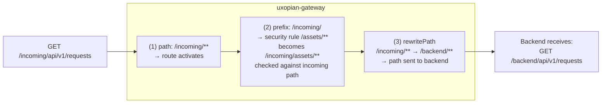

import Tabs from '@theme/Tabs';
import TabItem from '@theme/TabItem';

`gateway-application.yaml` defines how the uxopian-gateway matches incoming requests, authenticates them, and forwards them to the backend. This page explains the three fields that control path handling — `path`, `prefix`, `rewritePath` — how they interact, and how to derive the right values for your deployment.

## Route field reference

```yaml
app:
  routes:
    - id: my-route          # Unique identifier (for logs)
      uri: http://backend:8080
      path: /incoming/**    # (1) Match — which requests this route handles
      prefix: /incoming/    # (2) Anchor — security rules are relative to this
      rewritePath: /incoming/?(?<segment>.*), /backend/$\{segment}
                            # (3) Transform — path sent to the backend
      provider: FlowerDocsProvider
      security:
        - path: /assets/**
          public: true
        - path: /admin/**
          roles: ["ADMIN"]
```

| Field | Purpose | Used by |
|---|---|---|
| `path` | Ant pattern that must match for this route to activate | Request routing + `DefaultProviderHeaderFilter` |
| `prefix` | Prepended to each security rule `path` at startup | `AuthFilter`, `SecurityConfig` |
| `rewritePath` | Regex + replacement applied to the path **before** forwarding to the backend | Spring Cloud Gateway `rewritePath` filter |
| `provider` | AuthProvider bean name called to validate credentials | `AuthFilter` |
| `security` | Per-path rules (public or role-restricted). Paths are **relative** to `prefix` | `AuthFilter`, `SecurityConfig` |

## How the three fields work together



**Execution order in the pipeline:**

1. `DefaultProviderHeaderFilter` uses `path` to match the route and inject `X-Provider-ID`.
2. `AuthFilter` and `SecurityConfig` read the **formatted** security rules (with `prefix` prepended) and check them against the **incoming** path (before any rewrite).
3. Spring Cloud Gateway applies `rewritePath` and forwards to the backend `uri`.

The rewrite only affects what the backend receives. Authentication runs on the original path.

## Step-by-step: finding the right values

Follow these steps for any new deployment. The process goes **backend → gateway → entry point**.

### Step 1 — What does the backend expect?

Determine the full path the backend listens on. If uxopian-ai has a context path configured:

```yaml
# config/application.yml
server:
  servlet:
    context-path: /gui/gateway/uxopian-ai
```

Then all API paths are prefixed: `/gui/gateway/uxopian-ai/api/v1/requests`, `/gui/gateway/uxopian-ai/assets/...`, etc.

If no context path is set (default), paths are `/api/v1/requests`, `/assets/...`, etc.

### Step 2 — What path arrives at the gateway?

Determine what path the gateway receives. This depends on whether a proxy (Zuul, nginx, etc.) strips a prefix before forwarding:

| Entry point | Incoming path at the gateway |
|---|---|
| Direct browser | Same path as in the browser URL |
| FlowerDocs Zuul proxy | Zuul strips the scope prefix; e.g. `/plugins/<scope>/gateway/uxopian-ai/api/v1/requests` → `/uxopian-ai/api/v1/requests` |
| nginx `proxy_pass /;` | Full path preserved |
| nginx `proxy_pass /prefix/;` | Prefix stripped |

### Step 3 — Set `path`

`path` must be the Ant pattern that matches the path the gateway actually receives:

```yaml
path: /uxopian-ai/**     # if Zuul strips and sends /uxopian-ai/...
path: /gui/gateway/**    # if direct with full path
```

### Step 4 — Set `prefix`

`prefix` is the base of the `path` pattern, without wildcards. Security rule paths like `/assets/**` are formatted by prepending this value:

```yaml
# path: /uxopian-ai/**  →  prefix: /uxopian-ai/
# path: /gui/gateway/uxopian-ai/**  →  prefix: /gui/gateway/uxopian-ai/
```

Rule: `prefix` + `security.path` must equal the full incoming path for that resource.

### Step 5 — Set `rewritePath` (only if needed)

`rewritePath` is needed when the incoming path ≠ the path the backend expects. Format: `regex, replacement` (comma-separated, no quotes).

```yaml
# Incoming: /uxopian-ai/api/v1/requests
# Backend expects: /gui/gateway/uxopian-ai/api/v1/requests
rewritePath: /uxopian-ai/?(?<segment>.*), /gui/gateway/uxopian-ai/$\{segment}
```

The regex uses **named capture groups** (`(?<name>...)`). The replacement references them as `$\{name}`. The backslash before `{` is required in YAML to avoid variable substitution.

If the incoming path already matches what the backend expects, omit `rewritePath`.

## rewritePath syntax

```
rewritePath: <regex>, <replacement>
```

| Part | Description |
|---|---|
| `regex` | Java regex applied to the full incoming path |
| `replacement` | Replacement string. Use `$\{groupName}` for named captures |

Named capture group example:

```yaml
# /uxopian-ai/api/v1/requests
# (?<segment>.*) captures: api/v1/requests
rewritePath: /uxopian-ai/?(?<segment>.*), /gui/gateway/uxopian-ai/$\{segment}
# Result: /gui/gateway/uxopian-ai/api/v1/requests
```

The `?` after `/uxopian-ai/` makes the trailing slash optional, so both `/uxopian-ai` and `/uxopian-ai/api/...` match.

:::warning[The comma separator must not have quotes]
`rewritePath` is parsed by splitting on the **first comma**. Do not wrap the value in quotes — Spring YAML binding will include them in the regex.
:::

## YAML anchors for shared configuration

When multiple routes share the same URI or security rules, use YAML anchors (`&`) and aliases (`*`) to avoid duplication:

```yaml
# Define anchors at the top level (outside app:)
ai-uri: &AI_URI http://ai-standalone-service:8080

security-rules: &AI_SECURITY
  - path: /.well-known/**
    public: true
  - path: /assets/**
    public: true
  - path: /actuator/health
    public: true
  - path: /prompt/**
    roles: ["ADMIN"]

app:
  routes:
    - id: route-a
      uri: *AI_URI            # ← references the anchor
      security: *AI_SECURITY  # ← references the anchor
      ...
    - id: route-b
      uri: *AI_URI
      security: *AI_SECURITY
      ...
```

Changing the URI or security rules in one place updates all routes that reference the anchor. This is especially useful when managing multiple entry points (Zuul + direct) for the same backend.

## FlowerDocs example: two entry points for one backend

In a FlowerDocs deployment, the Uxopian AI chat is loaded via the FlowerDocs reverse proxy (Zuul), and optionally also accessible at a canonical URL. Two routes handle the same backend:

```yaml
ai-standalone-service-uri: &UXOPIAN_AI_URI http://ai-standalone-service:8080

security-rules: &UXOPIAN_AI_SECURITY
  - path: /.well-known/**
    public: true
  - path: /assets/**
    public: true
  - path: /v3/**
    public: true
  - path: /swagger-ui/**
    public: true
  - path: /actuator/health
    public: true
  - path: /prompt/**
    roles: ["ADMIN"]
  - path: /goal/**
    roles: ["ADMIN"]
  - path: /prompt-statistics
    roles: ["ADMIN"]

app:
  gateway:
    provider-header: X-Provider-ID
  routes:
    - id: uxopian-ai-zuul      # Entry point: via FlowerDocs Zuul proxy
      uri: *UXOPIAN_AI_URI
      prefix: /uxopian-ai/
      path: /uxopian-ai/**
      rewritePath: /uxopian-ai/?(?<segment>.*), /gui/gateway/uxopian-ai/$\{segment}
      provider: FlowerDocsProvider
      security: *UXOPIAN_AI_SECURITY

    - id: uxopian-ai-direct    # Entry point: direct path (same backend)
      uri: *UXOPIAN_AI_URI
      prefix: /gui/gateway/uxopian-ai/
      path: /gui/gateway/uxopian-ai/**
      provider: FlowerDocsProvider
      security: *UXOPIAN_AI_SECURITY

    - id: uxopian-ai-ws        # WebSocket (always public — auth is via the REST session)
      uri: ws://ai-standalone-service:8080
      path: /uxopian-ai/ws/**
      prefix: /uxopian-ai/ws/
      security:
        - path: /**
          public: true

server:
  port: 8085

logging:
  level:
    com.uxopian: DEBUG
```

### Why two routes?

The FlowerDocs scope files define `GATEWAY_ENDPOINT` as:

```javascript
const GATEWAY_ENDPOINT = window.location.origin + '/gui'
    + '/plugins/' + scope + '/gateway/uxopian-ai';
```

A browser request to `GET /gui/plugins/GEC/gateway/uxopian-ai/api/v1/requests` flows through FlowerDocs:

```
Browser
  └─ GET /gui/plugins/GEC/gateway/uxopian-ai/api/v1/requests
       │
       ▼ FlowerDocs Zuul (Route: /gateway/** → http://gateway:8085)
       │  strips /gui/plugins/GEC/gateway
       │
       └─ GET http://gateway:8085/uxopian-ai/api/v1/requests
              │
              ▼ uxopian-gateway (route: uxopian-ai-zuul)
              │  rewritePath: /uxopian-ai/api/v1/requests
              │           →   /gui/gateway/uxopian-ai/api/v1/requests
              │
              └─ GET http://ai-standalone-service:8080/gui/gateway/uxopian-ai/api/v1/requests
                     (context-path: /gui/gateway/uxopian-ai)
```

The `uxopian-ai-direct` route handles requests that arrive at the canonical path directly (admin access, health checks from monitoring, etc.) without going through Zuul.

### Why the same security rules work for both routes

The YAML anchor `*UXOPIAN_AI_SECURITY` defines rules with **relative** paths like `/assets/**`. The `prefix` field formats them for each route:

| Route | `prefix` | Formatted rule for `/assets/**` |
|---|---|---|
| `uxopian-ai-zuul` | `/uxopian-ai/` | `/uxopian-ai/assets/**` |
| `uxopian-ai-direct` | `/gui/gateway/uxopian-ai/` | `/gui/gateway/uxopian-ai/assets/**` |

Both formatted rules match their respective incoming paths, so authentication is applied consistently regardless of entry point.

## Debug logging

Enable debug logging to trace route matching and path rewriting:

```yaml
logging:
  level:
    com.uxopian: DEBUG
```

With DEBUG enabled, the gateway logs:

| Log message | What it means |
|---|---|
| `Matched route [uxopian-ai-zuul] for path [/uxopian-ai/api/v1/requests]` | Route matched via `path` field |
| `No provider header found for path [/uxopian-ai/assets/...]` — with `public: true` following | Path matched a public rule, auth skipped |
| `Provider [FlowerDocsProvider] resolved for path [/uxopian-ai/api/v1/...]` | `DefaultProviderHeaderFilter` injected the provider header |
| `Authenticated user [john@example.com] tenant [GEC]` | FlowerDocsProvider validated the token |

### Debugging workflow

**Step 1 — Find the incoming path.** Enable DEBUG and make a request. Look for the route match log to confirm the actual path arriving at the gateway.

**Step 2 — Verify the security rule match.** If the gateway returns 401 on a path you expected to be public, check the formatted rule. Add a temporary log or check the value by looking at the loaded route with:

```bash
curl http://localhost:8085/actuator/gateway/routes
```

**Step 3 — Verify the rewrite.** The Spring Cloud Gateway `rewritePath` filter logs the rewritten path at TRACE level:

```yaml
logging:
  level:
    org.springframework.cloud.gateway: TRACE
```

Look for: `Rewriting path [/uxopian-ai/api/v1/requests] to [/gui/gateway/uxopian-ai/api/v1/requests]`

**Step 4 — Confirm what the backend receives.** On the `uxopian-ai` side, enable request logging to verify the path and headers received:

```yaml
logging:
  level:
    org.springframework.web: DEBUG
```

## Common mistakes

| Mistake | Symptom | Fix |
|---|---|---|
| `prefix` doesn't end with `/` | Security rules for `/assets/**` formatted as `/prefixassets/**` | Always end `prefix` with `/` |
| `path` doesn't include `/**` | Only the root path matches, sub-paths return 404 | Use `path: /prefix/**` |
| `rewritePath` has quotes around the value | Regex includes literal quote characters | Remove quotes — YAML scalar, not string |
| Zuul strips a different prefix than expected | Route doesn't match, gateway returns 404 | Log the incoming path (Step 1 above) and adjust `path` |
| Security rule path starts with `/` and prefix ends with `/` | Double-slash in formatted path: `/prefix//asset/**` | `formatRule()` handles this — but verify with debug logs |
| YAML anchor defined inside `app:` | Alias resolution fails | Define anchors at root level, before `app:` |

## Related pages

- [Configuration file reference](../reference/configuration.md) — full `gateway-application.yaml` field table
- [Authentication and gateway](../understanding/authentication.md) — AuthProvider and identity headers
- [Integrate with FlowerDocs](./integrate_with_flowerdocs.mdx) — FlowerDocs provider and scope setup
