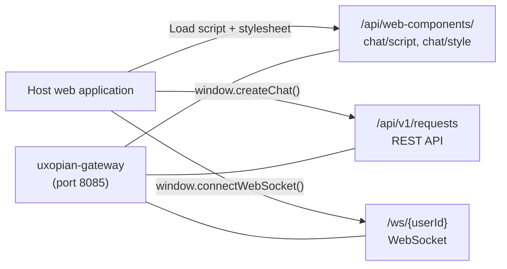

This guide explains how to embed the Uxopian AI chat interface in any web application. No build step is required on the consuming application side.

## How the connection works



*Figure: The host application loads bundles from the gateway and communicates via REST and WebSocket.*

## Prerequisites

- A running Uxopian AI stack with the gateway accessible from the browser
- At least one LLM provider configured
- The gateway URL known to the browser (e.g., `https://your-gateway-host`)

## Connector installation

### 1. Load the bundles

Add these two tags to the HTML page where you want to embed the chat. No build step is required on the consuming application side.

```html
<link rel="stylesheet" href="https://your-gateway/api/web-components/chat/style" />
<script src="https://your-gateway/api/web-components/chat/script"></script>
```

Replace `https://your-gateway` with the actual gateway URL accessible from the browser. The `/api/web-components/` path is served as public by the gateway (no authentication required for these static assets).

### 2. Connect the WebSocket

The chat interface uses WebSocket for real-time streaming. Call `connectWebSocket` once when the page loads, after the user is identified:

```javascript
window.connectWebSocket('wss://your-gateway/ws', userId);
```

`userId` must match the user ID that the gateway injects in the `X-User-Id` header. With `DevProvider`, this is any string you pass via the header. With `FlowerDocsProvider` or `Fast2Provider`, it is the authenticated user ID from the JWT.

### 3. Open the chat

**Open with a plain text message:**

```javascript
const request = new window.RequestBuilder()
  .addInput(
    new window.InputBuilder()
      .role('USER')
      .addContent(
        new window.ContentBuilder().type('text').value('Hello, I need help.').build()
      )
      .build()
  )
  .build();

window.createChat({
  endpoint: 'https://your-gateway/api/v1',
  wsEndpoint: 'wss://your-gateway/ws',
  request: request
});
```

**Open with a prompt:**

Use a `prompt` content type to trigger a named prompt template. The `payload` map passes variables into the Thymeleaf template:

```javascript
const request = new window.RequestBuilder()
  .addInput(
    new window.InputBuilder()
      .role('USER')
      .addContent(
        new window.ContentBuilder()
          .type('prompt')
          .value('arenderContext')
          .payload({ documentId: 'doc-123' })
          .build()
      )
      .addContent(
        new window.ContentBuilder().type('text').value('Summarize this document.').build()
      )
      .build()
  )
  .build();

window.createChat({
  endpoint: 'https://your-gateway/api/v1',
  wsEndpoint: 'wss://your-gateway/ws',
  request: request
});
```

**Reopen an existing conversation:**

```javascript
window.openChat({
  endpoint: 'https://your-gateway/api/v1',
  wsEndpoint: 'wss://your-gateway/ws',
  conversationId: 'existing-conversation-id'
});
```

### 4. Handle authentication

The gateway authenticates every request. The authentication mechanism depends on the `AuthProvider` configured in `gateway-application.yaml`.

With `DevProvider` (development only), the browser must include identity headers on each request. In practice, `DevProvider` is used with a proxy or dev server that injects `X-User-Id`, `X-User-TenantId`, and `X-User-Roles`.

With `FlowerDocsProvider` or `Fast2Provider`, the browser passes its JWT via `Authorization: Bearer` or a session cookie. The gateway validates the token and injects the identity headers before forwarding to uxopian-ai.

## Configuration

The `<chat-element>` custom element is created by the `window.createChat()` and `window.openChat()` functions, which pass configuration as HTML attributes. The following attributes are supported:

| Attribute | Required | Description |
|---|---|---|
| `endpoint` | yes | Base URL for the uxopian-ai REST API, as reachable from the browser via the gateway (e.g., `https://your-gateway/api/v1`) |
| `wsendpoint` | no | WebSocket base URL (e.g., `wss://your-gateway`). If omitted, the component falls back to `endpoint` for the WebSocket connection |
| `request` | no | JSON-serialized request object passed to `window.createChat()`. Encodes the initial message, prompt reference, and payload |

Authentication is not configured in the element itself. The gateway handles authentication before forwarding requests to uxopian-ai. When using `FlowerDocsProvider` or `Fast2Provider`, the browser must pass its JWT via `Authorization: Bearer` or a session cookie. When using `DevProvider` (development only), identity headers must be injected by a proxy layer.

### Content types reference

| Type | `value` field | `payload` |
|---|---|---|
| `text` | Free text sent as-is | Not used |
| `prompt` | Prompt ID (e.g., `arenderContext`) | Variables for Thymeleaf template |
| `goal` | Goal group name | Variables for Thymeleaf templates in the group |
| `image` | Base64-encoded image data | Not used |

## Verification

Follow these steps to confirm the integration is working end to end.

1. Open the page in a browser and open the browser developer tools (Network tab).
2. Verify that the script request to `/api/web-components/chat/script` returns HTTP 200. If it returns 404, the bundles are not present in the uxopian-ai image or the gateway route is not configured.
3. Verify that the stylesheet request to `/api/web-components/chat/style` returns HTTP 200.
4. Call `window.connectWebSocket('wss://your-gateway', userId)` in the browser console. Open the Network tab, filter by WS, and confirm a WebSocket connection appears with status 101 Switching Protocols.
5. Call `window.createChat(...)` with a plain text message. Confirm that:
   - A `POST /api/v1/conversations` request is issued and returns a conversation ID.
   - A `POST /api/v1/requests` request is issued.
   - The chat panel appears in the DOM and a response is streamed back.
6. If no response is returned, check that at least one LLM provider is configured in `llm-clients-config.yml` and that the gateway can reach uxopian-ai.

## Sample use case

A financial services firm operates a legacy document portal built on a Java web application. The portal displays contracts and reports. The team wants to add an AI assistant without replacing the portal.

They embed the Uxopian AI chat interface by adding two tags to the portal's base template. The gateway is configured with `Fast2Provider` so that users authenticated in the portal can use the chat without re-authenticating. On each page that displays a document, the portal calls `window.createChat()` with a `prompt` content type referencing the `documentContext` prompt and the current document ID as payload. The LLM receives the document content extracted by a custom `@HelperService` and produces a summary or answers user questions.

No changes to the portal's build system are required. The chat panel is injected into the page at runtime by the web component script.

## Common issues

| Issue | Cause | Solution |
|---|---|---|
| Script returns 404 | Bundle not available or gateway route not configured | Verify `/api/web-components/chat/script` is reachable through the gateway |
| WebSocket connection refused | ws/wss mismatch or wrong endpoint | Match protocol to page (http→ws, https→wss) |
| No LLM response | No LLM provider configured | Add at least one provider in `llm-clients-config.yml` |
| 403 on API calls | Authentication not passing through | Check gateway AuthProvider configuration |

## Related pages

- [Configure gateway routes](./configure_gateway_routes.md) — `path`, `prefix`, `rewritePath`, debug logging
- [Web components](../understanding/web_components.md)
- [Conversations and requests](../understanding/conversations_and_requests.md)
- [Authentication and gateway](../understanding/authentication.md)
- [Write prompts](../extending/writing_prompts.md)
