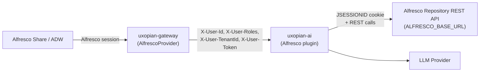

The Alfresco integration embeds the Xopia AI chat panel inside Alfresco Share or Alfresco Digital Workspace (ADW) — without requiring ARender. The gateway enriches forwarded requests with the signed-in Alfresco user identity, and the Alfresco plugin provides tools the LLM can call to discover the content model, search nodes with AFTS queries, list folders, and read document metadata and content.

## How the connection works



*Figure: Authentication flow and data path between Alfresco, the gateway, uxopian-ai, and the Alfresco REST API.*

The gateway's `AlfrescoProvider` is loaded at startup from the `/provider` directory next to the gateway JAR and intercepts requests matching the configured Alfresco path. It forwards the user identity as `X-User-Id`, `X-User-Roles`, `X-User-TenantId`, and `X-User-Token`. Inside the plugin, `AlfrescoWebClient` reuses the user's Alfresco token as a `JSESSIONID` cookie on every outbound call, so all Alfresco ACLs are enforced on the user's own credentials.

## Prerequisites

- Alfresco Content Services (Share or ADW) reachable from uxopian-ai.
- Uxopian AI stack (uxopian-ai + uxopian-gateway 2026.0.0-ft3 or later).
- `AlfrescoProvider` JAR placed in the gateway's `/provider` directory.
- CORS on the Alfresco repository configured to allow credentialed requests from the gateway origin (see [Common issues](#common-issues)).

## Installation

### 1. Enable the Alfresco tools

Alfresco tools ship inside the uxopian-ai distribution ZIP but are **disabled by default**. They are gated by the tool tag whitelist introduced in ft3 (`plugins.tools.enabled-tags`). To enable them:

```yaml title="config/application.yml"
plugins:
  tools:
    enabled-tags: alfresco,files
```

Or via environment variable:

```bash
PLUGINS_TOOLS_ENABLED_TAGS=alfresco,files
```

You can also combine Alfresco with FlowerDocs in a mixed deployment: `alfresco,flowerdocs,files`.

:::warning[Breaking default]
In ft3 the default value of `plugins.tools.enabled-tags` is `flowerdocs,files`. If you do not override it, Alfresco tools will not be registered at startup and the LLM will not know about Alfresco even though the plugin JAR is present in `plugins/`.
:::

### 2. Configure the Alfresco endpoint

Set the Alfresco repository base URL that `AlfrescoWebClient` will call:

```yaml title="config/application.yml"
alfresco:
  base-url: https://alfresco.example.com
  cmm-enabled: false
```

Or via environment variables:

```bash
ALFRESCO_BASE_URL=https://alfresco.example.com
ALFRESCO_CMM_ENABLED=false
```

The `base-url` must include the scheme and, if applicable, a context path; the plugin targets the standard Alfresco v1 REST API under `/alfresco/api/-default-/public/alfresco/versions/1`.

### 3. Configure the gateway route

Deploy the `AlfrescoProvider` JAR into the gateway's `/provider` directory and declare the route in `gateway-application.yaml`:

```yaml title="gateway-application.yaml"
app:
  routes:
    - id: uxopian-ai
      uri: http://uxopian-ai:8080
      path: /gui/gateway/uxopian-ai/**
      provider: AlfrescoProvider
      security:
        - path: /gui/gateway/uxopian-ai/.well-known/**
          public: true
        - path: /gui/gateway/uxopian-ai/prompt-statistics
          roles: [ADMIN]
```

`AlfrescoProvider` validates the caller's Alfresco session and populates the four `X-User-*` headers that uxopian-ai expects. Public paths (e.g. `.well-known/info`) and ADMIN-restricted paths (e.g. `prompt-statistics`) are declared through the standard gateway `security` rules.

### 4. Enable CORS for credentialed cross-origin requests

Because the chat panel runs under a different origin than the Alfresco repository, the plugin's `WebClient` must be able to send the Alfresco session cookie on cross-origin requests. Configure Alfresco's `global-properties` so `cors.allowCredentials=true` and the uxopian-ai gateway origin is listed in `cors.allowed.origins`. Without this, `AlfrescoWebClient` calls will fail with 401 even though the user is authenticated in Share.

### 5. (Optional) Enable custom content model lookup

If your tenant uses Alfresco Custom Content Model (CMM), set:

```yaml
alfresco:
  cmm-enabled: true
```

When enabled, `AlfrescoModelService` fetches the tenant's custom types and aspects via the CMM admin API and surfaces them alongside the built-in system properties. When disabled (default), the plugin falls back to the list in `alfresco.common-system-properties` — `cm:name`, `cm:title`, `cm:description`, `cm:created`, `cm:modified`, `cm:creator`, `cm:modifier` — which covers most out-of-the-box tenants.

### 6. Restart

After updating configuration, restart uxopian-ai. On startup, the log should show:

```
Initializing Alfresco WebClient. Target: https://alfresco.example.com
```

and the three Alfresco `@ToolService` beans registered: `AlfrescoSearchToolService`, `AlfrescoDocumentToolService`, `AlfrescoMetadataToolService`.

## Configuration reference

| Key | Env variable | Default | Description |
|---|---|---|---|
| `alfresco.base-url` | `ALFRESCO_BASE_URL` | (empty) | Alfresco repository base URL. Required when the Alfresco plugin is enabled. |
| `alfresco.cmm-enabled` | `ALFRESCO_CMM_ENABLED` | `false` | Enable Alfresco Custom Content Model lookup for tenant-specific types and aspects. |
| `alfresco.common-system-properties` | — | `cm:name`, `cm:title`, `cm:description`, `cm:created`, `cm:modified`, `cm:creator`, `cm:modifier` | List of fallback system properties exposed to the LLM when CMM is disabled. Each entry has a label and a hint pointing to the right filter builder. |
| `plugins.tools.enabled-tags` | `PLUGINS_TOOLS_ENABLED_TAGS` | `flowerdocs,files` | Comma-separated list of tool-tag whitelist values. Must contain `alfresco` for the Alfresco tools to be registered. |

## Tools exposed to the LLM

The Alfresco plugin registers 13 tools in three groups. All three services are tagged `alfresco` via `@ToolService(tags = "alfresco")`, so the full set is enabled atomically by the whitelist.

### Search (`AlfrescoSearchToolService`)

| Tool name | Purpose |
|---|---|
| `getAlfrescoDataModel` | Step 0 prerequisite: returns the tenant's light data model (system properties + optional CMM custom types/aspects). |
| `buildAlfrescoTypeFilter` | Builds an AFTS fragment filtering on node type (e.g. `TYPE:"cm:content"`, `TYPE:"acme:invoice"`). |
| `buildAlfrescoPropertyContainsFilter` | Builds an AFTS fragment for partial text match on a property. |
| `buildAlfrescoPropertyEqualsFilter` | Builds an AFTS fragment for exact property match. |
| `buildAlfrescoDateRangeFilter` | Builds an AFTS fragment for date ranges (creation, modification, etc.). |
| `buildAlfrescoFullTextFilter` | Builds an AFTS fragment for full-text content search. |
| `combineAlfrescoFilters` | Combines multiple AFTS fragments with AND or OR logic. |
| `buildAlfrescoSort` | Builds a sort specification (property + ascending/descending). |
| `searchAlfrescoNodes` | Executes the assembled AFTS query against Alfresco and returns the matching nodes. |

### Documents (`AlfrescoDocumentToolService`)

| Tool name | Purpose |
|---|---|
| `getAlfrescoDocumentIdsByName` | Looks up document node IDs by name (returns a list of UUIDs). |
| `getAlfrescoDocumentContent` | Fetches and returns the textual content of a document. |
| `listAlfrescoFolderContents` | Lists files in an Alfresco folder. |

### Metadata (`AlfrescoMetadataToolService`)

| Tool name | Purpose |
|---|---|
| `getAlfrescoDocumentProperties` | Returns all metadata properties of a node. |

A typical LLM search session calls `getAlfrescoDataModel` first to learn the correct type and property qualified names, builds one or more filters, optionally adds a sort, and calls `searchAlfrescoNodes`.

## Verification

1. Log in to Alfresco Share or ADW.
2. Open the Xopia chat panel (via the keyboard shortcut or dedicated launcher).
3. Ask: *"What custom document types are available?"* — the LLM should call `getAlfrescoDataModel` and describe the tenant model.
4. Ask: *"Find the Q1 2026 invoice for ACME Corp"* — the LLM should call `buildAlfrescoTypeFilter`, `buildAlfrescoPropertyContainsFilter`, `combineAlfrescoFilters`, and finish with `searchAlfrescoNodes`, returning a clickable list of matching nodes.
5. Ask: *"Summarize the last contract in /Sites/customers/acme/contracts"* — the LLM should chain `listAlfrescoFolderContents`, `getAlfrescoDocumentContent`, and return a summary.

## Sample use case

An Alfresco user asks Xopia to compile financial data: *"Sum the totals of the invoices stored in `/Sites/finance/invoices/2026/Q1`."* The LLM calls `listAlfrescoFolderContents` to enumerate invoices, `getAlfrescoDocumentContent` on each, extracts the totals, computes the sum, and replies with the total plus a list of the nodes used — each linking back to the document details page in Alfresco.

## Common issues

| Symptom | Cause | Resolution |
|---|---|---|
| Alfresco tools do not appear in the admin tool list | Tag whitelist excludes `alfresco` | Set `PLUGINS_TOOLS_ENABLED_TAGS` to include `alfresco` and restart. |
| `Initializing Alfresco WebClient. Target: null` in logs | `alfresco.base-url` missing | Set `ALFRESCO_BASE_URL` or `alfresco.base-url` in `config/application.yml`. |
| 401 on every Alfresco call | CORS does not allow credentials, or session token not forwarded | Set `cors.allowCredentials=true` and add the gateway origin to `cors.allowed.origins` in Alfresco `global-properties`. Verify `X-User-Token` is present on gateway-forwarded requests. |
| LLM invents property names like `cm:invoiceDate` | CMM disabled but the tenant uses custom types | Set `alfresco.cmm-enabled=true` so `getAlfrescoDataModel` surfaces the real custom types. |
| Gateway returns 403 on `/prompt-statistics` | Route security mis-configured | Check the `security` block of the `uxopian-ai` route in `gateway-application.yaml` — `prompt-statistics` must require the `ADMIN` role. |

## Related pages

- [Plugin system](../understanding/plugin_system.md)
- [Tools](../understanding/tools.md)
- [Environment variables reference](../reference/environment_variables.md)
- [Configuration file reference](../reference/configuration.md)
- [Integrate with FlowerDocs](./integrate_with_flowerdocs.mdx)
