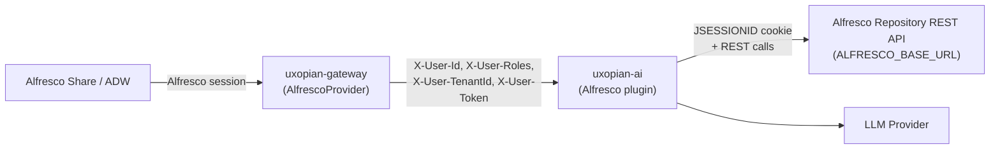
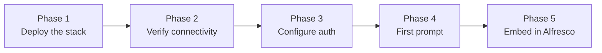

This guide walks through the complete integration of Uxopian AI into an Alfresco deployment. Follow the phases in order. Each phase ends with a validation checkpoint. **Do not move to the next phase until the current one passes** — this separates infrastructure concerns from UI integration.

## Architecture



*Figure: Authentication flow and data path between Alfresco, the gateway, uxopian-ai, and the Alfresco REST API.*

The gateway's `AlfrescoProvider` validates the caller's Alfresco session and forwards the user identity. Inside uxopian-ai, `AlfrescoWebClient` reuses the user's token as a `JSESSIONID` cookie on every outbound call, so all Alfresco ACLs are enforced on the user's own credentials.

## Integration roadmap



---

## Phase 1 — Deploy the Uxopian AI stack

Install and start `uxopian-ai` and `uxopian-gateway`. Choose one of the two installation methods:

- **Docker Compose** — Recommended for most deployments. See [Docker installation](../installation/docker.md).
- **Java service** — For environments without Docker. See [Java installation](../installation/java.md).

The Alfresco stack (Share, repository, etc.) can be started in parallel, but validate the Uxopian AI stack first.

### Checkpoint 1 — Stack is up

```bash
curl http://<gateway-host>:<port>/actuator/health
```

Expected response: `{"status":"UP"}`

---

## Phase 2 — Verify service connectivity

### 2.1 Enable the Alfresco tools

Alfresco tools are **disabled by default** — gated by the tool tag whitelist. Enable them before starting uxopian-ai:

```yaml title="config/application.yml"
plugins:
  tools:
    enabled-tags: alfresco,files
```

Or via environment variable:

```bash
PLUGINS_TOOLS_ENABLED_TAGS=alfresco,files
```

:::warning[Default value excludes Alfresco]
The default is `flowerdocs,files`. If you do not override it, Alfresco tools will not be registered and the LLM will not have access to Alfresco, even if the plugin JAR is present.
:::

:::info[Docker deployments — read this first]
Container-to-container URLs must use **Docker service names** as hostnames, not `localhost`. See [Docker networking and URL configuration](../installation/docker.md#docker-networking-and-url-configuration) for the full two-URL rule, external network setup, and DNS debugging commands.
:::

### 2.2 Configure the Alfresco base URL

Set `ALFRESCO_BASE_URL` to the Alfresco repository URL **as seen by uxopian-ai** (container-to-container):

```yaml title="config/application.yml"
# Same Docker Compose stack — use the Alfresco service name
alfresco:
  base-url: http://alfresco:8080

# Alfresco in a separate Docker stack — join its network first
alfresco:
  base-url: http://alfresco:8080

# External Alfresco (no Docker isolation)
alfresco:
  base-url: https://alfresco.example.com
```

If Alfresco runs in a separate Compose stack, `uxopian-ai` must join its Docker network:

```yaml
services:
  uxopian-ai:
    networks:
      - uxopian-ai-net
      - alfresco-net      # Join the Alfresco network

networks:
  uxopian-ai-net:
  alfresco-net:
    external: true
    name: <exact-network-name>   # From: docker network ls
```

### 2.3 Confirm connectivity

From inside the `uxopian-ai` container, confirm the Alfresco repository API responds:

```bash
docker exec -it <uxopian-ai-container> sh
curl http://alfresco:8080/alfresco/api/-default-/public/alfresco/versions/1/nodes/-root-
```

If `nslookup alfresco` returns `NXDOMAIN`, the containers are not on the same Docker network. Alfresco tool calls will fail silently if this endpoint is unreachable.

Check uxopian-ai startup logs for confirmation:

```
Initializing Alfresco WebClient. Target: http://alfresco:8080
```

### Checkpoint 2 — Connectivity verified

| Check | Expected |
|---|---|
| `GET /actuator/health` on gateway | `{"status":"UP"}` |
| Alfresco repository API reachable from uxopian-ai | HTTP 200 |
| uxopian-ai logs | Three Alfresco tool services registered: `AlfrescoSearchToolService`, `AlfrescoDocumentToolService`, `AlfrescoMetadataToolService` |

---

## Phase 3 — Configure and validate authentication

### 3.1 Configure AlfrescoProvider on the gateway

Deploy the `AlfrescoProvider` JAR into the gateway's `/provider` directory and declare the route:

```yaml title="gateway-application.yaml"
app:
  routes:
    - id: uxopian-ai
      uri: http://uxopian-ai:8080
      path: /gui/gateway/uxopian-ai/**
      prefix: /gui/gateway/uxopian-ai/
      provider: AlfrescoProvider
      security:
        - path: /.well-known/**
          public: true
        - path: /assets/**
          public: true
        - path: /actuator/health
          public: true
        - path: /v3/**
          public: true
        - path: /swagger-ui/**
          public: true
        - path: /prompt/**
          roles: ["ADMIN"]
        - path: /goal/**
          roles: ["ADMIN"]
```

If your deployment routes requests through a proxy that changes the path prefix before reaching the gateway, use `rewritePath` to normalize the path. See [Configure gateway routes](./configure_gateway_routes.md) for a step-by-step guide.

:::warning[The provider name must match exactly]
`AlfrescoProvider` must be the exact Spring bean name of the provider registered from the JAR in `/provider`. Check gateway startup logs for `Registered provider: AlfrescoProvider`. A typo or missing JAR causes all requests to fail at authentication with no clear error.
:::

### 3.2 Configure CORS for credentialed requests

The Alfresco plugin sends the user's session cookie cross-origin. Configure Alfresco's `global-properties`:

```properties
cors.enabled=true
cors.allowCredentials=true
cors.allowed.origins=http://<gateway-host>:<port>
```

Without this, tool calls from uxopian-ai to the Alfresco repository will return 401, even when the user is authenticated in Share.

### 3.3 Verify the LLM default provider exists

In `config/llm-clients-config.yml`, confirm that `llm.default.provider` names an entry that actually exists in `llm.provider.globals`:

```yaml
llm:
  default:
    provider: openai          # ← must match a provider below
  provider:
    globals:
      - provider: openai      # ← must exist
        globalConf:
          apiSecret: ${OPENAI_API_KEY:}
```

If the `default.provider` names a provider not in `globals`, every chat request fails at the LLM stage with no visible error in the UI.

### 3.4 Test authentication with an Alfresco session

Log in to Alfresco Share and retrieve a session token. Then test the gateway:

```bash
curl -H "Cookie: JSESSIONID=<your-alfresco-session>" \
  http://<gateway-host>:<port>/gui/gateway/uxopian-ai/api/v1/prompts
```

Expected: HTTP 200 with a list of prompts.

:::tip[Test interface — Swagger UI]
The Swagger UI at `/gui/gateway/uxopian-ai/swagger-ui/index.html` lets you test endpoints interactively without writing curl commands. Use the `Authorize` button to pass your Alfresco session.
:::

### Checkpoint 3 — Authentication works

| Check | Expected |
|---|---|
| `GET /api/v1/prompts` with Alfresco session | HTTP 200 |
| `GET /api/v1/prompts` without session | HTTP 401 |
| Gateway logs | No `AlfrescoProvider` errors |

---

## Phase 4 — Send your first prompt

Validate the full chain before touching Alfresco Share or ADW configuration.

### 4.1 Open the admin UI

The admin UI is available at `http://<gateway-host>:<port>/gui/gateway/uxopian-ai/admin`. Verify:
- The LLM provider is listed as active
- `AlfrescoSearchToolService`, `AlfrescoDocumentToolService`, `AlfrescoMetadataToolService` appear in the tools list

### 4.2 Send a test request

```bash
curl -X POST http://<gateway-host>:<port>/gui/gateway/uxopian-ai/api/v1/requests \
  -H "Cookie: JSESSIONID=<your-alfresco-session>" \
  -H "Content-Type: application/json" \
  -d '{
    "inputs": [{
      "role": "USER",
      "content": [{ "type": "text", "value": "Hello, confirm you are working." }]
    }]
  }'
```

A successful response includes a `response` field with the LLM reply.

### 4.3 Test an Alfresco tool call

Ask the LLM to discover the Alfresco data model — this confirms the tool chain is wired correctly:

```bash
-d '{"inputs": [{"role": "USER", "content": [
  {"type": "text", "value": "What document types are available in Alfresco?"}
]}]}'
```

The LLM should call `getAlfrescoDataModel` and return available types. If the tool fails:
- Verify `ALFRESCO_BASE_URL` is reachable from uxopian-ai (Phase 2)
- Verify CORS is configured (Phase 3.2)
- Check that `X-User-Token` is forwarded by the gateway (visible in uxopian-ai DEBUG logs)

### Checkpoint 4 — LLM chain is validated

| Check | Expected |
|---|---|
| POST `/api/v1/requests` with text message | LLM response |
| `getAlfrescoDataModel` tool call triggered | Alfresco types listed in response |
| Admin UI tool list | Three Alfresco tool services visible |

---

## Phase 5 — Embed the chat panel in Alfresco

The Alfresco Share / ADW integration embeds the Uxopian AI chat panel via custom Share extensions (webscripts, context menu actions, custom UI components). This phase is specific to your Alfresco deployment layout.

See the [Quickstart with Alfresco + ARender](../getting_started/quickstart_alfresco.mdx) for a complete Docker Compose example that shows how the Share extensions are built and deployed.

### Key integration points

- **Context menu actions** — Share webscripts inject Uxopian AI actions into the Document Library context menu.
- **Chat panel** — The panel is loaded via `window.createChat()` from the web component bundle served by the gateway.
- **Session passthrough** — `AlfrescoProvider` uses the user's existing `JSESSIONID`, so no re-authentication is required.

### Checkpoint 5 — Chat panel works in Alfresco

1. Log in to Alfresco Share.
2. Navigate to the Document Library.
3. Right-click a document — Uxopian AI actions should appear in the context menu.
4. Click **Chat** or **Summarize**.
5. The chat panel should appear and the LLM should return a response using the Alfresco document content.

---

## Configuration reference

| Key | Env variable | Default | Description |
|---|---|---|---|
| `alfresco.base-url` | `ALFRESCO_BASE_URL` | (empty) | Alfresco repository base URL. Required when the plugin is enabled. |
| `alfresco.cmm-enabled` | `ALFRESCO_CMM_ENABLED` | `false` | Enable custom content model lookup. When enabled, `getAlfrescoDataModel` surfaces custom types and aspects. |
| `alfresco.common-system-properties` | — | `cm:name`, `cm:title`, … | Fallback properties when CMM is disabled. |
| `plugins.tools.enabled-tags` | `PLUGINS_TOOLS_ENABLED_TAGS` | `flowerdocs,files` | Must include `alfresco` to register the Alfresco tools. |

## Tools exposed to the LLM

The plugin registers 13 tools in three groups, all tagged `alfresco`.

### Search (`AlfrescoSearchToolService`)

| Tool | Purpose |
|---|---|
| `getAlfrescoDataModel` | Returns the tenant data model (prerequisite for all searches) |
| `buildAlfrescoTypeFilter` | Builds AFTS filter on node type |
| `buildAlfrescoPropertyContainsFilter` | Builds AFTS filter for partial text match |
| `buildAlfrescoPropertyEqualsFilter` | Builds AFTS filter for exact property match |
| `buildAlfrescoDateRangeFilter` | Builds AFTS filter for date ranges |
| `buildAlfrescoFullTextFilter` | Builds AFTS full-text search filter |
| `combineAlfrescoFilters` | Combines AFTS fragments with AND/OR |
| `buildAlfrescoSort` | Builds sort specification |
| `searchAlfrescoNodes` | Executes the assembled AFTS query |

### Documents (`AlfrescoDocumentToolService`)

| Tool | Purpose |
|---|---|
| `getAlfrescoDocumentIdsByName` | Looks up node IDs by document name |
| `getAlfrescoDocumentContent` | Fetches document text content |
| `listAlfrescoFolderContents` | Lists files in a folder |

### Metadata (`AlfrescoMetadataToolService`)

| Tool | Purpose |
|---|---|
| `getAlfrescoDocumentProperties` | Returns all metadata properties of a node |

## Common issues

| Symptom | Cause | Solution |
|---|---|---|
| Alfresco tools absent from admin tool list | Tag whitelist excludes `alfresco` | Set `PLUGINS_TOOLS_ENABLED_TAGS` to include `alfresco` and restart |
| `Initializing Alfresco WebClient. Target: null` in logs | `alfresco.base-url` missing | Set `ALFRESCO_BASE_URL` |
| Alfresco tool calls fail with connection error | `ALFRESCO_BASE_URL` uses `localhost` | Use the Alfresco Docker service name — `localhost` resolves to the uxopian-ai container |
| `NXDOMAIN` when resolving Alfresco service name | Containers on different Docker networks | Join the Alfresco Docker network (see Phase 2.2) |
| 401 on every Alfresco tool call | CORS missing `allowCredentials`, or session token not forwarded | Set `cors.allowCredentials=true` in Alfresco and add gateway origin to `cors.allowed.origins` |
| LLM invents property names | CMM disabled but tenant uses custom types | Set `alfresco.cmm-enabled=true` |
| LLM returns "provider not found" | `llm.default.provider` names a non-existent provider | Align `default.provider` with an entry in `llm.provider.globals` (Phase 3.3) |
| 401 on gateway requests | `AlfrescoProvider` failing to validate session | Check provider JAR is in `/provider` directory and gateway startup logs |

## Related pages

- [Configure gateway routes](./configure_gateway_routes.md) — `path`, `prefix`, `rewritePath`, debug logging
- [Authentication and gateway](../understanding/authentication.md)
- [Plugin system](../understanding/plugin_system.md)
- [Tools](../understanding/tools.md)
- [Quickstart with Alfresco + ARender](../getting_started/quickstart_alfresco.mdx)
- [Configuration file reference](../reference/configuration.md)
