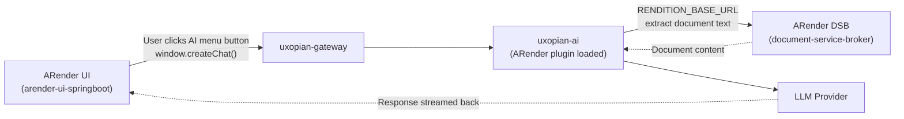

The ARender integration adds an "AI" menu to the ARender top panel. Buttons in this menu call `window.createChat()` with a prompt reference and the current document ID. The uxopian-ai ARender plugin extracts document text via the ARender Document Service Broker (DSB) REST API.

## How the connection works



*Figure: ARender integration data flow from AI menu click to LLM response.*

## Prerequisites

- ARender 2023.x stack (UI, DSB, renderer, text handler, converter)
- Uxopian AI stack running with the ARender plugin JARs available
- Docker image access for all ARender and Uxopian services
- `RENDITION_BASE_URL` set to the DSB service URL reachable from uxopian-ai

## Connector installation

### 1. Download the ARender example package

:::tip[Download]
**<a href={require('../getting_started/uxopian-ai_docker_example_arender.zip').default} download="uxopian-ai_docker_example_arender.zip">uxopian-ai_docker_example_arender.zip</a>**
:::

The archive contains:

```
uxopian-ai-stack.yml          # Full Docker Compose with ARender + Uxopian
gateway-application.yaml      # Gateway config
config/                       # uxopian-ai config files
arender/
  configurations/
    arender-plugins.xml                   # Imports the AI top-panel plugin
    arender-custom-client.properties      # Sets AI host URL and top-panel buttons
    toppanel-arender-ai-configuration.xml # AI menu buttons and JavaScript handlers
  public/
    web-components.js   # JS loaded by ARender in the browser — included automatically from the example
```

### 2. Configure the ARender UI environment variable

The default value is `http://localhost:8085/uxopian-ai`. Override it in your `.env` file if the gateway is accessible at a different address:

```bash
UXOPIAN_AI_HOST=http://your-host:8085/uxopian-ai
```

This value propagates to ARender at startup via `arender-custom-client.properties` (`uxopian.ai.host=${UXOPIAN_AI_HOST:}`), which injects it into the button JavaScript handlers in `toppanel-arender-ai-configuration.xml`. The `web-components.js` file in `arender/public/` also uses this host for the comparison buttons — if you change the URL, update the `UXOPIAN_AI_HOST` constant in that file accordingly.

### 3. Configure RENDITION_BASE_URL on uxopian-ai

The uxopian-ai service must be able to reach the ARender DSB:

```yaml
services:
  uxopian-ai:
    environment:
      - RENDITION_BASE_URL=http://dsb-service:8761
```

This URL is used by the ARender plugin to extract document text for prompt rendering.

### 4. Start the stack

```bash
docker compose -f uxopian-ai-stack.yml up -d
```

## Configuration

### arender-custom-client.properties

Key properties:

```properties
# CSS and JS files loaded by the ARender UI
style.sheet=css/arender-style.css
arenderjs.startupScript=web-components.js

# Top-panel middle section buttons (aiMenu is added)
topPanel.section.middle.buttons.beanNames=...,aiMenu

# Gateway URL used by JavaScript calls
uxopian.ai.host=${UXOPIAN_AI_HOST:}
```

| Key | Description |
|---|---|
| `style.sheet` | Comma-separated CSS files loaded in the ARender UI |
| `arenderjs.startupScript` | JavaScript bundle loaded at startup |
| `topPanel.section.middle.buttons.beanNames` | Bean names for top-panel buttons; add `aiMenu` to include the AI menu |
| `uxopian.ai.host` | URL of the gateway, used by button JavaScript to call `createChat()` |

### arender-plugins.xml

This file imports the top-panel configuration:

```xml
<import resource="toppanel-arender-ai-configuration.xml"/>
```

Do not modify this file unless you need to add additional ARender plugins.

### toppanel-arender-ai-configuration.xml

Defines the `aiMenu` bean and its dropdown buttons. Each button calls `window.createChat()` with a specific prompt and the current document ID. The shipped configuration includes:

| Button | Prompt used | Description |
|---|---|---|
| Summarize in text format | `summarizeDocumentText` | Plain text summary |
| Summarize in Markdown | `summarizeDocumentMarkdown` | Markdown-formatted summary |
| Detailed comparison | `detailedComparison` | Point-by-point document comparison |
| Generic comparison | `genericComparison` | High-level document comparison |
| Translate to French | `translate` | Translation with `language=french` payload |
| Translate to English | `translate` | Translation with `language=english` payload |
| Open chat | (none) | Opens a free-form chat window |

To add a new button, add a `DropdownMenuItemPresenter` bean and reference its ID in the `aiMenu` bean's `orderedNamedList`.

## Verification

1. Open the ARender UI at `http://localhost:8080`.
2. Open a document.
3. Click the "AI" button in the top panel.
4. Click "Summarize in text format".
5. The chat panel should appear and begin generating a summary.

Check uxopian-ai logs if the panel does not appear:

```bash
docker compose -f uxopian-ai-stack.yml logs uxopian-ai
```

## Sample use case

A document review workflow: a contract is open in ARender. A reviewer clicks "Summarize in Markdown" from the AI menu. Uxopian AI fetches the document text from the DSB, renders the `summarizeDocumentMarkdown` prompt, and streams a structured summary back to the chat panel embedded in the ARender UI.

## Common issues

| Error | Cause | Solution |
|---|---|---|
| AI menu not visible | `aiMenu` missing from `topPanel.section.middle.buttons.beanNames` | Add `aiMenu` to the property |
| `web-components.js` not found | Bundle not placed in `public/` or wrong path | Verify file exists and is referenced in `arenderjs.startupScript` |
| No document content in response | `RENDITION_BASE_URL` unreachable | Verify uxopian-ai can reach the DSB at `RENDITION_BASE_URL` |
| CORS errors | Browser blocked by CORS policy | Configure CORS on the gateway or serve ARender and gateway on the same origin |
| Chat panel blank | `UXOPIAN_AI_HOST` points to wrong URL | Verify `UXOPIAN_AI_HOST` is the gateway URL reachable from the browser |

## Related pages

- [Web components](../understanding/web_components.md)
- [Prompts and templating](../understanding/prompts_and_templating.md)
- [Environment variables reference](../reference/environment_variables.md)
- [Quickstart with ARender](../getting_started/quickstart_arender.mdx)
