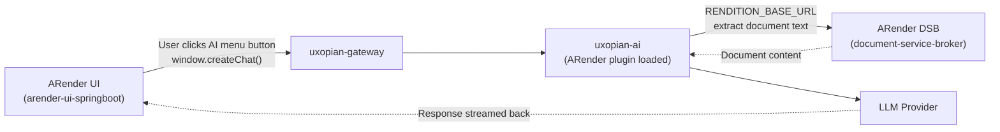
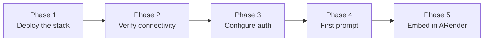

This guide walks through the complete integration of Uxopian AI into an ARender deployment. Follow the phases in order. Each phase ends with a validation checkpoint. **Do not move to the next phase until the current one passes** — this avoids context-switching between infrastructure work and UI configuration.

## Architecture



*Figure: ARender integration data flow from AI menu click to LLM response.*

## Integration roadmap



---

## Phase 1 — Deploy the Uxopian AI stack

Install and start `uxopian-ai` and `uxopian-gateway`. Choose one of the two installation methods:

- **Docker Compose** — Recommended for most deployments. See [Docker installation](../installation/docker.md).
- **Java service** — For environments without Docker. See [Java installation](../installation/java.md).

At minimum, the stack must include `uxopian-ai`, `uxopian-gateway`, and `opensearch`. The ARender services (`ui`, `dsb`, renderer, etc.) can be started in parallel but are not required to validate the Uxopian AI stack itself.

### Checkpoint 1 — Stack is up

```bash
curl http://<gateway-host>:<port>/actuator/health
```

Expected response: `{"status":"UP"}`

---

## Phase 2 — Verify service connectivity

:::info[Docker deployments — read this first]
Container-to-container URLs must use **Docker service names** as hostnames, not `localhost`. `localhost` inside a container refers to the container itself, not the host machine. See [Docker networking and URL configuration](../installation/docker.md#docker-networking-and-url-configuration) for the full two-URL rule, external network setup, and DNS debugging commands.
:::

### 2.1 Configure RENDITION_BASE_URL

Set `RENDITION_BASE_URL` to the ARender DSB URL **as seen by uxopian-ai** (container-to-container):

```yaml
# Same Docker Compose stack — use the DSB service name
RENDITION_BASE_URL=http://dsb-service:8761

# ARender in a separate Docker stack — join its network first, then use its service name
RENDITION_BASE_URL=http://dsb-service:8761

# Java service on the same host (no Docker isolation)
RENDITION_BASE_URL=http://localhost:8761
```

If ARender runs in a separate Compose stack, `uxopian-ai` must join its Docker network:

```yaml
services:
  uxopian-ai:
    networks:
      - uxopian-ai-net
      - arender-net       # Join the ARender network

networks:
  uxopian-ai-net:
  arender-net:
    external: true
    name: <exact-network-name>   # From: docker network ls
```

Note that `UXOPIAN_AI_HOST` is a **browser-side** URL — it must point to the gateway using the public host address or IP, not a Docker service name:

```yaml
UXOPIAN_AI_HOST=http://my-server:8085/uxopian-ai   # ✓ browser-accessible
UXOPIAN_AI_HOST=http://gateway-service:8085/uxopian-ai  # ✗ not reachable from browsers
```

### 2.2 Confirm the DSB is reachable from uxopian-ai

```bash
docker exec -it <uxopian-ai-container> sh
curl http://dsb-service:8761/ActionsAPI
```

If `nslookup dsb-service` returns `NXDOMAIN`, the containers are not on the same Docker network. Document content will be silently absent in LLM responses if `RENDITION_BASE_URL` is unreachable.

### Checkpoint 2 — Connectivity verified

| Check | Expected |
|---|---|
| `GET /actuator/health` on gateway | `{"status":"UP"}` |
| `curl RENDITION_BASE_URL` from inside uxopian-ai container | HTTP 200 |
| OpenSearch reachable from uxopian-ai | No connection errors in logs |

---

## Phase 3 — Configure and validate authentication

### 3.1 Configure the gateway route

In `gateway-application.yaml`, configure the route to uxopian-ai with the appropriate auth provider. For development, use `DevProvider`. For production, replace with your identity provider.

```yaml
app:
  routes:
    - id: uxopian-ai
      uri: http://uxopian-ai:8080
      path: /uxopian-ai/**
      provider: DevProvider          # Replace with production provider
      security:
        - path: /.well-known/**
          public: true
        - path: /assets/**
          public: true
        - path: /actuator/health
          public: true
        - path: /v3/**
          public: true
        - path: /swagger-ui/**
          public: true
```

If requests arrive at the gateway with a different path prefix than the backend expects (e.g., after being proxied by ARender or nginx), you may need `rewritePath`. See [Configure gateway routes](./configure_gateway_routes.md) for a step-by-step derivation.

### 3.2 Verify the LLM default provider exists

In `config/llm-clients-config.yml`, confirm that `llm.default.provider` names an entry that actually exists in `llm.provider.globals`:

```yaml
llm:
  default:
    provider: openai          # ← must match a provider below
  provider:
    globals:
      - provider: openai      # ← must exist
        globalConf:
          apiSecret: ${OPENAI_API_KEY:}
```

If the `default.provider` names a provider not in `globals`, every chat request will fail at the LLM stage with no visible error in the UI.

### 3.3 Test authentication

With `DevProvider`, inject identity headers directly:

```bash
curl -H "X-User-Id: test-user" \
     -H "X-User-TenantId: test-tenant" \
     -H "X-User-Roles: USER" \
     http://<gateway-host>:<port>/uxopian-ai/api/v1/prompts
```

Expected: HTTP 200 with a list of prompts.

:::tip[Test interface — Swagger UI]
The gateway exposes a Swagger UI at `/uxopian-ai/swagger-ui/index.html`. Use the `Authorize` button to pass credentials and test endpoints interactively.
:::

### Checkpoint 3 — Authentication works

| Check | Expected |
|---|---|
| `GET /uxopian-ai/api/v1/prompts` with identity headers | HTTP 200 |
| `GET /uxopian-ai/api/v1/prompts` without headers | HTTP 401 |
| Gateway logs | No provider errors at startup |

---

## Phase 4 — Send your first prompt

Validate the full chain — gateway → uxopian-ai → LLM → response — before touching ARender configuration.

### 4.1 Open the admin UI

The admin UI is available at `http://<gateway-host>:<port>/uxopian-ai/admin`. From here, verify that the LLM provider is listed as active and that the expected prompts are loaded.

### 4.2 Send a test request

```bash
curl -X POST http://<gateway-host>:<port>/uxopian-ai/api/v1/requests \
  -H "X-User-Id: test-user" \
  -H "X-User-TenantId: test-tenant" \
  -H "X-User-Roles: USER" \
  -H "Content-Type: application/json" \
  -d '{
    "inputs": [{
      "role": "USER",
      "content": [{ "type": "text", "value": "Hello, confirm you are working." }]
    }]
  }'
```

A successful response includes a `response` field with the LLM reply and a non-null `conversationId`.

### 4.3 Test a document extraction call

To confirm that the ARender plugin is wired correctly, ask the LLM to summarize a document that it can reach via the DSB. If the DSB has a test document available, reference its ID:

```bash
-d '{"inputs": [{"role": "USER", "content": [
  {"type": "text", "value": "Summarize document <dsb-doc-id>"}
]}]}'
```

The LLM should call the ARender extraction tool and return content. If the tool fails, verify `RENDITION_BASE_URL` is correct (Phase 2).

### Checkpoint 4 — LLM chain is validated

| Check | Expected |
|---|---|
| POST `/uxopian-ai/api/v1/requests` with text message | LLM response |
| Admin UI provider status | Provider listed as active |

The backend stack is validated. You can now configure ARender.

---

## Phase 5 — Embed the AI menu in ARender

### 5.1 Download the ARender example package

:::tip[Download]
**<a href={require('../getting_started/uxopian-ai_docker_example_arender.zip').default} download="uxopian-ai_docker_example_arender.zip">uxopian-ai_docker_example_arender.zip</a>**
:::

The archive contains ARender configuration files to integrate:

```
arender/
  configurations/
    arender-plugins.xml                   # Imports the AI top-panel plugin
    arender-custom-client.properties      # Sets AI host URL and top-panel buttons
    toppanel-arender-ai-configuration.xml # AI menu buttons and JavaScript handlers
  public/
    web-components.js   # JS loaded by ARender in the browser
```

### 5.2 Configure the gateway URL

Set `UXOPIAN_AI_HOST` to the gateway URL **as reachable from user browsers**:

```bash
UXOPIAN_AI_HOST=http://your-gateway:8085/uxopian-ai
```

This value propagates into the ARender XML configuration at startup. If it points to the wrong URL, the `createChat()` call will fail in the browser.

The `web-components.js` file in `arender/public/` also contains a hardcoded `UXOPIAN_AI_HOST` constant used by comparison buttons. Update it to match your deployment before starting ARender.

### 5.3 arender-custom-client.properties

Key properties to verify:

```properties
# JS bundle loaded at startup — registers createChat() in the browser
arenderjs.startupScript=web-components.js

# Add aiMenu to the top panel
topPanel.section.middle.buttons.beanNames=...,aiMenu

# Gateway URL used by button JavaScript
uxopian.ai.host=${UXOPIAN_AI_HOST:}
```

:::danger[web-components.js is required]
`web-components.js` is loaded by ARender in the browser and registers the `createChat()` function. Without it, clicking any AI button produces a silent error. Verify the file is present in `arender/public/` and referenced in `arenderjs.startupScript`.
:::

### 5.4 Restart ARender

After updating ARender configuration, restart the ARender UI service. The top panel should display the AI button.

### Checkpoint 5 — AI menu works in ARender

1. Open ARender and load a document.
2. Click the **AI** button in the top panel.
3. Click **Summarize in text format**.
4. The chat panel should appear and stream a summary.

If the panel does not appear, open browser developer tools:
- Network tab: does `/uxopian-ai/assets/...` return HTTP 200?
- Console: is `createChat is not defined`? → `web-components.js` not loaded.
- Console: network errors to `UXOPIAN_AI_HOST`? → URL is wrong or gateway is unreachable.

---

## ARender configuration reference

### arender-custom-client.properties

| Key | Description |
|---|---|
| `style.sheet` | Comma-separated CSS files loaded in the ARender UI |
| `arenderjs.startupScript` | JavaScript bundle loaded at startup. Must include `web-components.js` |
| `topPanel.section.middle.buttons.beanNames` | Bean names for top-panel buttons; add `aiMenu` to include the AI menu |
| `uxopian.ai.host` | Gateway URL used by button JavaScript to call `createChat()` |

### toppanel-arender-ai-configuration.xml — shipped buttons

| Button | Prompt used | Description |
|---|---|---|
| Summarize in text format | `summarizeDocumentText` | Plain text summary |
| Summarize in Markdown | `summarizeDocumentMarkdown` | Markdown-formatted summary |
| Detailed comparison | `detailedComparison` | Point-by-point document comparison |
| Generic comparison | `genericComparison` | High-level document comparison |
| Translate to French | `translate` | Translation with `language=french` payload |
| Translate to English | `translate` | Translation with `language=english` payload |
| Open chat | (none) | Opens a free-form chat window |

To add a new button, add a `DropdownMenuItemPresenter` bean and reference its ID in the `aiMenu` bean's `orderedNamedList`.

---

## Common issues

| Error | Cause | Solution |
|---|---|---|
| AI menu not visible | `aiMenu` missing from `beanNames` | Add `aiMenu` to `topPanel.section.middle.buttons.beanNames` |
| `createChat is not defined` | `web-components.js` not loaded | Verify file exists and is in `arenderjs.startupScript` |
| No document content in response | `RENDITION_BASE_URL` unreachable | Run `docker exec … curl RENDITION_BASE_URL` — if `NXDOMAIN`, join the ARender Docker network |
| `RENDITION_BASE_URL=http://localhost:8761` fails | `localhost` = the container, not the host | Use the DSB Docker service name (e.g. `dsb-service`) |
| `UXOPIAN_AI_HOST` uses a Docker service name | Browsers cannot resolve Docker DNS | Use the public host IP/domain for `UXOPIAN_AI_HOST` |
| LLM returns "provider not found" | `llm.default.provider` names a non-existent provider | Align `default.provider` with an entry in `llm.provider.globals` (Phase 3.2) |
| 401 on all requests | Provider not configured or path mismatch | Check gateway route `path` and provider configuration |
| CORS errors in browser | Browser blocked cross-origin requests | Serve ARender and gateway on the same origin, or configure CORS |

## Related pages

- [Configure gateway routes](./configure_gateway_routes.md) — `path`, `prefix`, `rewritePath`, debug logging
- [Authentication and gateway](../understanding/authentication.md)
- [Web components](../understanding/web_components.md)
- [Prompts and templating](../understanding/prompts_and_templating.md)
- [Quickstart with ARender](../getting_started/quickstart_arender.mdx)
- [Environment variables reference](../reference/environment_variables.md)
