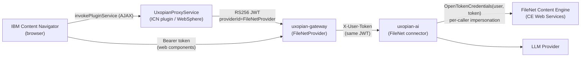

This guide covers how to configure the FileNet connector in `uxopian-ai` and install the Uxopian AI plugin for IBM Content Navigator (ICN). The plugin adds an **"Open in Uxopian"** context menu action on P8 documents and injects an AI Chat button into the ICN toolbar.

## Architecture



*Figure: The ICN plugin signs an RS256 JWT (issuer `icn-plugin`) identifying the ICN user, then forwards requests to the Uxopian AI gateway, which validates the JWT via `FileNetProvider` and forwards the raw token to `uxopian-ai` (header `X-User-Token`) together with the resolved user id. The browser also loads the chat web components directly from the gateway using the same token. `uxopian-ai` reuses that same identity for every call to the Content Engine: it wraps the caller's user id and token in an `OpenTokenCredentials` and executes the call via `Credentials.doAs(...)`, so FileNet sees and audits the real end user — not a shared service account. This requires the Content Platform Engine to trust that token: it does so by pointing its native OpenID Connect client at the gateway's own dynamic JWKS/discovery endpoints, configured once via the `FNCMCluster` CR ([Phase 0.4](#04-configure-oidc-trust-on-the-content-platform-engine)).*

The plugin exposes four operations:

| Operation (`op=`) | Purpose |
|---|---|
| `token` | Returns a signed RS256 JWT (no roles) for the current ICN user — used by the browser to authenticate web component asset requests |
| `admin-token` | Returns a signed RS256 JWT with `ADMIN` role — used by the **AI Admin** toolbar button to create a gateway session before opening the admin panel |
| `config` | Returns the plugin's configured **Uxopian AI Host URL** (read server-side via `PluginServiceCallbacks.loadConfiguration()`) — used by `actionHandler.js` at runtime (see [2.4](#24-configure-the-uxopian-ai-host)) |
| *(none)* | Proxies all other requests to the gateway backend (`icn.plugin.bff.url`) with the JWT attached |

## Prerequisites

| Requirement | Details |
|---|---|
| IBM FileNet P8 + IBM Content Navigator | Version 3.0+ |
| FileNet Content Engine | **5.5.9 or later** — required for `OpenTokenCredentials` (bearer-token authentication), used for per-caller impersonation — see [Phase 0.4](#04-configure-oidc-trust-on-the-content-platform-engine) |
| WebSphere Application Server | Hosts ICN |
| Java 8 (JDK) | Required only to rebuild from source |
| Maven 3.6+ | Required only to rebuild from source |
| Uxopian AI + gateway | Deployed and reachable from WebSphere, with the FileNet connector configured — see [Phase 0](#phase-0--configure-the-filenet-connector-in-uxopian-ai) |
| Access to the CPE's WebSphere/Liberty admin console and the `FNCMCluster` CR (Kubernetes) | Required to register the OIDC discovery trust that lets the Content Platform Engine authenticate callers as themselves — see [Phase 0.4](#04-configure-oidc-trust-on-the-content-platform-engine) |
| Access to the Arondor Artifactory | Required only when building `uxopian-ai` from source — provides the proprietary IBM CE Java API jars (`jace`, `p8cel10n`) |

---

## Phase 0 — Configure the FileNet connector in uxopian-ai

Before installing the ICN plugin, `uxopian-ai` itself must be able to reach the FileNet Content Engine. This is independent of the ICN plugin — it's the backend connector that runs searches and reads/writes documents.

### 0.1 IBM CE Java API dependencies

The `filenet` integration module depends on two proprietary IBM Content Engine Java API artifacts:

```xml title="uxopian-ai/pom.xml"
<filenet.version>5.6.0</filenet.version>
```

This must resolve to a Content Engine Java API version matching your CE server, and to **5.5.9 or later** — earlier versions do not implement `OpenTokenCredentials`, which the connector now requires (see [0.3](#03-configure-the-filenet-connection)).

```xml title="uxopian-ai/integrations/filenet/connector/pom.xml"
<dependency>
    <groupId>com.filenet</groupId>
    <artifactId>jace</artifactId>
    <version>${filenet.version}</version>
</dependency>
<dependency>
    <groupId>com.filenet</groupId>
    <artifactId>p8cel10n</artifactId>
    <version>${filenet.version}</version>
</dependency>
```

These are not on Maven Central. The root `pom.xml` already declares the Arondor Artifactory repositories (`arondor-release` / `arondor-snapshot` at `artifactory.arondor.cloud`), where these jars are published — no manual `mvn install:install-file` step is needed as long as the build machine has network access and credentials for that Artifactory.

### 0.2 Enable the FileNet tools

FileNet tools are **disabled by default** — gated by the tool tag whitelist. Enable them before starting uxopian-ai:

```yaml title="config/application.yml"
plugins:
  tools:
    enabled-tags: filenet,flowerdocs,files,interaction
```

Or via environment variable:

```bash
PLUGINS_TOOLS_ENABLED_TAGS=filenet,flowerdocs,files,interaction
```

:::warning[Default value excludes FileNet]
The default is `flowerdocs,files,interaction`. If you do not override it, FileNet tools will not be registered and the LLM will not have access to FileNet, even if the plugin JAR is present.
:::

### 0.3 Configure the FileNet connection

Set the Content Engine connection and the properties surfaced to the LLM:

```yaml title="config/application.yml"
filenet:
  ce-api-url: http://<ce-host>:<port>/wsi/FNCEWS40MTOM/
  repository-id: <object-store-symbolic-name>
  oidc-realm: ${FILENET_OIDC_REALM:}
  # Optional — overrides the built-in defaults (DocumentTitle, DateCreated, DateLastModified,
  # Creator, LastModifier, MajorVersionNumber, MimeType)
  common-system-properties:
    - name: DocumentTitle
      title: Document Title
      dataType: "xs:string"
      multiValued: false
      # allowedValues and usageHint are also accepted here — see below
    - name: DateCreated
      title: Date Created
      dataType: "xs:dateTime"
      multiValued: false
  # Optional — properties the LLM is allowed to write via setDocumentProperty
  writable-properties:
    - name: DocumentTitle
      title: Document Title
      dataType: "xs:string"
      multiValued: false
```

`ce-api-url` is the Content Engine Web Services (CEWS) endpoint, reachable from `uxopian-ai` — not the ICN/WebSphere host. `repository-id` is the object store's symbolic name (not its GUID).

Each entry under `common-system-properties` and `writable-properties` also accepts two optional fields not shown above: `allowedValues` (a list restricting the values the LLM may pass to `buildPropertyEqualsFilter`) and `usageHint` (free text describing when/how to use the property, surfaced to the LLM via `getDataModel`).

:::info[No shared service account]
Every FileNet call is authenticated as the **current caller**, not a shared service account. For each request, `FileNetCeClient` reads the authenticated user (id + token) from `AiContext` — populated from the JWT the gateway forwards as `X-User-Token` — and wraps them in an `OpenTokenCredentials(userId, token, oidcRealm)`, then runs the Content Engine call via `Credentials.doAs(...)`. FileNet therefore logs and authorizes every operation against the real end user. `oidc-realm` is the **LDAP realm name** already configured on the CPE (find it in the CPE's WebSphere/Liberty admin console under **Security > Global security > User account repository**, or in its startup logs) — not a name you invent, and not the OIDC issuer identifier configured in [Phase 0.4](#04-configure-oidc-trust-on-the-content-platform-engine). There is no fallback: if the caller has no identity or token in `AiContext`, the call fails rather than silently using a shared account.
:::

### 0.4 Configure OIDC trust on the Content Platform Engine

Per-caller impersonation only works if the Content Platform Engine trusts the JWT issued by the ICN plugin. **This is not configured in ACCE** — ACCE's "Managed User realm" / identity rules feature is for a different thing entirely (email-based self-registration for External Share).

The Content Platform Engine runs on **WebSphere Liberty**, which has a native `openidConnectClient-1.0` feature for exactly this: validating an inbound bearer JWT against an OpenID Connect provider it discovers **dynamically over HTTPS**, instead of a locally pinned certificate. The gateway already acts as that provider — it exposes the ICN plugin's signing key at standard discovery endpoints ([Phase 3](#phase-3--configure-the-gateway) registers the key; the gateway then serves it itself, no separate action needed):

- `https://<gateway-host>/.well-known/openid-configuration?issuer=icn-plugin`
- `https://<gateway-host>/.well-known/jwks.json`

:::warning[Do not use the RelyingParty Interceptor / `jvm_customize_options` for this]
Older IBM docs and some CPE deployments configure inbound OAuth/OIDC trust via `provider_1.*` JVM custom properties (the "RelyingParty Interceptor"). That mechanism is for **classic WebSphere Application Server (WAS)**, not Liberty — on Liberty, `JWTUsernameHandler` never actually validates a JWT's signature itself, it only cross-checks an ambient `Subject` that nothing populates, so it silently fails with `E_NOT_AUTHENTICATED` regardless of how the properties are set. Use `open_id_connect_providers` below instead.
:::

#### On a Kubernetes / FNCM-operator deployment

1. Configure the OIDC provider under `shared_configuration.open_id_connect_providers` in the `FNCMCluster` CR:

   ```yaml
   shared_configuration:
     open_id_connect_providers:
       - provider_name: "icn-plugin"
         issuer_identifier: "icn-plugin"
         signature_algorithm: "RS256"
         discovery_endpoint_url: "https://<gateway-host>/.well-known/openid-configuration?issuer=icn-plugin"
         inbound_propagation: "supported"
         user_identifier: "sub"
         unique_user_identifier: "sub"
         map_identity_to_registry_user: "true"
         authn_session_disabled: "true"
         https_required: "true"
         client_oidc_secret:
           cpe: "icn-plugin-oidc-client"
   ```

   `client_oidc_secret.cpe` names a Secret with placeholder `client_id`/`client_secret` keys — the field is mandatory for the CR to generate a valid `<openidConnectClient>` element, but no live OAuth authorization-code flow is ever exercised here (only inbound bearer-token propagation), so its actual value is never used.

2. The CPE's Liberty runtime validates the gateway's HTTPS certificate against its **own dedicated truststore** (`trustStoreRef="defaultTrustStore"`, a PKCS12 file provisioned by the FNCM operator) — separate from the JDK's own cacerts. If the gateway's certificate chains up to a public CA not already in that truststore, the discovery fetch fails with `CWWKS1524E`/`CWWKS1525E` (`PKIX path building failed`). Import the missing root into `shared_configuration.trusted_certificate_list` (same CR field, used here for TLS trust rather than JWT-signature trust):

   ```yaml
   shared_configuration:
     trusted_certificate_list:
       - "letsencrypt-isrg-root-x1"   # name of a Secret with a tls.crt key holding the CA root
   ```

3. `kubectl apply` the CR — the operator restarts the CPE pod. `open_id_connect_providers` reconciles into a separate ConfigMap (`<cluster-name>-cpe-config`, key `idp-oidc.xml`) on its own schedule, independent of other CR fields — if the pod's config looks stale, check that ConfigMap directly before assuming the operator hasn't picked up the change.

4. Confirm that the identities carried by the JWT (the ICN user id, JWT claim `sub`) resolve to valid users in the P8 domain's directory — CE authorizes and audits calls against this identity directly, so it must already exist there.

:::info[No manual re-registration when the plugin's keystore changes]
Because the CPE fetches the signing key dynamically, rotating the ICN plugin's keystore ([Modifying the plugin](#replacing-the-keystore)) needs no action on the CPE side — only the gateway's static `filenet.jwt.public-key` ([Phase 3.1](#31-register-the-plugins-public-key-with-filenetprovider)) must be updated, since that is what the gateway itself serves back out through the JWKS endpoint.
:::

### Checkpoint 0 — Connector is up

Check uxopian-ai startup logs for confirmation:

```
Initializing FileNet CE client. CEWS: http://<ce-host>:<port>/wsi/FNCEWS40MTOM/, object store: <repository-id>
```

| Check | Expected |
|---|---|
| uxopian-ai logs | `FileNetSearchToolService`, `FileNetFilterToolService`, `FileNetDocumentToolService`, `FileNetRedactTool` registered |
| Admin UI tool list | The four FileNet tool services appear, tagged `filenet` |
| A search request, made as a real ICN user | Returns results without a CE connection error, and FileNet's own audit trail attributes the call to that user (not a shared account) |

---

## Plugin downloads

:::tip[Prebuilt JAR]
**<a href="/files/uxopian-ai/uxopian-icn-plugin.jar" download="uxopian-icn-plugin.jar">uxopian-icn-plugin.jar</a>** — ready to deploy, no build required
:::

:::tip[Source package]
**<a href={require('./uxopian-icn-plugin.zip').default} download="uxopian-icn-plugin.zip">uxopian-icn-plugin.zip</a>** — Maven project to rebuild for your environment
:::

:::info[navigatorAPI.jar is not bundled]
The package contains only the plugin's own sources — it does not include IBM's `navigatorAPI.jar`, which is proprietary and must be sourced from your own ICN installation (see [1.1](#11-supply-navigatorapijar)). It also does not include any internal build tooling (code formatter, import sorter) — just a plain Maven project.
:::

Contents:

| File | Purpose |
|---|---|
| `pom.xml` | Maven build descriptor |
| `icn-plugin.p12` | Default PKCS12 keystore — **replace before production** |
| `src/main/java/com/uxopian/icn/UxopianPlugin.java` | Plugin entry point — registers actions/services and the configuration screen |
| `src/main/java/com/uxopian/icn/UxopianAction.java` | Context menu action for P8 documents |
| `src/main/java/com/uxopian/icn/UxopianProxyService.java` | Servlet — JWT signing and request proxy |
| `src/main/java/com/uxopian/icn/jwt/JwtSigner.java` | RS256 JWT generation (300 s TTL — long enough to survive the full round trip through the gateway and into a FileNet CE call) |
| `src/main/java/com/uxopian/icn/jwt/KeystoreLoader.java` | PKCS12/JKS keystore loader with WebSphere IBMJCE fallback |
| `src/main/resources/com/uxopian/icn/WebContent/actionHandler.js` | Raw startup script (loaded via `getScript()`, eval'd as-is) — token fetch, web component injection, toolbar buttons |
| `src/main/resources/com/uxopian/icn/WebContent/uxopianPluginDojo/actionHandler.js` | AMD module backing the **context menu action** (`UxopianAction.getActionFunction() = "uxopianPluginDojo/actionHandler"`) — must live under a `WebContent/<dojoModule>/` folder, see the note below |
| `src/main/resources/com/uxopian/icn/WebContent/uxopianPluginDojo/ConfigurationPane.html` / `.js` | Dojo widget backing the plugin's configuration screen in the ICN Admin Console — lets an administrator set the Uxopian AI host without rebuilding (see [2.4](#24-configure-the-uxopian-ai-host)) |
| `src/main/resources/com/uxopian/icn/icn-plugin.p12` | Keystore bundled inside the JAR (fallback when no external path is set) |
| `src/main/resources/com/uxopian/icn/icn-plugin.jks` | JKS version of the keystore for IBM Java 8 compatibility |
| `src/test/java/**`, `src/test/javascript/**` | JUnit 5/Mockito unit tests (`mvn test`) and Jest tests for `actionHandler.js` (`npm install && npm test`) |

:::info[Any AMD/`require()`-loaded class must live under `WebContent/<dojoModule>/`]
ICN registers exactly one Dojo module path per plugin: `getDojoModule()`'s value (`uxopianPluginDojo`), mapped to `WebContent/<that value>/` inside the JAR. Anything referenced via a dotted class name — `getConfigurationDijitClass()`, `getActionFunction()`, `getContentClass()` — is resolved through `require()` and **must** physically sit in that subfolder, or the browser 404s on `.../getResource/uxopianPluginDojo/<Class>.js` (and you'll see a Dojo `xhrFailed`/`multipleDefine` error in the console). Only the plain startup script named by `getScript()` (`actionHandler.js`, fetched and `eval`'d directly, not `require()`'d) can live flat at the `WebContent/` root — which is why this plugin keeps two `actionHandler.js` files: the flat one for the IIFE that injects the toolbar buttons, and `uxopianPluginDojo/actionHandler.js` for the tiny AMD module the context menu action actually invokes.
:::

## Phase 1 — Build the plugin JAR

Skip this phase if you are deploying the prebuilt JAR included in the ZIP.

### 1.1 Supply navigatorAPI.jar

`navigatorAPI.jar` is declared as a `system`-scoped dependency in `pom.xml` and must be present at `./navigatorAPI.jar` relative to the project root — it is **not** included in the source package (proprietary IBM binary). The IBM Navigator API JAR can be found in your own ICN installation at `NavigatorApplication.ear/navigator.war/WEB-INF/lib/`.

### 1.2 Run the build

```bash
mvn clean package
```

The output JAR is `target/uxopian-icn-plugin.jar`. There is nothing to configure at build time — the Uxopian AI gateway host is set after deployment, from the ICN Admin Console (see [2.4](#24-configure-the-uxopian-ai-host)).

---

## Phase 2 — Deploy the plugin in ICN

### 2.1 Copy the JAR

Copy `uxopian-icn-plugin.jar` to a directory accessible by WebSphere, for example:

```bash
/opt/IBM/ICN/plugins/uxopian-icn-plugin.jar
```

### 2.2 Configure WebSphere system properties

Set these JVM custom properties in the WebSphere administration console under **Application servers → \<server\> → Java and Process Management → Process definition → Java Virtual Machine → Custom properties**:

| Property | Default | Description |
|---|---|---|
| `icn.plugin.bff.url` | `http://localhost:8085/gui/gateway/uxopian-ai-filenet-icn` | Gateway backend URL as seen from WebSphere |
| `icn.plugin.keystore.path` | `icn-plugin.p12` | Path to the PKCS12 keystore file. If relative, it is resolved against the WebSphere process working directory; an absolute path is safer. If unset, the plugin falls back to the keystore bundled inside the JAR. |
| `icn.plugin.keystore.alias` | `icn-plugin` | Alias of the key pair inside the keystore |
| `icn.plugin.keystore.password` | `changeit` | Keystore password |

:::warning[Change the keystore and password before production]
The default `icn-plugin.p12` bundled in the JAR uses the password `changeit`. Generate a new key pair for each environment and set `icn.plugin.keystore.path` to an external file.
:::

### 2.3 Register the plugin in ICN Admin Console

1. Open the ICN Administration Console.
2. Navigate to **Plug-ins**.
3. Click **New Plug-in**.
4. Set the JAR file path to the location from step 2.1.
5. Click **Load**.
6. Confirm that the plugin name **Uxopian Plugin** and version **1.0.0** are displayed.
7. Save the configuration and restart ICN.

### 2.4 Configure the Uxopian AI host

The gateway URL is not baked into the JAR — it is set from the ICN Admin Console, via the configuration screen the plugin registers (`UxopianPlugin.getConfigurationDijitClass`):

1. In the ICN Administration Console, open **Plug-ins** and select **Uxopian Plugin**.
2. Click **Configure**.
3. Set **Uxopian AI Host URL** to your gateway's frontend-facing URL, for example `https://your-gateway-host/gui/gateway/uxopian-ai-filenet`.
4. Save. No rebuild or restart is required — `actionHandler.js` fetches this value at runtime from `UxopianProxyService` (`op=config`, which reads it server-side via `PluginServiceCallbacks.loadConfiguration()`), the same way it fetches tokens.

There is no built-in default — if this field is left empty, the chat and admin actions fail with a "Uxopian AI Host URL is not configured" error instead of silently pointing at some other environment. This must be set explicitly for every deployment.

---

## Phase 3 — Configure the gateway

### 3.1 Register the plugin's public key with FileNetProvider

The gateway's `FileNetProvider` validates incoming JWTs using a **statically configured** public key — it does not fetch it dynamically. Retrieve the public key from the running plugin:

```bash
curl http://<websphere-host>:<icn-port>/navigator/jaxrs/UxopianPlugin/UxopianProxyService?op=public-key
```

The endpoint returns a PEM-encoded RSA public key. Set it (as a PEM string or a path to a file containing it) in the gateway's configuration, alongside the other `FileNetProvider` JWT properties:

```yaml title="application.yml (uxopian-gateway)"
filenet:
  jwt:
    public-key: |
      -----BEGIN PUBLIC KEY-----
      ...
      -----END PUBLIC KEY-----
    # public-key: /path/to/icn-plugin-public-key.pem   # a file path also works
    issuer: icn-plugin              # default: icn-plugin — must match the plugin's JWT issuer
    tenant-id: filenet               # default: filenet
    clock-skew-seconds: 300          # default: 300
```

:::warning[Re-register the key whenever the keystore changes]
If you replace the plugin's keystore ([Modifying the plugin](#replacing-the-keystore)), the public key changes too. Re-fetch it from `?op=public-key` and update `filenet.jwt.public-key` on the gateway, then restart the gateway.
:::

### 3.2 Declare the gateway route

Add a route in the gateway's `application.yml` for the FileNet integration:

```yaml title="application.yml (uxopian-gateway)"
app:
  routes:
    - id: uxopian-ai-filenet
      uri: http://uxopian-ai:8080
      path: /**/uxopian-ai-filenet/**
      prefix: /**/uxopian-ai-filenet/
      provider: FileNetProvider
      rewritePath: ^(.*)/uxopian-ai-filenet/?(?<segment>.*), /gui/gateway/uxopian-ai/$\{segment}
      security:
        - path: "/**/api/web-components/**"
          public: true
        - path: "/actuator/health"
          public: true
        - path: "/**/api/v1/admin/**"
          roles: [ "ADMIN" ]
        - path: "/**/prompt/**"
          roles: [ "ADMIN" ]
        - path: "/**/goal/**"
          roles: [ "ADMIN" ]
        - path: "/**/prompt-statistics"
          roles: [ "ADMIN" ]
        - path: "/**/admin/**"
          public: true
        - path: "/**/v3/**"
          public: true
        - path: "/**/swagger-ui/**"
          public: true
```

The `path` value here must match the **Uxopian AI Host URL** configured on the plugin ([2.4](#24-configure-the-uxopian-ai-host)) (or the value of `icn.plugin.bff.url` for the backend route). Adjust if your gateway uses a different path prefix.

### 3.3 Verify connectivity

From WebSphere, confirm the gateway is reachable:

```bash
curl http://<gateway-host>:<port>/actuator/health
```

Expected: `{"status":"UP"}`

---

## Phase 4 — Validate

### 4.1 Fetch a token from the plugin service

From a browser that is logged into ICN, or using a tool that can forward the ICN session, call:

```
GET /navigator/jaxrs/UxopianPlugin/UxopianProxyService?op=token
```

Expected: `{"token":"eyJ..."}`

### 4.2 Test the gateway route with the token

```bash
curl -H "Authorization: Bearer <token>" \
  http://<gateway-host>:<port>/gui/gateway/uxopian-ai-filenet/api/v1/prompts
```

Expected: HTTP 200 with a list of prompts.

### 4.3 Test the context menu action and toolbar buttons in ICN

1. Log in to IBM Content Navigator.
2. Browse to a P8 document in the Document Library.
3. Right-click the document — **Open in Uxopian** should appear in the context menu.
4. Click the action — the Uxopian AI chat panel should open.
5. Verify the **AI Chat** toolbar button (chat bubble icon) appears in the ICN navigation bar.
6. Verify the **AI Admin** toolbar button (gear icon) appears next to the AI Chat button.
7. Click **AI Admin** — the browser should open a new tab on the gateway admin panel, authenticated automatically.

### Checkpoint — Integration is working

| Check | Expected |
|---|---|
| `GET ?op=token` | `{"token":"eyJ..."}` |
| `GET ?op=admin-token` | `{"token":"eyJ..."}` (JWT with `"roles":["ADMIN"]`) |
| `GET /api/v1/prompts` with token | HTTP 200 |
| ICN context menu | "Open in Uxopian" action visible on P8 documents |
| ICN toolbar | AI Chat button and AI Admin button injected |
| Chat panel | Opens and returns LLM responses |
| AI Admin button | Opens admin panel in new tab, authenticated via `GATEWAY_SESSION` cookie |

---

## Modifying the plugin

### Changing the Uxopian AI host at runtime

The gateway URL is already runtime-configurable — no rebuild needed. Update **Uxopian AI Host URL** on the plugin's configuration screen in the ICN Admin Console ([2.4](#24-configure-the-uxopian-ai-host)) and save; `actionHandler.js` fetches it from the server (`fetchUxopianHost()`, `op=config`) the first time a chat/admin action runs after a page load, and caches it for the rest of that session.

:::info[Why not read it directly from the desktop model?]
An earlier version tried `ecm.model.desktop.getPlugin('UxopianPlugin').configuration` — that method doesn't exist on ICN's client-side `Desktop` model (confirmed against `ecm/model/Desktop.js` in `navigator.war`), causing `TypeError: ecm.model.desktop.getPlugin is not a function` at runtime. The plugin configuration set via the Admin Console is only reliably readable **server-side**, via `PluginServiceCallbacks.loadConfiguration()` — hence the `op=config` round trip.
:::

### Replacing the keystore

Generate a new RSA key pair and PKCS12 keystore:

```bash
keytool -genkeypair -alias icn-plugin -keyalg RSA -keysize 2048 \
  -validity 3650 -storetype PKCS12 \
  -keystore /opt/IBM/ICN/keys/icn-plugin.p12 \
  -storepass <your-password>
```

Then set `icn.plugin.keystore.path`, `icn.plugin.keystore.alias`, and `icn.plugin.keystore.password` as WebSphere JVM custom properties and re-register the new public key with the gateway (Phase 3.1).

### Customizing the frontend behavior

`actionHandler.js` is a standard Dojo AMD module. It controls:
- Token fetching (`fetchToken` for chat, `fetchAdminToken` for admin)
- CSS and JS asset injection for the web components
- The `openChat` function (invoked by the context menu action and the AI Chat toolbar button)
- The `buildChatRequest` function (constructs the initial chat payload)
- The `openAdmin` function (invoked by the **AI Admin** toolbar button) — resolves the host via `fetchUxopianHost()` (rejecting with an explicit error if unconfigured), fetches an `admin-token`, then opens `GET <gateway-base>/auth/login?providerId=FileNetProvider&token=…&redirect=/admin/` in a new tab so the gateway sets the `GATEWAY_SESSION` cookie in a first-party context before redirecting to the admin panel. `<gateway-base>` is derived by replacing the configured host's last path segment, matching the gateway's `app.gateway.login-path` (default `/gui/gateway/auth/login`).

After editing, rebuild the JAR with `mvn clean package` to re-embed the updated file.

---

## Configuration reference

| JVM property | Default | Description |
|---|---|---|
| `icn.plugin.bff.url` | `http://localhost:8085/gui/gateway/uxopian-ai-filenet-icn` | Uxopian AI gateway backend URL (server-side proxy target) |
| `icn.plugin.keystore.path` | `icn-plugin.p12` | PKCS12 keystore path. Relative paths resolve against the WebSphere JVM working directory. Falls back to the JAR-embedded keystore if the file does not exist. |
| `icn.plugin.keystore.alias` | `icn-plugin` | Key alias in the keystore |
| `icn.plugin.keystore.password` | `changeit` | Keystore password |

| Maven property | Default | Description |
|---|---|---|
| `uxopian.icn.context.path` | `/navigator` | ICN servlet context path — used to construct the token endpoint URL |

| ICN plugin configuration (set via ICN Admin Console) | Default | Description |
|---|---|---|
| Uxopian AI Host URL (`uxopianAiHost`) | *(none — required)* | Frontend-facing gateway URL, fetched at runtime by `actionHandler.js` via `op=config` (`fetchUxopianHost()`). Set from **Plug-ins → Uxopian Plugin → Configure** ([2.4](#24-configure-the-uxopian-ai-host)) — no rebuild needed to change it. Chat/admin actions fail with an explicit error if it's left unset. |

| FileNet connector property (uxopian-ai) | Env variable | Default | Description |
|---|---|---|---|
| `filenet.ce-api-url` | — | (empty) | Content Engine Web Services (CEWS) endpoint. Required. |
| `filenet.repository-id` | — | (empty) | Object store symbolic name. Required. |
| `filenet.oidc-realm` | `FILENET_OIDC_REALM` | (empty) | The CPE's existing LDAP realm name (see [0.3](#03-configure-the-filenet-connection)) — not an arbitrary name, and not the `issuer_identifier` configured in [Phase 0.4](#04-configure-oidc-trust-on-the-content-platform-engine). Used to build a per-caller `OpenTokenCredentials` — every CE call is authenticated as the current end user, not a shared account. Required. |
| `filenet.common-system-properties` | — | `DocumentTitle`, `DateCreated`, `DateLastModified`, `Creator`, `LastModifier`, `MajorVersionNumber`, `MimeType` | Properties surfaced to the LLM as the default data model. |
| `filenet.writable-properties` | — | (empty) | Properties the LLM is allowed to update via `setDocumentProperty`. |
| `plugins.tools.enabled-tags` | `PLUGINS_TOOLS_ENABLED_TAGS` | `flowerdocs,files,interaction` | Must include `filenet` to register the FileNet tools. |

| FileNetProvider JWT property (uxopian-gateway) | Default | Description |
|---|---|---|
| `filenet.jwt.public-key` | — | PEM string or file path. RSA public key used to validate JWTs from the ICN plugin. Required. |
| `filenet.jwt.issuer` | `icn-plugin` | Expected JWT issuer. |
| `filenet.jwt.tenant-id` | `filenet` | Tenant assigned to authenticated ICN users. |
| `filenet.jwt.clock-skew-seconds` | `300` | Allowed clock skew when validating token expiry. |

## Tools exposed to the LLM

Once `filenet` is added to `plugins.tools.enabled-tags` ([Phase 0.2](#02-enable-the-filenet-tools)), the plugin registers the following tools, all tagged `filenet`:

### Search and filtering (`FileNetSearchToolService`, `FileNetFilterToolService`)

| Tool | Purpose |
|---|---|
| `getDataModel` | Returns the common system properties and document classes available for filtering |
| `buildClassFilter` | Builds an `ISCLASS()` CE SQL condition on document type |
| `buildPropertyContainsFilter` | Builds a `LIKE` condition for partial text match |
| `buildPropertyEqualsFilter` | Builds an exact-match condition on a property or status |
| `buildDateRangeFilter` | Builds a date range condition on `DateCreated`/`DateLastModified` |
| `buildFullTextFilter` | Builds a `CONTAINS()` full-text condition |
| `buildFolderScopedFilter` | Scopes the search to a folder |
| `buildAndClause` / `buildOrClause` | Combine two raw conditions with AND/OR |
| `buildAndClauseFromClauses` / `buildOrClauseFromClauses` | Combine existing filter clauses with AND/OR |
| `searchDocuments` | Executes the assembled CE SQL query |

### Documents (`FileNetDocumentToolService`)

| Tool | Purpose |
|---|---|
| `readDocumentText` | Reads the full OCR text of a document (via ARender) across all pages |
| `getDocumentMetadata` | Returns all metadata properties (system + custom class) of a document |
| `fileNetListFolderContents` | Lists documents in a folder (unfiltered, max 50) |
| `setDocumentProperty` | Updates a metadata property — only for properties listed in `filenet.writable-properties` |

### Redaction (`FileNetRedactTool`)

| Tool | Purpose |
|---|---|
| `prepareRedact` | Fetches the document, uploads it to ARender, and extracts text elements to redact |
| `applyObfuscation` | Runs the redaction pipeline and saves the result as a new version in FileNet |

The `FileNetHelper` bean (bridging FileNet documents to ARender for OCR) is always active — it is not gated by `plugins.tools.enabled-tags`.

## Common issues

| Symptom | Cause | Solution |
|---|---|---|
| FileNet tools absent from admin tool list | Tag whitelist excludes `filenet` | Set `PLUGINS_TOOLS_ENABLED_TAGS` to include `filenet` and restart uxopian-ai (Phase 0.2) |
| `Initializing FileNet CE client` never logged, or CE connection error | `filenet.ce-api-url` / `filenet.repository-id` missing or wrong | Verify the CEWS endpoint is reachable from uxopian-ai and the object store symbolic name is correct (Phase 0.3) |
| Build fails resolving `com.filenet:jace` / `com.filenet:p8cel10n` | No access to the Arondor Artifactory | Confirm network access and credentials for `artifactory.arondor.cloud` (Phase 0.1) |
| `Cannot impersonate caller against FileNet: missing user identity or token` | The current request has no authenticated user or token in `AiContext` | Confirm the gateway route is not `public: true` for this path, and that the ICN plugin's JWT reaches uxopian-ai unmodified as `X-User-Token` |
| `E_NOT_AUTHENTICATED` from FileNet on every call | The CPE's `open_id_connect_providers` config doesn't trust the caller's JWT | Confirm `issuer_identifier` matches the ICN plugin's JWT issuer, `discovery_endpoint_url` is reachable from the CPE pod, and `filenet.oidc-realm` is a real LDAP realm name (Phase 0.4) — also check CE is 5.5.9+ |
| `CWWKS1524E`/`CWWKS1525E` (`PKIX path building failed`) in the CPE's `messages.log` | Liberty's `openidConnectClient` validates the discovery fetch against its **own** dedicated truststore (`trustStoreRef="defaultTrustStore"`), separate from the JDK cacerts — it doesn't yet trust the CA signing the gateway's HTTPS certificate | Import that CA root into `shared_configuration.trusted_certificate_list` (Phase 0.4, step 2) |
| `CWWKS1739E`/`CWWKS1737E` right after a successful discovery fetch | The discovery/JWKS fetch itself failed (check for `CWWKS1524E` just above it in the log) — with no key obtained, signature validation fails immediately | Fix the underlying discovery failure first; this error is a symptom, not the root cause |
| `E_NOT_AUTHENTICATED` for one specific user only | The JWT's user id does not resolve to a valid CE user in the P8 domain directory | Confirm the ICN user exists (and is spelled identically) in the P8 domain's directory configuration |
| Context menu action missing | Plugin not loaded | Check ICN Admin Console plug-in list; confirm the JAR path is correct and ICN restarted |
| `TypeError: ecm.model.desktop.getPlugin is not a function` in the browser console | Deployed JAR predates the `op=config` fix — an earlier build tried to read the configuration directly off the client-side desktop model, which has no such method | Redeploy the current JAR (rebuild from source, or the prebuilt JAR on this page) |
| No configuration section on the plugin's admin page, with a 404 on `.../getResource/uxopianPluginDojo/ConfigurationPane.js` (and a Dojo `multipleDefine`/`xhrFailed` error in the console) | An AMD-loaded plugin class isn't under the `WebContent/<dojoModule>/` subfolder ICN expects | Redeploy the current JAR — see the note above the Contents table; confirm with `jar tf uxopian-icn-plugin.jar \| grep WebContent` that `ConfigurationPane.js` and the AMD `actionHandler.js` are under `WebContent/uxopianPluginDojo/`, not flat under `WebContent/` |
| `op=token` returns `{"error":"..."}` | Keystore not found or wrong alias/password | Set `icn.plugin.keystore.path` to an absolute path; verify alias and password in WebSphere JVM custom properties |
| Web component assets fail to load (403/401) | The configured Uxopian AI Host URL points to the wrong gateway, or the gateway route is not public for assets | Confirm the plugin's **Uxopian AI Host URL** ([2.4](#24-configure-the-uxopian-ai-host)) matches the gateway route; set `/api/web-components/**` to `public: true` |
| JWT rejected by gateway | Public key not configured, or wrong `issuer`/`tenant-id`, on `FileNetProvider` | Re-fetch the public key from `?op=public-key` and set `filenet.jwt.public-key` on the gateway (Phase 3.1) |
| Chat panel blank after opening | `icn.plugin.bff.url` unreachable from WebSphere | Test connectivity from WebSphere to the gateway; check firewall rules |
| IBM Java 8 keystore error | IBM JCE provider does not support PKCS12 by default | The plugin automatically falls back to the `.jks` keystore; ensure `icn-plugin.jks` is present alongside `icn-plugin.p12` |

## Related pages

- [Configure gateway routes](./configure_gateway_routes.md) — `path`, `prefix`, `rewritePath`, debug logging
- [Authentication and gateway](../understanding/authentication.md)
- [Web components](../understanding/web_components.md)
- [Downloads](../getting_started/downloads.mdx)
