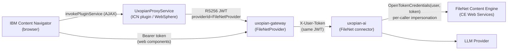
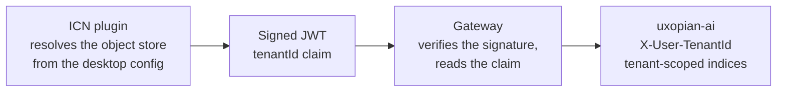

This guide covers how to configure the FileNet connector in `uxopian-ai` and install the Uxopian AI plugin for IBM Content Navigator (ICN). The plugin adds an **"Open in Uxopian"** context menu action on P8 documents and injects an AI Chat button into the ICN toolbar.

## Architecture



*Figure: The ICN plugin signs a JWT identifying the ICN user; the gateway validates it via `FileNetProvider` and forwards it to `uxopian-ai`, which reuses that same identity for every Content Engine call — so FileNet audits the real end user, not a shared service account (see [Phase 0.4](#04-configure-oidc-trust-on-the-content-platform-engine) for how the Content Engine comes to trust that token).*

Requires IBM FileNet P8 + ICN 3.0+, Content Engine **5.5.9 or later** (needed for the `OpenTokenCredentials` bearer-token authentication used for per-caller impersonation), and access to the CPE's Liberty configuration to register OIDC trust ([Phase 0.4](#04-configure-oidc-trust-on-the-content-platform-engine)). Building from source additionally needs Java 8, Maven 3.6+, and access to the Arondor Artifactory.

---

## Phase 0 — Configure the FileNet connector in uxopian-ai

Before installing the ICN plugin, `uxopian-ai` itself must be able to reach the FileNet Content Engine. This is independent of the ICN plugin — it's the backend connector that runs searches and reads/writes documents.

### 0.1 IBM CE Java API dependencies

The `filenet` module depends on two proprietary IBM Content Engine Java API artifacts (`jace`, `p8cel10n`), versioned via the single `filenet.version` property in `uxopian-ai/pom.xml`. Set it to match your CE server's version, and to **5.5.9 or later** (required for `OpenTokenCredentials`, see [0.3](#03-configure-the-filenet-connection)). These jars aren't on Maven Central — the root `pom.xml` already declares the Arondor Artifactory repositories where they're published, so no manual `install:install-file` step is needed as long as the build machine has network access and credentials for `artifactory.arondor.cloud`.

### 0.2 Expose the FileNet tools to the right Application

Since 2026.0.0-ft5, `plugins.tools.enabled-tags` no longer gates which tools get *registered* at startup: the four FileNet tool services register automatically as soon as the `filenet` plugin JAR is present in `plugins/` — no startup configuration needed for this part (see [Plugin system — Filtering tools by tag](../understanding/plugin_system.md#filtering-tools-by-tag)).

What you do need to configure is which caller is **allowed to use** them — that's controlled per [Application](../admin/managing_applications.md), not by a startup property. The ICN plugin's requests resolve to the Application derived from `FileNetProvider` (named `FileNet`, auto-created on first use, unless you set a different `X-Application-Id`). Open it in the admin UI and, under **Permissions**, whitelist the `filenet` tool tag (add `files`/`interaction` too if you use those tools).

:::warning[Do not also whitelist `flowerdocs` or `alfresco` on this Application]
FileNet, FlowerDocs, and Alfresco tools all expose overlapping document search/read/redact operations for different, incompatible backends. Whitelisting more than one ECM connector's tags on the same Application confuses the LLM about which backend to call — see [Choosing a document management backend](../understanding/plugin_system.md#choosing-a-document-management-backend). Keep this Application scoped to `filenet` only.
:::

:::info[The `enabled-tags` env var still matters once, at auto-creation]
`PLUGINS_TOOLS_ENABLED_TAGS` (default `flowerdocs,files`) only seeds the *default* Application's tool-tag whitelist the moment it is first auto-created. If you'd rather not depend on that timing, just edit the Application's Permissions directly in the admin UI as above — it always wins over whatever the property seeded.
:::

### 0.3 Configure the FileNet connection

Set the Content Engine connection and the properties surfaced to the LLM:

```yaml title="config/application.yml"
filenet:
  ce-api-url: http://<ce-host>:<port>/wsi/FNCEWS40MTOM/
  oidc-realm: ${FILENET_OIDC_REALM:}
  # Optional — overrides the built-in defaults (DocumentTitle, DateCreated, DateLastModified,
  # Creator, LastModifier, MajorVersionNumber, MimeType)
  common-system-properties:
    - name: DocumentTitle
      title: Document Title
      dataType: "xs:string"
      multiValued: false
      # allowedValues and usageHint are also accepted here — see below
    - name: DateCreated
      title: Date Created
      dataType: "xs:dateTime"
      multiValued: false
  # Optional — properties intended to be writable by the LLM. Not yet wired to a
  # callable tool — there is currently no LLM-callable way to update a FileNet
  # document property, so this list has no effect on tool behavior yet.
  writable-properties:
    - name: DocumentTitle
      title: Document Title
      dataType: "xs:string"
      multiValued: false
```

`ce-api-url` is the CEWS endpoint reachable from `uxopian-ai` (not the ICN/WebSphere host). Each property entry also accepts `allowedValues` and `usageHint` (both optional, not shown above) to constrain and document the property for the LLM.

There is no object store setting: the object store **is** the tenant, resolved per request from the ICN desktop (see [How the tenant is resolved](#how-the-tenant-is-resolved)).

:::info[No shared service account]
Every FileNet call is authenticated as the **current caller**: `uxopian-ai` wraps the caller's identity in an `OpenTokenCredentials` and runs the Content Engine call via `Credentials.doAs(...)`, so FileNet logs and authorizes against the real end user, with no fallback to a shared account. `oidc-realm` is the **LDAP realm name** already configured on the CPE (find it under **Security > Global security > User account repository** in the CPE's admin console) — not a name you invent, and not the OIDC issuer configured below.
:::

### 0.4 Configure OIDC trust on the Content Platform Engine

Per-caller impersonation only works if the Content Platform Engine trusts the JWT issued by the ICN plugin. **This is not configured in ACCE** — ACCE's "Managed User realm" / identity rules feature is for a different thing entirely (email-based self-registration for External Share).

The Content Platform Engine runs on **WebSphere Liberty**, which has a native `openidConnectClient-1.0` feature for exactly this: validating an inbound bearer JWT against an OpenID Connect provider it discovers **dynamically over HTTPS**, instead of a locally pinned certificate. This is standard Liberty server configuration — it applies the same way regardless of how CPE itself is deployed (VM, container, Kubernetes, or otherwise). The gateway already acts as that provider — it exposes the ICN plugin's signing key at standard discovery endpoints ([Phase 3](#phase-3--configure-the-gateway) registers the key; the gateway then serves it itself, no separate action needed):

- `https://<gateway-host>/.well-known/openid-configuration?issuer=icn-plugin`
- `https://<gateway-host>/.well-known/jwks.json`

:::warning[Do not use the RelyingParty Interceptor / `jvm_customize_options` for this]
Some older CPE guidance configures inbound OAuth/OIDC trust via `provider_1.*` JVM custom properties. That mechanism is for **classic WebSphere Application Server**, not Liberty — on Liberty it silently fails with `E_NOT_AUTHENTICATED` regardless of configuration. Use `openidConnectClient-1.0` below instead.
:::

1. Add a Liberty config snippet (`server.xml`, or a file under `configDropins/overrides/`) declaring the feature, an `authFilter` scoped to Content Engine Web Service calls only, and the `openidConnectClient` itself:

   ```xml title="e.g. configDropins/overrides/icn-plugin-oidc.xml"
   <server>
     <featureManager>
       <feature>openidConnectClient-1.0</feature>
     </featureManager>

     <authFilter id="icn-pluginWsiFilter">
       <requestUrl id="wsiUrl" urlPattern="/wsi/" matchType="contains"/>
     </authFilter>

     <openidConnectClient id="icn-plugin"
       authFilterRef="icn-pluginWsiFilter"
       realmName="icn-plugin"
       clientId="icn-plugin"
       clientSecret="not-used-no-live-oauth-flow"
       audiences="ALL_AUDIENCES"
       issuerIdentifier="icn-plugin"
       responseType="code"
       scope="openid profile email"
       mapIdentityToRegistryUser="true"
       authnSessionDisabled="true"
       inboundPropagation="supported"
       httpsRequired="true"
       validationMethod="introspect"
       signatureAlgorithm="RS256"
       userIdentifier="sub"
       uniqueUserIdentifier="sub"
       discoveryEndpointUrl="https://<gateway-host>/.well-known/openid-configuration?issuer=icn-plugin"/>
   </server>
   ```

   `clientSecret` is mandatory for a valid element but never actually used — only inbound bearer-token propagation happens here, no live OAuth authorization-code flow. Scoping `authFilterRef` to `/wsi/` (Content Engine Web Services) keeps this validation limited to Content Engine API calls — **do not** add a server-wide `webAppSecurity` override alongside this; it isn't needed for token validation and breaks ACCE (see the danger box below).

2. Import the gateway's TLS CA root into the truststore Liberty's SSL config points at (`trustStoreRef`, typically a PKCS12 file — check your SSL config for the exact path; this is separate from the JDK's own cacerts):

   ```bash
   keytool -importcert -trustcacerts -noprompt \
     -alias gateway-ca -file gateway-ca-root.crt \
     -keystore <path-to-trustStore.p12> -storetype PKCS12 -storepass <password>
   ```

   If this CA isn't trusted, the discovery fetch fails with `CWWKS1524E`/`CWWKS1525E` (`PKIX path building failed`).

3. Restart CPE, then confirm the JWT's user id (claim `sub`) resolves to a valid user in the P8 domain's directory — CE authorizes and audits against this identity directly.

:::info[Keystore rotation needs no CPE-side action]
The CPE fetches the signing key dynamically, so rotating the plugin's keystore only requires updating the `public-key` on the gateway's `FileNetProvider` instance ([Phase 3.1](#31-register-the-plugins-public-key-with-filenetprovider)) — nothing to redo on the CPE.
:::

:::danger[Do not add a server-wide webAppSecurity override — it breaks ACCE]
Some deployment tooling — notably the FNCM Kubernetes operator, which templates `open_id_connect_providers`
into this same config — automatically adds `<webAppSecurity overrideHttpAuthMethod="CLIENT_CERT"
allowFailOverToBasicAuth="true"/>` alongside it. This is **not** required for the WSI JWT validation
above (`authFilterRef` alone scopes which requests get intercepted) — it forces ACCE, which shares
this same Liberty server and has no FORM-login support in its own `web.xml`, into a plain
Basic-auth popup instead of its normal login page, with no known config-only fix once it's applied
(Liberty merges `webAppSecurity` per-attribute, so a later file cannot cleanly undo it). If you are
hand-configuring `server.xml` directly, simply never add a `webAppSecurity` override and ACCE stays
unaffected. If your deployment tooling adds it automatically and does not expose a way to suppress
it, this is a known limitation of that tooling, not of Liberty or the Content Platform Engine itself.
:::

:::note[On the FNCM operator for Kubernetes]
If your CPE is deployed via the FNCM Kubernetes operator, the snippet above is expressed instead as
`shared_configuration.open_id_connect_providers` and `shared_configuration.trusted_certificate_list`
in the `FNCMCluster` CR, which the operator renders into the equivalent Liberty config on your
behalf (`kubectl apply`, then the operator restarts the CPE pod — this reconciles into its own
ConfigMap on a separate schedule from other CR fields, so check it directly if the config looks
stale). The operator adds the `webAppSecurity` override from the danger box above unconditionally
whenever `open_id_connect_providers` is set, with no field to opt out.
:::

### Checkpoint 0 — Connector is up

Check uxopian-ai startup logs for confirmation:

```
Initializing FileNet CE client. CEWS: http://<ce-host>:<port>/wsi/FNCEWS40MTOM/
```

| Check | Expected |
|---|---|
| uxopian-ai logs | `FileNetSearchToolService`, `FileNetFilterToolService`, `FileNetDocumentToolService`, `FileNetRedactTool` registered |
| Admin UI tool list | The four FileNet tool services appear, tagged `filenet` |
| A search request, made as a real ICN user | Returns results without a CE connection error, and FileNet's own audit trail attributes the call to that user (not a shared account) |

---

## Plugin downloads

:::tip[Download]
**<a href={require('./uxopian-icn-plugin.zip').default} download="uxopian-icn-plugin.zip">uxopian-icn-plugin.zip</a>** — Maven source project to build for your environment (does not bundle IBM's proprietary `navigatorAPI.jar`, see [1.1](#11-supply-navigatorapijar))
:::

Only the source is distributed — no prebuilt JAR — so you build and control what's deployed to WebSphere.

### Key integration points

- **Configuration screen** — a Dojo widget in the ICN Admin Console lets an administrator set the Uxopian AI host without rebuilding (see [2.4](#24-configure-the-uxopian-ai-host)).
- **Context menu action** — `UxopianAction` adds **Open in Uxopian** on P8 documents.
- **Toolbar buttons** — `actionHandler.js` injects the AI Chat and AI Admin buttons and fetches short-lived signed JWTs (`JwtSigner`, 300 s TTL) to authenticate them.
- **Keystore** — `icn-plugin.p12` (PKCS12) ships as a default, with a `.jks` fallback for IBM Java 8; replace before production (see [Replacing the keystore](#replacing-the-keystore)).
- **Tests** — `mvn test` (JUnit 5/Mockito) and `npm install && npm test` (Jest, for `actionHandler.js`).

## Phase 1 — Build the plugin JAR

### 1.1 Supply navigatorAPI.jar

`navigatorAPI.jar` is declared as a `system`-scoped dependency in `pom.xml` and must be present at `./navigatorAPI.jar` relative to the project root — it is **not** included in the source package (proprietary IBM binary). The IBM Navigator API JAR can be found in your own ICN installation at `NavigatorApplication.ear/navigator.war/WEB-INF/lib/`.

### 1.2 Run the build

```bash
mvn clean package
```

The output JAR is `target/uxopian-icn-plugin.jar`. There is nothing to configure at build time — the Uxopian AI gateway host is set after deployment, from the ICN Admin Console (see [2.4](#24-configure-the-uxopian-ai-host)).

---

## Phase 2 — Deploy the plugin in ICN

### 2.1 Copy the JAR

Copy `uxopian-icn-plugin.jar` to a directory accessible by WebSphere, for example:

```bash
/opt/IBM/ICN/plugins/uxopian-icn-plugin.jar
```

### 2.2 Configure WebSphere system properties

Set these JVM custom properties in the WebSphere administration console under **Application servers → \<server\> → Java and Process Management → Process definition → Java Virtual Machine → Custom properties**:

| Property | Default | Description |
|---|---|---|
| `icn.plugin.bff.url` | `http://localhost:8085/gui/gateway/uxopian-ai/filenet` | Gateway backend URL as seen from WebSphere |
| `icn.plugin.keystore.path` | `icn-plugin.p12` | Path to the PKCS12 keystore file. If relative, it is resolved against the WebSphere process working directory; an absolute path is safer. If unset, the plugin falls back to the keystore bundled inside the JAR. |
| `icn.plugin.keystore.alias` | `icn-plugin` | Alias of the key pair inside the keystore |
| `icn.plugin.keystore.password` | `changeit` | Keystore password |

:::warning[Change the keystore and password before production]
The default `icn-plugin.p12` bundled in the JAR uses the password `changeit`. Generate a new key pair for each environment and set `icn.plugin.keystore.path` to an external file.
:::

### 2.3 Register the plugin in ICN Admin Console

1. Open the ICN Administration Console.
2. Navigate to **Plug-ins**.
3. Click **New Plug-in**.
4. Set the JAR file path to the location from step 2.1.
5. Click **Load**.
6. Confirm that the plugin name **Uxopian Plugin** and version **1.0.0** are displayed.
7. Save the configuration and restart ICN.

### 2.4 Configure the Uxopian AI host

The gateway URL is not baked into the JAR — it is set from the ICN Admin Console, via the configuration screen the plugin registers (`UxopianPlugin.getConfigurationDijitClass`):

1. In the ICN Administration Console, open **Plug-ins** and select **Uxopian Plugin**.
2. Click **Configure**.
3. Set **Uxopian AI Host URL** to your gateway's frontend-facing URL, for example `https://your-gateway-host/gui/gateway/uxopian-ai/filenet`. This must be an exact match for the fixed path the gateway route below expects — it is not an arbitrary prefix.
4. Save. No rebuild or restart is required — `actionHandler.js` fetches this value at runtime from `UxopianProxyService` (`op=config`, which reads it server-side via `PluginServiceCallbacks.loadConfiguration()`), the same way it fetches tokens.

There is no built-in default — if this field is left empty, the chat and admin actions fail with a "Uxopian AI Host URL is not configured" error instead of silently pointing at some other environment. This must be set explicitly for every deployment.

---

## Phase 3 — Configure the gateway

### 3.1 Register the plugin's public key with FileNetProvider

The gateway's `FileNetProvider` validates incoming JWTs using a **statically configured** public key — it does not fetch it dynamically. Retrieve the public key from the running plugin:

```bash
curl http://<websphere-host>:<icn-port>/navigator/jaxrs/UxopianPlugin/UxopianProxyService?op=public-key
```

The endpoint returns a PEM-encoded RSA public key. Register it as a **named instance** of `FileNetProvider` under `app.providers` — this is the standard way to configure `FileNetProvider`, even for a single P8 domain: it costs nothing extra now and means serving a second CPE later is just another entry, not a reconfiguration of the first.

```yaml title="application.yml (uxopian-gateway)"
app:
  providers:
    filenet:
      type: FileNetProvider      # the provider's @Service bean name
      config:
        public-key: |
          -----BEGIN PUBLIC KEY-----
          ...
          -----END PUBLIC KEY-----
        # public-key: /path/to/icn-plugin-public-key.pem   # a file path also works
        issuer: icn-plugin              # default: icn-plugin — must match the plugin's JWT issuer
        tenant-id: filenet               # default: filenet — fallback only, see below
        clock-skew-seconds: 300          # default: 300
```

The route ([3.2](#32-declare-the-gateway-route)) references this instance by the name chosen above — `provider: filenet` — not the bean type `FileNetProvider`.

:::warning[Re-register the key whenever the keystore changes]
If you replace the plugin's keystore ([Replacing the keystore](#replacing-the-keystore)), the public key changes too. Re-fetch it from `?op=public-key` and update this instance's `public-key` on the gateway, then restart the gateway.
:::

:::tip[Serving a second P8 domain from the same gateway]
Add another entry under `app.providers` with its own name and `public-key`/`issuer`/`tenant-id` (for example `filenet-tenant-b`), then point a second route at it via `provider: filenet-tenant-b`. See [Configuration reference — Named provider instances](../reference/configuration.md#named-provider-instances-appproviders).
:::

### How the tenant is resolved

One object store means one tenant. The object store's symbolic name **is** the uxopian-ai tenant id,
so a single plugin and gateway deployment serves every object store a desktop exposes — there is no
object store setting on either side, and no route or tenant value to add per object store.



The plugin resolves it server-side, from the desktop configuration:

1. If the request carries a `repositoryId` **that the desktop exposes**, that repository wins. ICN
   passes it for document-scoped actions.
2. Otherwise the desktop's **default repository** is used. The navigation bar entry points (chat,
   admin) are desktop-wide and carry no repository, so this is the normal path for them.
3. The tenant is that repository's **object store symbolic name**, which is not always the
   repository id — repository `OSFAST2PS` may map to object store `OS_FAST2_PS`.

Confirm the resolution in the Navigator logs:

```
Resolved object store 'OS_FAST2_PS' from repository 'OSFAST2PS'
```

:::info[A forged repositoryId cannot widen the scope]
`PluginServiceCallbacks.getRepositoryId()` reads a request parameter, so it is client-supplied — but
the desktop configuration is the authority. An id the desktop does not expose is ignored in favour of
the default, and the tenant is then signed into the JWT with the plugin's private key. The gateway
only reads the claim from a token whose signature it has already verified, so it is the plugin, never
the browser, that asserts the tenant.
:::

:::warning[Each object store is fully isolated]
Because the tenant drives data isolation, each object store gets its own OpenSearch indices and its
own configuration (prompts, agents, LLM providers). Configuration is **not** shared across object
stores: what you set up while browsing one is invisible from another.
:::

### 3.2 Declare the gateway route

Add a route in the gateway's `application.yml` for the FileNet integration. **It must be declared
before** any route matching `/gui/gateway/uxopian-ai/**` (the default FlowerDocs route, present in
every deployment) — see the warning below for why:

```yaml title="application.yml (uxopian-gateway)"
app:
  routes:
    # uxopian-ai-filenet MUST come first — see warning below.
    - id: uxopian-ai-filenet
      uri: http://uxopian-ai:8080
      path: /gui/gateway/uxopian-ai/filenet/**
      prefix: /gui/gateway/uxopian-ai/filenet/
      provider: filenet   # the app.providers instance name from 3.1, not the bean type
      rewritePath: /gui/gateway/uxopian-ai/filenet/?(?<segment>.*), /gui/gateway/uxopian-ai/$\{segment}
      security:
        - path: "/**/api/web-components/**"
          public: true
        - path: "/actuator/health"
          public: true
        - path: "/**/api/v1/admin/**"
          roles: [ "ADMIN" ]
        - path: "/**/prompt/**"
          roles: [ "ADMIN" ]
        - path: "/**/goal/**"
          roles: [ "ADMIN" ]
        - path: "/**/prompt-statistics"
          roles: [ "ADMIN" ]
        - path: "/**/admin/**"
          public: true
        - path: "/**/v3/**"
          public: true
        - path: "/**/swagger-ui/**"
          public: true

    # Already present in every deployment (not something you add for FileNet) — shown here
    # only to illustrate why declaration order matters, see warning below.
    - id: uxopian-ai
      uri: http://uxopian-ai:8080
      prefix: /gui/gateway/uxopian-ai/
      path: /gui/gateway/uxopian-ai/**
      provider: FlowerDocsProvider
```

The `path` value here must match the **Uxopian AI Host URL** configured on the plugin ([2.4](#24-configure-the-uxopian-ai-host)) (or the value of `icn.plugin.bff.url` for the backend route).

:::danger[Route declaration order matters — FileNet's route must come first]
`/gui/gateway/uxopian-ai/filenet/**` is a sub-path of the default FlowerDocs route's own pattern
(`/gui/gateway/uxopian-ai/**`). The gateway matches routes **in declaration order** and stops at
the first match — so if `uxopian-ai` is declared first, it silently wins for every FileNet
request too, injecting `FlowerDocsProvider` instead of `filenet`. Symptoms are confusing
because most of the flow still appears to work: the login exchange succeeds and a session cookie
is set, but it's stored keyed by `filenet`; the very next request then fails to resolve
it under the wrong provider key and 401s with `Authentication token is missing`, even though a
valid session cookie was sent. This is exactly the failure mode if `AI Admin` opens the right URL
but the admin panel itself 401s. Verify the actual provider being used for a request by checking
the gateway's own DEBUG logs for `DefaultProviderHeaderFilter` — it logs which route and provider
matched.
:::

:::warning[If a reverse proxy or load balancer sits in front of the gateway, `/gui/gateway/uxopian-ai/filenet` must be routed there too]
This path is a sub-path of `/gui/gateway/uxopian-ai`, so most proxy rules already routing that
prefix (for the default FlowerDocs route) cover it automatically. But a rule matching
`/gui/gateway/uxopian-ai` **exactly** (not as a shared prefix covering sub-paths) will NOT match
`/gui/gateway/uxopian-ai/filenet/...`, and `/gui/gateway/auth/login` (the login-exchange endpoint
the **AI Admin** button needs) is a *sibling* of `/gui/gateway/uxopian-ai`, not a child of it — so
it needs its own coverage regardless of how the FileNet route itself is configured. The safest
single rule is a prefix on `/gui/gateway` (not `/gui/gateway/uxopian-ai`), covering both. Verify
with a plain `curl -I <host>/gui/gateway/auth/login` (expect a gateway response, not a 404 from
some other backend) before assuming the ICN plugin's
admin/chat flows will work end-to-end.
:::

### 3.3 Verify connectivity

From WebSphere, confirm the gateway is reachable:

```bash
curl http://<gateway-host>:<port>/actuator/health
```

Expected: `{"status":"UP"}`

---

## Phase 4 — Validate

### 4.1 Fetch a token from the plugin service

From a browser that is logged into ICN, or using a tool that can forward the ICN session, call:

```
GET /navigator/jaxrs/UxopianPlugin/UxopianProxyService?op=token
```

Expected: `{"token":"eyJ..."}`

### 4.2 Test the gateway route with the token

```bash
curl -H "Authorization: Bearer <token>" \
  http://<gateway-host>:<port>/gui/gateway/uxopian-ai/filenet/api/v1/prompts
```

Expected: HTTP 200 with a list of prompts.

### 4.3 Test the context menu action and toolbar buttons in ICN

1. Log in to IBM Content Navigator.
2. Browse to a P8 document in the Document Library.
3. Right-click the document — **Open in Uxopian** should appear in the context menu.
4. Click the action — the Uxopian AI chat panel should open.
5. Verify the **AI Chat** toolbar button (chat bubble icon) appears in the ICN navigation bar.
6. Verify the **AI Admin** toolbar button (gear icon) appears next to the AI Chat button.
7. Click **AI Admin** — the browser should open a new tab on the gateway admin panel, authenticated automatically.

---

## Replacing the keystore

```bash
keytool -genkeypair -alias icn-plugin -keyalg RSA -keysize 2048 \
  -validity 3650 -storetype PKCS12 \
  -keystore /opt/IBM/ICN/keys/icn-plugin.p12 \
  -storepass <your-password>
```

Set `icn.plugin.keystore.path`, `.alias`, and `.password` as WebSphere JVM custom properties (Phase 2.2), then re-register the new public key with the gateway (Phase 3.1).

---

## Configuration reference

| JVM property | Default | Description |
|---|---|---|
| `icn.plugin.bff.url` | `http://localhost:8085/gui/gateway/uxopian-ai/filenet` | Uxopian AI gateway backend URL (server-side proxy target) |
| `icn.plugin.keystore.path` | `icn-plugin.p12` | PKCS12 keystore path. Relative paths resolve against the WebSphere JVM working directory. Falls back to the JAR-embedded keystore if the file does not exist. |
| `icn.plugin.keystore.alias` | `icn-plugin` | Key alias in the keystore |
| `icn.plugin.keystore.password` | `changeit` | Keystore password |
| `uxopian.icn.context.path` (Maven property) | `/navigator` | ICN servlet context path — used to construct the token endpoint URL |

| ICN plugin configuration (set via ICN Admin Console) | Default | Description |
|---|---|---|
| Uxopian AI Host URL (`uxopianAiHost`) | *(none — required)* | Frontend-facing gateway URL, fetched at runtime by `actionHandler.js` via `op=config` (`fetchUxopianHost()`). Set from **Plug-ins → Uxopian Plugin → Configure** ([2.4](#24-configure-the-uxopian-ai-host)) — no rebuild needed to change it. Chat/admin actions fail with an explicit error if it's left unset. |

| FileNet connector property (uxopian-ai) | Env variable | Default | Description |
|---|---|---|---|
| `filenet.ce-api-url` | — | (empty) | Content Engine Web Services (CEWS) endpoint. Required. |
| `filenet.oidc-realm` | `FILENET_OIDC_REALM` | (empty) | The CPE's existing LDAP realm name (see [0.3](#03-configure-the-filenet-connection)) — not an arbitrary name, and not the `issuer_identifier` configured in [Phase 0.4](#04-configure-oidc-trust-on-the-content-platform-engine). Used to build a per-caller `OpenTokenCredentials` — every CE call is authenticated as the current end user, not a shared account. Required. |
| `filenet.common-system-properties` | — | `DocumentTitle`, `DateCreated`, `DateLastModified`, `Creator`, `LastModifier`, `MajorVersionNumber`, `MimeType` | Properties surfaced to the LLM as the default data model. |
| `filenet.writable-properties` | — | (empty) | Properties intended to be writable by the LLM. Configured but not yet wired to a callable tool. |
| `plugins.tools.enabled-tags` | `PLUGINS_TOOLS_ENABLED_TAGS` | `flowerdocs,files,interaction` | Does **not** gate registration since 2026.0.0-ft5; only seeds the tool-tag whitelist of the auto-created default Application (see [0.2](#02-expose-the-filenet-tools-to-the-right-application)). |

| `FileNetProvider` `app.providers.<name>.config.*` key (uxopian-gateway) | Default | Description |
|---|---|---|
| `public-key` | — | PEM string or file path. RSA public key used to validate JWTs from the ICN plugin. Required. |
| `issuer` | `icn-plugin` | Expected JWT issuer. |
| `tenant-id` | `filenet` | Fallback tenant, used only for tokens with no `tenantId` claim. Normally the object store from the claim wins — see [How the tenant is resolved](#how-the-tenant-is-resolved). |
| `clock-skew-seconds` | `300` | Allowed clock skew when validating token expiry. |

## Common issues

| Symptom | Cause | Solution |
|---|---|---|
| FileNet tools appear in the admin's global tool list but the LLM never calls them | The Application the request resolves to (`FileNet` by default) does not whitelist the `filenet` tag in its Permissions | Add `filenet` to that Application's tool-tag whitelist, and make sure `flowerdocs`/`alfresco` aren't also whitelisted there (Phase 0.2) |
| `Initializing FileNet CE client` never logged, or CE connection error | `filenet.ce-api-url` missing or wrong | Verify the CEWS endpoint is reachable from uxopian-ai (Phase 0.3) |
| Data from the wrong object store, or an empty tenant in uxopian-ai | The plugin could not resolve the object store, so it omitted the `tenantId` claim and the gateway fell back to the instance's `tenant-id` | Check the Navigator logs for `tenant claim omitted` and confirm the desktop has a default repository — see [How the tenant is resolved](#how-the-tenant-is-resolved) |
| `Cannot impersonate caller against FileNet: missing user identity or token` | The current request has no authenticated user or token in `AiContext` | Confirm the gateway route is not `public: true` for this path, and that the ICN plugin's JWT reaches uxopian-ai unmodified as `X-User-Token` |
| `E_NOT_AUTHENTICATED` from FileNet | On every call: the CPE's `open_id_connect_providers` config doesn't trust the caller's JWT. For one specific user only: their JWT user id doesn't resolve to a valid CE user in the P8 domain directory | Confirm `issuer_identifier` matches the plugin's JWT issuer, `discovery_endpoint_url` is reachable, and `filenet.oidc-realm` is a real LDAP realm name (Phase 0.4); for a single user, check their directory entry |
| `CWWKS1524E`/`CWWKS1525E` (`PKIX path building failed`), or `CWWKS1739E`/`CWWKS1737E` right after | Liberty's `openidConnectClient` doesn't yet trust the CA signing the gateway's HTTPS certificate in its own dedicated truststore (separate from the JDK cacerts), so the discovery fetch fails — the second pair of errors is just a symptom of that failed fetch | Import that CA root into `shared_configuration.trusted_certificate_list` (Phase 0.4, step 2) |
| `op=token` returns `{"error":"..."}`, or IBM Java 8 keystore error | Keystore not found, wrong alias/password, or (Java 8) PKCS12 unsupported | Set `icn.plugin.keystore.path` to an absolute path and verify credentials; the plugin falls back to the bundled `.jks` automatically on Java 8 |
| JWT rejected by gateway | Public key not configured, or wrong `issuer`/`tenant-id`, on the `FileNetProvider` instance | Re-fetch the public key from `?op=public-key` and set this instance's `public-key` under `app.providers` on the gateway (Phase 3.1) |
| Chat panel blank, or web component assets 401/403 | `icn.plugin.bff.url`/Uxopian AI Host URL wrong, unreachable, or the gateway route isn't public for assets | Verify connectivity from WebSphere to the gateway and that `/api/web-components/**` is `public: true` |
| `AI Admin` 404s at `.../auth/login...` | The reverse proxy/load balancer in front of the gateway doesn't cover `/gui/gateway/auth/login` — see [3.2](#32-declare-the-gateway-route) | Route the broader `/gui/gateway` prefix there instead |
| `AI Admin` 401s with `Authentication token is missing` despite a `GATEWAY_SESSION` cookie | Route declaration order — see [3.2](#32-declare-the-gateway-route) | Move `uxopian-ai-filenet` before `uxopian-ai` in the routes list |
| Chat fails with `System prompt with id <name> not found` | `buildChatRequest()` was customized to reference a prompt that doesn't exist for this tenant (default sends none) | Remove the `PROMPT` entry, or create a prompt with that id for this tenant |
| ACCE shows a Basic-auth popup instead of its own login page | A `webAppSecurity` override was added alongside the OIDC config (e.g. auto-added by the FNCM Kubernetes operator) — see [0.4](#04-configure-oidc-trust-on-the-content-platform-engine) | If hand-configuring `server.xml`, remove the override — it isn't required. If your deployment tooling adds it unconditionally, this is a limitation of that tooling; the popup remains functional |

## Related pages

- [Getting started with FileNet](../getting_started/quickstart_filenet.mdx) — prerequisites and the overall integration path
- [Managing Applications](../admin/managing_applications.md) — scoping the `filenet` tool tag to the right caller
- [Configure gateway routes](./configure_gateway_routes.md) — `path`, `prefix`, `rewritePath`, debug logging
- [Authentication and gateway](../understanding/authentication.md)
- [Web components](../understanding/web_components.md)
- [Tools](../understanding/tools.md)
- [Downloads](../getting_started/downloads.mdx)
