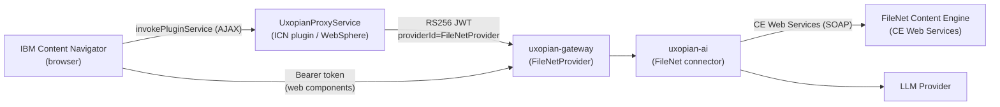

This guide covers how to configure the FileNet connector in `uxopian-ai` and install the Uxopian AI plugin for IBM Content Navigator (ICN). The plugin adds an **"Ouvrir dans Uxopian"** context menu action on P8 documents and injects an AI Chat button into the ICN toolbar.

## Architecture



*Figure: The ICN plugin signs a JWT with a private key stored in WebSphere, then forwards requests to the Uxopian AI gateway, which validates the JWT via `FileNetProvider`. The browser also loads the chat web components directly from the gateway using the same token. Independently, `uxopian-ai` connects to the FileNet Content Engine directly (CE Web Services) to run searches and read/write documents — this connection is configured in [Phase 0](#phase-0--configure-the-filenet-connector-in-uxopian-ai) and does not go through the ICN plugin.*

The plugin exposes three operations:

| Operation (`op=`) | Purpose |
|---|---|
| `token` | Returns a signed RS256 JWT (no roles) for the current ICN user — used by the browser to authenticate web component asset requests |
| `admin-token` | Returns a signed RS256 JWT with `ADMIN` role — used by the **Admin IA** toolbar button to create a gateway session before opening the admin panel |
| *(none)* | Proxies all other requests to the gateway backend (`icn.plugin.bff.url`) with the JWT attached |

## Prerequisites

| Requirement | Details |
|---|---|
| IBM FileNet P8 + IBM Content Navigator | Version 3.0+ |
| WebSphere Application Server | Hosts ICN |
| Java 8 (JDK) | Required only to rebuild from source |
| Maven 3.6+ | Required only to rebuild from source |
| Uxopian AI + gateway | Deployed and reachable from WebSphere, with the FileNet connector configured — see [Phase 0](#phase-0--configure-the-filenet-connector-in-uxopian-ai) |
| Access to the Arondor Artifactory | Required only when building `uxopian-ai` from source — provides the proprietary IBM CE Java API jars (`jace`, `p8cel10n`) |

---

## Phase 0 — Configure the FileNet connector in uxopian-ai

Before installing the ICN plugin, `uxopian-ai` itself must be able to reach the FileNet Content Engine. This is independent of the ICN plugin — it's the backend connector that runs searches and reads/writes documents.

### 0.1 IBM CE Java API dependencies

The `filenet` integration module depends on two proprietary IBM Content Engine Java API artifacts:

```xml title="uxopian-ai/pom.xml"
<filenet.version>5.5.6</filenet.version>
```

```xml title="uxopian-ai/integrations/filenet/connector/pom.xml"
<dependency>
    <groupId>com.filenet</groupId>
    <artifactId>jace</artifactId>
    <version>${filenet.version}</version>
</dependency>
<dependency>
    <groupId>com.filenet</groupId>
    <artifactId>p8cel10n</artifactId>
    <version>${filenet.version}</version>
</dependency>
```

These are not on Maven Central. The root `pom.xml` already declares the Arondor Artifactory repositories (`arondor-release` / `arondor-snapshot` at `artifactory.arondor.cloud`), where these jars are published — no manual `mvn install:install-file` step is needed as long as the build machine has network access and credentials for that Artifactory.

### 0.2 Enable the FileNet tools

FileNet tools are **disabled by default** — gated by the tool tag whitelist. Enable them before starting uxopian-ai:

```yaml title="config/application.yml"
plugins:
  tools:
    enabled-tags: filenet,flowerdocs,files,interaction
```

Or via environment variable:

```bash
PLUGINS_TOOLS_ENABLED_TAGS=filenet,flowerdocs,files,interaction
```

:::warning[Default value excludes FileNet]
The default is `flowerdocs,files,interaction`. If you do not override it, FileNet tools will not be registered and the LLM will not have access to FileNet, even if the plugin JAR is present.
:::

### 0.3 Configure the FileNet connection

Set the Content Engine connection and the properties surfaced to the LLM:

```yaml title="config/application.yml"
filenet:
  ce-api-url: http://<ce-host>:<port>/wsi/FNCEWS40MTOM/
  repository-id: <object-store-symbolic-name>
  username: <service-account>
  password: ${FILENET_PASSWORD:}
  # Optional — overrides the built-in defaults (DocumentTitle, DateCreated, DateLastModified,
  # Creator, LastModifier, MajorVersionNumber, MimeType)
  common-system-properties:
    - name: DocumentTitle
      title: Document Title
      dataType: "xs:string"
      multiValued: false
    - name: DateCreated
      title: Date Created
      dataType: "xs:dateTime"
      multiValued: false
  # Optional — properties the LLM is allowed to write via setDocumentProperty
  writable-properties:
    - name: DocumentTitle
      title: Document Title
      dataType: "xs:string"
      multiValued: false
```

`ce-api-url` is the Content Engine Web Services (CEWS) endpoint, reachable from `uxopian-ai` — not the ICN/WebSphere host. `repository-id` is the object store's symbolic name (not its GUID).

### Checkpoint 0 — Connector is up

Check uxopian-ai startup logs for confirmation:

```
Initializing FileNet CE client. CEWS: http://<ce-host>:<port>/wsi/FNCEWS40MTOM/, object store: <repository-id>
```

| Check | Expected |
|---|---|
| uxopian-ai logs | `FileNetSearchToolService`, `FileNetFilterToolService`, `FileNetDocumentToolService`, `FileNetRedactTool` registered |
| Admin UI tool list | The four FileNet tool services appear, tagged `filenet` |
| A search request | Returns results without a CE connection error |

---

## Plugin downloads

:::tip[Prebuilt JAR]
**<a href="/files/uxopian-ai/uxopian-icn-plugin.jar" download="uxopian-icn-plugin.jar">uxopian-icn-plugin.jar</a>** — ready to deploy, no build required
:::

:::tip[Source package]
**<a href={require('./uxopian-icn-plugin.zip').default} download="uxopian-icn-plugin.zip">uxopian-icn-plugin.zip</a>** — Maven project to rebuild for your environment
:::

Contents:

| File | Purpose |
|---|---|
| `pom.xml` | Maven build descriptor |
| `navigatorAPI.jar` | IBM FileNet Navigator API (local dependency, provided by IBM) |
| `icn-plugin.p12` | Default PKCS12 keystore — **replace before production** |
| `src/main/java/com/uxopian/icn/UxopianPlugin.java` | Plugin entry point — registers actions and services |
| `src/main/java/com/uxopian/icn/UxopianAction.java` | Context menu action for P8 documents |
| `src/main/java/com/uxopian/icn/UxopianFeature.java` | ICN feature panel (AI Chat tab) — defined but currently **not registered** in `UxopianPlugin`; the chat is opened only via the context menu action and the toolbar button below |
| `src/main/java/com/uxopian/icn/UxopianProxyService.java` | Servlet — JWT signing and request proxy |
| `src/main/java/com/uxopian/icn/jwt/JwtSigner.java` | RS256 JWT generation (30 s TTL) |
| `src/main/java/com/uxopian/icn/jwt/KeystoreLoader.java` | PKCS12/JKS keystore loader with WebSphere IBMJCE fallback |
| `src/main/resources/com/uxopian/icn/WebContent/actionHandler.js` | Dojo module — token fetch, web component injection, toolbar button |
| `src/main/resources/com/uxopian/icn/WebContent/icon.svg` | Chat button icon |
| `src/main/resources/com/uxopian/icn/icn-plugin.p12` | Keystore bundled inside the JAR (fallback when no external path is set) |
| `src/main/resources/com/uxopian/icn/icn-plugin.jks` | JKS version of the keystore for IBM Java 8 compatibility |

## Phase 1 — Build the plugin JAR

Skip this phase if you are deploying the prebuilt JAR included in the ZIP.

### 1.1 Set the target host

Open `pom.xml` and update the two Maven properties:

```xml title="pom.xml"
<properties>
    <!-- URL of the Uxopian AI gateway (frontend-facing) -->
    <uxopian.ai.host>https://your-gateway-host/gui/gateway/uxopian-ai-filenet</uxopian.ai.host>
    <!-- ICN context path — change if ICN is deployed under a different path -->
    <uxopian.icn.context.path>/navigator</uxopian.icn.context.path>
</properties>
```

`uxopian.ai.host` is injected into `actionHandler.js` at compile time via Maven resource filtering (delimiter `@`). The browser uses this URL to load the chat web component assets.

### 1.2 Run the build

```bash
mvn clean package
```

The output JAR is `target/uxopian-icn-plugin.jar`.

:::note[navigatorAPI.jar is a local dependency]
`navigatorAPI.jar` is declared as a `system`-scoped dependency in `pom.xml` and must be present at `./navigatorAPI.jar` relative to the project root. The IBM Navigator API JAR can be found in your ICN installation at `NavigatorApplication.ear/navigator.war/WEB-INF/lib/`.
:::

---

## Phase 2 — Deploy the plugin in ICN

### 2.1 Copy the JAR

Copy `uxopian-icn-plugin.jar` to a directory accessible by WebSphere, for example:

```bash
/opt/IBM/ICN/plugins/uxopian-icn-plugin.jar
```

### 2.2 Configure WebSphere system properties

Set these JVM custom properties in the WebSphere administration console under **Application servers → \<server\> → Java and Process Management → Process definition → Java Virtual Machine → Custom properties**:

| Property | Default | Description |
|---|---|---|
| `icn.plugin.bff.url` | `http://localhost:8085/gui/gateway/uxopian-ai-filenet-icn` | Gateway backend URL as seen from WebSphere |
| `icn.plugin.keystore.path` | `icn-plugin.p12` | Path to the PKCS12 keystore file. If relative, it is resolved against the WebSphere process working directory; an absolute path is safer. If unset, the plugin falls back to the keystore bundled inside the JAR. |
| `icn.plugin.keystore.alias` | `icn-plugin` | Alias of the key pair inside the keystore |
| `icn.plugin.keystore.password` | `changeit` | Keystore password |

:::warning[Change the keystore and password before production]
The default `icn-plugin.p12` bundled in the JAR uses the password `changeit`. Generate a new key pair for each environment and set `icn.plugin.keystore.path` to an external file.
:::

### 2.3 Register the plugin in ICN Admin Console

1. Open the ICN Administration Console.
2. Navigate to **Plug-ins**.
3. Click **New Plug-in**.
4. Set the JAR file path to the location from step 2.1.
5. Click **Load**.
6. Confirm that the plugin name **Uxopian Plugin** and version **1.0.0** are displayed.
7. Save the configuration and restart ICN.

---

## Phase 3 — Configure the gateway

### 3.1 Register the plugin's public key with FileNetProvider

The gateway's `FileNetProvider` validates incoming JWTs using a **statically configured** public key — it does not fetch it dynamically. Retrieve the public key from the running plugin:

```bash
curl http://<websphere-host>:<icn-port>/navigator/jaxrs/UxopianPlugin/UxopianProxyService?op=public-key
```

The endpoint returns a PEM-encoded RSA public key. Set it (as a PEM string or a path to a file containing it) in the gateway's configuration, alongside the other `FileNetProvider` JWT properties:

```yaml title="application.yml (uxopian-gateway)"
filenet:
  jwt:
    public-key: |
      -----BEGIN PUBLIC KEY-----
      ...
      -----END PUBLIC KEY-----
    # public-key: /path/to/icn-plugin-public-key.pem   # a file path also works
    issuer: icn-plugin              # default: icn-plugin — must match the plugin's JWT issuer
    tenant-id: filenet               # default: filenet
    clock-skew-seconds: 300          # default: 300
```

:::warning[Re-register the key whenever the keystore changes]
If you replace the plugin's keystore ([Modifying the plugin](#replacing-the-keystore)), the public key changes too. Re-fetch it from `?op=public-key` and update `filenet.jwt.public-key` on the gateway, then restart the gateway.
:::

### 3.2 Declare the gateway route

Add a route in the gateway's `application.yml` for the FileNet integration:

```yaml title="application.yml (uxopian-gateway)"
app:
  routes:
    - id: uxopian-ai-filenet
      uri: http://uxopian-ai:8080
      path: /**/uxopian-ai-filenet/**
      prefix: /**/uxopian-ai-filenet/
      provider: FileNetProvider
      rewritePath: ^(.*)/uxopian-ai-filenet/?(?<segment>.*), /gui/gateway/uxopian-ai/$\{segment}
      security:
        - path: "/**/api/web-components/**"
          public: true
        - path: "/actuator/health"
          public: true
        - path: "/**/api/v1/admin/**"
          roles: [ "ADMIN" ]
        - path: "/**/prompt/**"
          roles: [ "ADMIN" ]
        - path: "/**/goal/**"
          roles: [ "ADMIN" ]
        - path: "/**/prompt-statistics"
          roles: [ "ADMIN" ]
        - path: "/**/admin/**"
          public: true
        - path: "/**/v3/**"
          public: true
        - path: "/**/swagger-ui/**"
          public: true
```

The `path` value here must match `uxopian.ai.host` from `pom.xml` (or the value of `icn.plugin.bff.url` for the backend route). Adjust if your gateway uses a different path prefix.

### 3.3 Verify connectivity

From WebSphere, confirm the gateway is reachable:

```bash
curl http://<gateway-host>:<port>/actuator/health
```

Expected: `{"status":"UP"}`

---

## Phase 4 — Validate

### 4.1 Fetch a token from the plugin service

From a browser that is logged into ICN, or using a tool that can forward the ICN session, call:

```
GET /navigator/jaxrs/UxopianPlugin/UxopianProxyService?op=token
```

Expected: `{"token":"eyJ..."}`

### 4.2 Test the gateway route with the token

```bash
curl -H "Authorization: Bearer <token>" \
  http://<gateway-host>:<port>/gui/gateway/uxopian-ai-filenet/api/v1/prompts
```

Expected: HTTP 200 with a list of prompts.

### 4.3 Test the context menu action and toolbar buttons in ICN

1. Log in to IBM Content Navigator.
2. Browse to a P8 document in the Document Library.
3. Right-click the document — **Ouvrir dans Uxopian** should appear in the context menu.
4. Click the action — the Uxopian AI chat panel should open.
5. Verify the **AI Chat** toolbar button (chat bubble icon) appears in the ICN navigation bar.
6. Verify the **Admin IA** toolbar button (gear icon) appears next to the AI Chat button.
7. Click **Admin IA** — the browser should open a new tab on the gateway admin panel, authenticated automatically.

### Checkpoint — Integration is working

| Check | Expected |
|---|---|
| `GET ?op=token` | `{"token":"eyJ..."}` |
| `GET ?op=admin-token` | `{"token":"eyJ..."}` (JWT with `"roles":["ADMIN"]`) |
| `GET /api/v1/prompts` with token | HTTP 200 |
| ICN context menu | "Ouvrir dans Uxopian" action visible on P8 documents |
| ICN toolbar | AI Chat button and Admin IA button injected |
| Chat panel | Opens and returns LLM responses |
| Admin IA button | Opens admin panel in new tab, authenticated via `GATEWAY_SESSION` cookie |

---

## Modifying the plugin

### Changing the Uxopian AI host at runtime

The gateway URL baked into `actionHandler.js` at build time (`@uxopian.ai.host@`) is a compile-time setting. To change it without rebuilding, update `uxopian.ai.host` in `pom.xml` and rebuild with `mvn clean package`.

If you need a fully runtime-configurable host, modify `UxopianProxyService.java` to expose the host as a JVM system property and serve it to the frontend via an additional `op=config` endpoint.

### Replacing the keystore

Generate a new RSA key pair and PKCS12 keystore:

```bash
keytool -genkeypair -alias icn-plugin -keyalg RSA -keysize 2048 \
  -validity 3650 -storetype PKCS12 \
  -keystore /opt/IBM/ICN/keys/icn-plugin.p12 \
  -storepass <your-password>
```

Then set `icn.plugin.keystore.path`, `icn.plugin.keystore.alias`, and `icn.plugin.keystore.password` as WebSphere JVM custom properties and re-register the new public key with the gateway (Phase 3.1).

### Customizing the frontend behavior

`actionHandler.js` is a standard Dojo AMD module. It controls:
- Token fetching (`fetchToken` for chat, `fetchAdminToken` for admin)
- CSS and JS asset injection for the web components
- The `openChat` function (invoked by the context menu action and the AI Chat toolbar button)
- The `buildChatRequest` function (constructs the initial chat payload)
- The `openAdmin` function (invoked by the **Admin IA** toolbar button) — fetches an `admin-token`, then opens `GET <gateway-base>/auth/login?providerId=FileNetProvider&token=…&redirect=/admin/` in a new tab so the gateway sets the `GATEWAY_SESSION` cookie in a first-party context before redirecting to the admin panel. `<gateway-base>` is derived at runtime from `uxopian.ai.host` by replacing its last path segment — with the default `uxopian.ai.host`, the resulting URL is `https://iris.qa.dev.uxopian.com/gui/gateway/auth/login?...`, matching the gateway's `app.gateway.login-path` (default `/gui/gateway/auth/login`).

After editing, rebuild the JAR with `mvn clean package` to re-embed the updated file.

---

## Configuration reference

| JVM property | Default | Description |
|---|---|---|
| `icn.plugin.bff.url` | `http://localhost:8085/gui/gateway/uxopian-ai-filenet-icn` | Uxopian AI gateway backend URL (server-side proxy target) |
| `icn.plugin.keystore.path` | `icn-plugin.p12` | PKCS12 keystore path. Relative paths resolve against the WebSphere JVM working directory. Falls back to the JAR-embedded keystore if the file does not exist. |
| `icn.plugin.keystore.alias` | `icn-plugin` | Key alias in the keystore |
| `icn.plugin.keystore.password` | `changeit` | Keystore password |

| Maven property | Default | Description |
|---|---|---|
| `uxopian.ai.host` | `https://iris.qa.dev.uxopian.com/gui/gateway/uxopian-ai-filenet` | Frontend-facing gateway URL — baked into `actionHandler.js` at build time |
| `uxopian.icn.context.path` | `/navigator` | ICN servlet context path — used to construct the token endpoint URL |

| FileNet connector property (uxopian-ai) | Env variable | Default | Description |
|---|---|---|---|
| `filenet.ce-api-url` | — | (empty) | Content Engine Web Services (CEWS) endpoint. Required. |
| `filenet.repository-id` | — | (empty) | Object store symbolic name. Required. |
| `filenet.username` / `filenet.password` | `FILENET_PASSWORD` for the password | (empty) | FileNet service account credentials used for every CE call. |
| `filenet.common-system-properties` | — | `DocumentTitle`, `DateCreated`, `DateLastModified`, `Creator`, `LastModifier`, `MajorVersionNumber`, `MimeType` | Properties surfaced to the LLM as the default data model. |
| `filenet.writable-properties` | — | (empty) | Properties the LLM is allowed to update via `setDocumentProperty`. |
| `plugins.tools.enabled-tags` | `PLUGINS_TOOLS_ENABLED_TAGS` | `flowerdocs,files,interaction` | Must include `filenet` to register the FileNet tools. |

| FileNetProvider JWT property (uxopian-gateway) | Default | Description |
|---|---|---|
| `filenet.jwt.public-key` | — | PEM string or file path. RSA public key used to validate JWTs from the ICN plugin. Required. |
| `filenet.jwt.issuer` | `icn-plugin` | Expected JWT issuer. |
| `filenet.jwt.tenant-id` | `filenet` | Tenant assigned to authenticated ICN users. |
| `filenet.jwt.clock-skew-seconds` | `300` | Allowed clock skew when validating token expiry. |

## Tools exposed to the LLM

Once `filenet` is added to `plugins.tools.enabled-tags` ([Phase 0.2](#02-enable-the-filenet-tools)), the plugin registers the following tools, all tagged `filenet`:

### Search and filtering (`FileNetSearchToolService`, `FileNetFilterToolService`)

| Tool | Purpose |
|---|---|
| `getDataModel` | Returns the common system properties and document classes available for filtering |
| `buildClassFilter` | Builds an `ISCLASS()` CE SQL condition on document type |
| `buildPropertyContainsFilter` | Builds a `LIKE` condition for partial text match |
| `buildPropertyEqualsFilter` | Builds an exact-match condition on a property or status |
| `buildDateRangeFilter` | Builds a date range condition on `DateCreated`/`DateLastModified` |
| `buildFullTextFilter` | Builds a `CONTAINS()` full-text condition |
| `buildFolderScopedFilter` | Scopes the search to a folder |
| `buildAndClause` / `buildOrClause` | Combine two raw conditions with AND/OR |
| `buildAndClauseFromClauses` / `buildOrClauseFromClauses` | Combine existing filter clauses with AND/OR |
| `searchDocuments` | Executes the assembled CE SQL query |

### Documents (`FileNetDocumentToolService`)

| Tool | Purpose |
|---|---|
| `readDocumentText` | Reads the full OCR text of a document (via ARender) across all pages |
| `getDocumentMetadata` | Returns all metadata properties (system + custom class) of a document |
| `listFolderContents` | Lists documents in a folder (unfiltered, max 50) |
| `setDocumentProperty` | Updates a metadata property — only for properties listed in `filenet.writable-properties` |

### Redaction (`FileNetRedactTool`)

| Tool | Purpose |
|---|---|
| `prepareRedact` | Fetches the document, uploads it to ARender, and extracts text elements to redact |
| `applyObfuscation` | Runs the redaction pipeline and saves the result as a new version in FileNet |

The `FileNetHelper` bean (bridging FileNet documents to ARender for OCR) is always active — it is not gated by `plugins.tools.enabled-tags`.

## Common issues

| Symptom | Cause | Solution |
|---|---|---|
| FileNet tools absent from admin tool list | Tag whitelist excludes `filenet` | Set `PLUGINS_TOOLS_ENABLED_TAGS` to include `filenet` and restart uxopian-ai (Phase 0.2) |
| `Initializing FileNet CE client` never logged, or CE connection error | `filenet.ce-api-url` / `filenet.repository-id` missing or wrong | Verify the CEWS endpoint is reachable from uxopian-ai and the object store symbolic name is correct (Phase 0.3) |
| Build fails resolving `com.filenet:jace` / `com.filenet:p8cel10n` | No access to the Arondor Artifactory | Confirm network access and credentials for `artifactory.arondor.cloud` (Phase 0.1) |
| Context menu action missing | Plugin not loaded | Check ICN Admin Console plug-in list; confirm the JAR path is correct and ICN restarted |
| `op=token` returns `{"error":"..."}` | Keystore not found or wrong alias/password | Set `icn.plugin.keystore.path` to an absolute path; verify alias and password in WebSphere JVM custom properties |
| Web component assets fail to load (403/401) | `uxopian.ai.host` points to wrong URL or gateway route is not public for assets | Confirm `uxopian.ai.host` matches the gateway route; set `/api/web-components/**` to `public: true` |
| JWT rejected by gateway | Public key not configured, or wrong `issuer`/`tenant-id`, on `FileNetProvider` | Re-fetch the public key from `?op=public-key` and set `filenet.jwt.public-key` on the gateway (Phase 3.1) |
| Chat panel blank after opening | `icn.plugin.bff.url` unreachable from WebSphere | Test connectivity from WebSphere to the gateway; check firewall rules |
| IBM Java 8 keystore error | IBM JCE provider does not support PKCS12 by default | The plugin automatically falls back to the `.jks` keystore; ensure `icn-plugin.jks` is present alongside `icn-plugin.p12` |

## Related pages

- [Configure gateway routes](./configure_gateway_routes.md) — `path`, `prefix`, `rewritePath`, debug logging
- [Authentication and gateway](../understanding/authentication.md)
- [Web components](../understanding/web_components.md)
- [Downloads](../getting_started/downloads.mdx)
