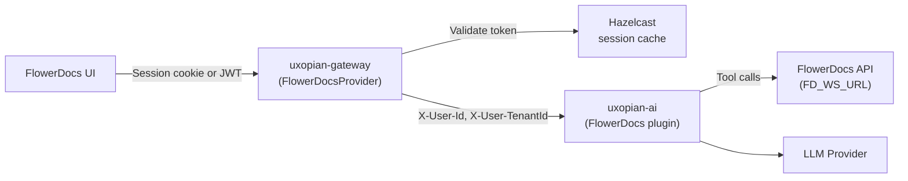

The FlowerDocs integration embeds the Uxopian AI chat panel inside the FlowerDocs UI. The gateway uses `FlowerDocsProvider` to validate FlowerDocs session tokens. The FlowerDocs plugin provides tools the LLM can call to search, redact, and navigate documents and folders within the FlowerDocs system.

## How the connection works



*Figure: Authentication flow and data path between FlowerDocs, the gateway, uxopian-ai, and the FlowerDocs API.*

## Prerequisites

- FlowerDocs deployment with Maven-based scope build
- Uxopian AI stack (uxopian-ai + gateway) running and accessible
- `FlowerDocsProvider` configured on the gateway
- FlowerDocs core web service URL (`FD_WS_URL`) accessible from uxopian-ai

## Connector installation

### 1. Configure FlowerDocsProvider on the gateway

In `gateway-application.yaml`, set the route provider to `FlowerDocsProvider`:

```yaml
app:
  routes:
    - id: uxopian-ai
      uri: http://uxopian-ai:8080
      path: /**
      provider: FlowerDocsProvider
```

`FlowerDocsProvider` validates FlowerDocs JWTs from `Authorization: Bearer` headers or `SESSION` cookies. It caches valid sessions in Hazelcast to reduce validation overhead.

### 2. Configure FD_WS_URL on uxopian-ai

The FlowerDocs plugin connects to the FlowerDocs core web service. Set the URL as an environment variable pointing to the FlowerDocs core endpoint:

```yaml
services:
  uxopian-ai:
    environment:
      - FD_WS_URL=http://flowerdocs-service:8080/core/
```

Replace with the actual FlowerDocs core endpoint in your environment.

### 3. Download the scope files

:::tip[Download]
**<a href={require('./uxopian-ai_flowerdocs_scope.zip').default} download="uxopian-ai_flowerdocs_scope.zip">uxopian-ai_flowerdocs_scope.zip</a>**
:::

Extract the ZIP. The archive contains scope files in two directories:

```
conf/
  Route/
    Gateway.xml             # Route definition pointing to the gateway
  Script/
    OpenChatShortcut/       # Keyboard shortcut script for opening chat
    UxoAiAdminShortcut/     # Keyboard shortcut script for opening admin UI
    consts/                 # Constants (gateway URL, tenant config)
    openChat/               # openChat() helper script
    refreshToken/           # Token refresh script
    translate/              # Translation helper script
    uxoai-utils/            # Utility scripts
    web-comp/               # Web component loader script
    OpenChatShortcut.xml    # Scope file descriptor
    UxoAiAdminShortcut.xml
    const.xml
    openChat.xml
    refreshToken.xml
    translate.xml
    uxoai-utils.xml
    web-comp.xml
```

### 4. Install the scope files into FlowerDocs

The scope files are installed via the FlowerDocs CLM service. Refer to your FlowerDocs documentation for the scope installation procedure.

### 5. Restart

After importing scope files and restarting FlowerDocs, the chat panel should be available via the keyboard shortcut or the openChat script.

## Configuration

| Parameter | Where | Description |
|---|---|---|
| `provider: FlowerDocsProvider` | `gateway-application.yaml` | Activates FlowerDocs JWT validation |
| `FD_WS_URL` | uxopian-ai environment | FlowerDocs core web service URL for tool calls (e.g. `http://<flowerdocs-endpoint>/core/`) |
| `Gateway.xml` URL | Scope file | Gateway URL as seen by the FlowerDocs server |

## Verification

1. Log in to FlowerDocs.
2. Use the keyboard shortcut or trigger the `openChat()` scope script.
3. The Uxopian AI chat panel should appear embedded in the FlowerDocs UI.
4. Ask the LLM to search for documents: "Find all contracts from 2024".
5. The LLM uses the FlowerDocs tools to query the FlowerDocs API and returns results.

## Sample use case

A document manager is searching for invoices in FlowerDocs. Using the chat panel, they type: "Find all invoices created after January 2024 with status Pending." The LLM calls `getTaskClassAndTagClassesDescriptions` to retrieve the data model, builds date and status criteria, calls `searchDocuments`, and returns a Markdown table of matching documents with clickable links to each document in the FlowerDocs interface.

## Common issues

| Error | Cause | Solution |
|---|---|---|
| 401 on all requests | `FlowerDocsProvider` failing to validate token | Check FlowerDocs JWT format and gateway logs |
| Chat panel does not appear | Scope files not imported or incorrect path | Verify scope file structure matches FlowerDocs scope import layout |
| Tool calls fail | `FD_WS_URL` unreachable | Verify uxopian-ai can reach the FlowerDocs core endpoint |
| Session not found after login | Hazelcast not configured or unreachable | Check Hazelcast configuration in `hazelcast.yml` |
| Wrong tenant | FlowerDocs JWT does not include tenant | Verify `FlowerDocsProvider` extracts tenant ID correctly |

## Related pages

- [Authentication and gateway](../understanding/authentication.md)
- [Tools](../understanding/tools.md)
- [Plugin system](../understanding/plugin_system.md)
- [Configure FlowerDocs scope files](./configure_flowerdocs_scope.mdx)
- [Environment variables reference](../reference/environment_variables.md)
