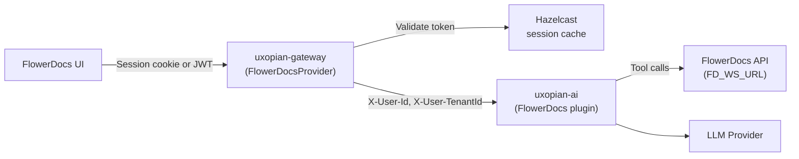
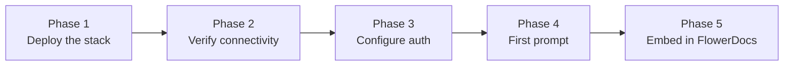

This guide walks through the complete integration of Uxopian AI into a FlowerDocs deployment. Follow the phases in order. Each phase ends with a validation checkpoint. **Do not move to the next phase until the current one passes** — this avoids context-switching between infrastructure and UI concerns.

## Architecture



*Figure: Authentication flow and data path between FlowerDocs, the gateway, uxopian-ai, and the FlowerDocs API.*

## Integration roadmap



---

## Phase 1 — Deploy the Uxopian AI stack

Install and start `uxopian-ai` and `uxopian-gateway`. Choose one of the two installation methods:

- **Docker Compose** — Recommended for most deployments. See [Docker installation](../installation/docker.md).
- **Java service** — For environments without Docker. See [Java installation](../installation/java.md).

At minimum, the stack must include:

| Service | Purpose |
|---|---|
| `uxopian-ai` | Core application — handles conversations, LLM calls, and FlowerDocs tool calls |
| `uxopian-gateway` | Public entry point — authenticates requests before forwarding to uxopian-ai |
| `opensearch` | Persistence store for conversations, prompts, and provider configuration |

### Checkpoint 1 — Stack is up

```bash
curl http://<gateway-host>:<port>/actuator/health
```

Expected response:

```json
{"status":"UP"}
```

If the gateway does not respond, check that the containers or services have started and that no port conflict exists. Check logs:

```bash
# Docker
docker compose logs uxopian-gateway uxopian-ai

# Java service
journalctl -u uxopian-gateway -n 50
```

---

## Phase 2 — Verify service connectivity

:::info[Docker deployments — read this first]
Container-to-container URLs must use **Docker service names** as hostnames, not `localhost` or the host machine IP. `localhost` inside a container refers to the container itself. See [Docker networking and URL configuration](../installation/docker.md#docker-networking-and-url-configuration) for the full explanation, external network setup, and DNS debugging.
:::

### 2.1 Configure FD_WS_URL

Set `FD_WS_URL` to the FlowerDocs Core URL **as seen by uxopian-ai** — not by user browsers:

```yaml
# Same Docker Compose stack — use the FlowerDocs Core service name
FD_WS_URL=http://flowerdocs-core:8080/core/

# FlowerDocs in a separate Docker stack — join its network first, then use its service name
FD_WS_URL=http://flowerdocs-core:8080/core/

# Java service on the same host (no Docker isolation)
FD_WS_URL=http://localhost:8080/core/
```

If FlowerDocs runs in a separate Compose stack, `uxopian-ai` must join its Docker network. Find the FlowerDocs Core container name and network:

```bash
docker ps --format '{{.Names}}' | grep -i flower
docker inspect <flowerdocs-core-container> --format '{{range $k,$v := .NetworkSettings.Networks}}{{$k}}{{end}}'
```

Then declare the external network in the Uxopian AI Compose file:

```yaml
# docker-compose.yml (Uxopian AI)
services:
  uxopian-ai:
    networks:
      - uxopian-ai-net
      - flowerdocs-net   # Join the FlowerDocs network

networks:
  uxopian-ai-net:
  flowerdocs-net:
    external: true
    name: <exact-network-name>   # From docker network ls
```

### 2.2 Verify internal connectivity

From inside the `uxopian-ai` container, confirm that FlowerDocs Core is reachable:

```bash
docker exec -it <uxopian-ai-container> sh
curl http://flowerdocs-core:8080/core/rest/actuator/health
```

If `nslookup flowerdocs-core` returns `NXDOMAIN`, the containers are not on the same network. FlowerDocs tool calls will fail silently at query time if this URL is unreachable.

### Checkpoint 2 — Connectivity verified

| Check | Expected |
|---|---|
| `GET /actuator/health` on gateway | `{"status":"UP"}` |
| `curl FD_WS_URL` from inside uxopian-ai container | HTTP 200 |
| OpenSearch reachable from uxopian-ai | No connection errors in logs |

---

## Phase 3 — Configure and validate authentication

### 3.1 Configure FlowerDocsProvider on the gateway

In `gateway-application.yaml`, set the route provider to `FlowerDocsProvider`:

```yaml
app:
  routes:
    - id: uxopian-ai
      uri: http://uxopian-ai:8080
      path: /**
      provider: FlowerDocsProvider
```

`FlowerDocsProvider` validates FlowerDocs JWTs from `Authorization: Bearer` headers or `SESSION` cookies. It caches valid sessions in Hazelcast to reduce validation overhead.

:::warning[The provider name must match exactly]
The `provider` value must match a Spring bean name registered in the gateway. If `FlowerDocsProvider` is misspelled or missing from the classpath, the gateway will reject all requests with 500 or start without any provider, falling through to an unconfigured state. Check gateway startup logs for `Registered provider: FlowerDocsProvider`.
:::

### 3.2 Verify the LLM default provider exists

In `config/llm-clients-config.yml`, check that the provider referenced in `llm.default.provider` is actually defined under `llm.provider.globals`:

```yaml
llm:
  default:
    provider: openai          # ← this value must match a provider below
    model: gpt-5.1
  provider:
    globals:
      - provider: openai      # ← must match the default above
        defaultLlmModelConfName: gpt5
        globalConf:
          apiSecret: ${OPENAI_API_KEY:}
```

If the `default.provider` names a provider that does not appear in `globals`, every request will fail at the LLM call stage with a "provider not found" error — with no useful message in the chat panel.

### 3.3 Test authentication with a FlowerDocs token

Log in to FlowerDocs and retrieve a JWT token. Then test the gateway directly:

```bash
curl -H "Authorization: Bearer <your-flowerdocs-jwt>" \
  http://<gateway-host>:<port>/api/v1/prompts
```

Expected: HTTP 200 with a JSON list of prompts.

If you get HTTP 401, check:
- The token format (FlowerDocs JWT vs session cookie)
- The Hazelcast configuration (session caching must be reachable)
- Gateway logs for the specific validation failure

:::tip[Test interface — Swagger UI]
The gateway exposes a Swagger UI at `/swagger-ui/index.html`. Use it to test authenticated endpoints without writing curl commands. Select `Authorize` and paste your FlowerDocs JWT.
:::

### Checkpoint 3 — Authentication works

| Check | Expected |
|---|---|
| `GET /api/v1/prompts` with FlowerDocs JWT | HTTP 200 |
| `GET /api/v1/prompts` without token | HTTP 401 |
| Gateway logs | No `FlowerDocsProvider` errors |

---

## Phase 4 — Send your first prompt

This phase validates the full chain: gateway → uxopian-ai → LLM → response. Do this before touching FlowerDocs UI integration.

### 4.1 Open the admin UI

The admin UI is available at `http://<gateway-host>:<port>/admin`. It requires an `ADMIN` or `SYSTEM_ADMIN` role in your FlowerDocs token.

From the admin UI you can:
- Verify that the LLM provider is loaded and active
- Inspect configured prompts and goals
- Monitor usage statistics

### 4.2 Send a test request via the REST API

With an authenticated FlowerDocs token, send a minimal chat request:

```bash
curl -X POST http://<gateway-host>:<port>/api/v1/requests \
  -H "Authorization: Bearer <your-flowerdocs-jwt>" \
  -H "Content-Type: application/json" \
  -d '{
    "inputs": [{
      "role": "USER",
      "content": [{ "type": "text", "value": "Hello, can you confirm you are working?" }]
    }]
  }'
```

A successful response includes a `response` field with the LLM reply and a non-null `conversationId`.

If the request times out or returns an LLM error:
- Verify the API key in `llm-clients-config.yml`
- Confirm `llm.default.provider` matches a configured provider (see Phase 3.2)
- Check uxopian-ai logs for the actual error

### 4.3 Test a FlowerDocs tool call

To confirm that the FlowerDocs plugin is wired correctly, ask the LLM to list documents:

```bash
curl -X POST http://<gateway-host>:<port>/api/v1/requests \
  -H "Authorization: Bearer <your-flowerdocs-jwt>" \
  -H "Content-Type: application/json" \
  -d '{
    "inputs": [{
      "role": "USER",
      "content": [{ "type": "text", "value": "Search for all documents in the system." }]
    }]
  }'
```

The LLM should issue a FlowerDocs tool call and return document results. If the tool call fails, verify that `FD_WS_URL` is reachable from uxopian-ai (Phase 2.2) and that the FlowerDocs token is forwarded correctly.

### Checkpoint 4 — LLM chain is validated

| Check | Expected |
|---|---|
| POST `/api/v1/requests` with text message | LLM response in reply |
| FlowerDocs tool call triggered | Documents returned in response |
| Admin UI provider status | Provider listed as active |

At this point the backend stack is fully functional. You can now move to UI integration with confidence.

---

## Phase 5 — Embed the chat panel in FlowerDocs

### 5.1 Download the scope files

:::tip[Download]
**<a href={require('./uxopian-ai_flowerdocs_scope.zip').default} download="uxopian-ai_flowerdocs_scope.zip">uxopian-ai_flowerdocs_scope.zip</a>** — see [Configure FlowerDocs scope files — this archive needs a refresh](./configure_flowerdocs_scope.mdx#download-the-scope-files) before relying on it.
:::

Extract the ZIP. The archive contains scope files loaded by FlowerDocs in dependency order:

| Order | File | Role |
|---|---|---|
| 0 | `const.xml` / `consts/` | **Required** — gateway URL constants used by all other scripts |
| 1 | `uxoai-utils.xml` / `uxoai-utils/` | **Required** — shared helper functions (`createAIAction`, `contextualInput`, `openChatComp`) |
| 2 | `web-comp.xml` / `web-comp/` | **Required** — loads the JS bundle from the gateway; registers `createChat()` |
| 2 | `openChat.xml` / `openChat/` | Adds a contextual action button on documents/folders |
| 2 | `OpenChatShortcut.xml` / `OpenChatShortcut/` | Keyboard shortcut to open a blank chat panel |
| 2 | `UxoAiAdminShortcut.xml` / `UxoAiAdminShortcut/` | Shortcut to the Uxopian AI admin panel (admins only) |
| 2 | `translate.xml` / `translate/` | Adds a translation action using a pre-built prompt |
| 2 | `qp-search.xml` / `qp-search/` | Quick Prompt — captures search results for context |
| 3 | `qp-connector.xml` / `qp-connector/` | Quick Prompt — maps FlowerDocs context; exposes `window.qpHandleToggle` |
| 3 | `qp-loader.xml` / `qp-loader/` | Quick Prompt — loads the Quick Prompt bundle |
| 4 | `qp-button.xml` / `qp-button/` | Quick Prompt — header toggle button (optional) |
| — | `Route/Gateway.xml` | Reverse-proxy route: FlowerDocs `/gateway/**` → uxopian-gateway |

:::danger[web-comp is a hard prerequisite for all other scripts]
`web-comp` fetches the Uxopian AI JavaScript bundle and stylesheet from the gateway and injects them into the FlowerDocs page. This is what registers the `createChat()` function. Without it, every script that opens the chat panel will fail silently — no error, no panel.

Before importing the scope, verify that:
1. `web-comp` is present in the scope archive.
2. The gateway URL in `consts/` is reachable from **user browsers** (not just the FlowerDocs server).
3. The gateway serves `/api/web-components/chat/script` and `/api/web-components/chat/style`.
:::

See [Configure FlowerDocs scope files](./configure_flowerdocs_scope.mdx) for a detailed description of each file and customization steps.

### 5.2 Customize the scope files

Before importing, update two values:

1. **`conf/Route/Gateway.xml`** — set the `URL` tag to the uxopian-gateway URL as seen from the **FlowerDocs server**.
2. **`conf/Script/consts/`** — verify that `GATEWAY_PATH` matches the route path in `Gateway.xml` and that `UXO_AI_ENDPOINT` resolves to a URL reachable from **user browsers**.

### 5.3 Install the scope files into FlowerDocs

Import the scope files with the [Command Line Manager (CLM)](/docs/flowerdocs/install/clm/clm), the same tool used for any other FlowerDocs [scope](/docs/flowerdocs/concepts/scope) content.

### 5.4 Restart FlowerDocs

After importing scope files, restart the FlowerDocs GUI.

### Checkpoint 5 — Chat panel works in FlowerDocs

1. Log in to FlowerDocs.
2. Open a document or folder.
3. Use the keyboard shortcut assigned to `OpenChatShortcut`, or click the chat action button in the header.
4. The Uxopian AI chat panel should appear embedded in the FlowerDocs UI.
5. Type a question: *"Find all invoices from 2024."*
6. The LLM should use the FlowerDocs tools to query the API and return results.

If the panel does not appear, open browser developer tools and check:
- Network tab: does `/api/web-components/chat/script` return HTTP 200?
- Console: is `createChat is not defined`? → `web-comp` failed to load.
- Console: is `UXO_AI_ENDPOINT is not defined`? → `consts` is missing or not loaded.

---

## Configuration reference

| Parameter | Where | Description |
|---|---|---|
| `provider: FlowerDocsProvider` | `gateway-application.yaml` | Activates FlowerDocs JWT validation |
| `FD_WS_URL` | uxopian-ai environment | FlowerDocs core **web service** URL for tool calls (unrelated to the browser WebSocket below, despite the name) |
| `llm.default.provider` | `llm-clients-config.yml` | Must match an entry in `llm.provider.globals` |
| `Gateway.xml` URL | Scope file | Gateway URL as seen by the **FlowerDocs server** — feeds the scoped, proxied `UXO_AI_ENDPOINT` |
| `consts/wsGatewayUrl` | Scope file, optional | `uxopian-gateway`'s own public Ingress URL, as seen by **user browsers** — only needed for the WebSocket channel, see [Configure FlowerDocs scope files](./configure_flowerdocs_scope.mdx#why-websocket-needs-a-separate-direct-endpoint) |
| `gateway-service` `ingress.*` | Helm values (`uxopian-gateway`) | Exposes the gateway directly, for the WebSocket channel only |

## Common issues

| Error | Cause | Solution |
|---|---|---|
| 401 on all gateway requests | `FlowerDocsProvider` failing to validate token | Check FlowerDocs JWT format and gateway logs |
| Gateway starts but all requests fail with 500 | Provider name misspelled or not registered | Check gateway logs for `Registered provider` entries |
| LLM returns "provider not found" | `llm.default.provider` names a non-existent provider | Align `default.provider` with an entry in `llm.provider.globals` |
| Tool calls fail silently | `FD_WS_URL` unreachable from uxopian-ai | Verify with `docker exec … curl FD_WS_URL` — if `NXDOMAIN`, join the FlowerDocs Docker network |
| `FD_WS_URL=http://localhost/core/` fails | `localhost` = the container, not the host | Use the FlowerDocs Core Docker service name instead |
| Chat panel does not appear | `web-comp` not loaded or gateway URL wrong | Check browser console for `createChat is not defined` |
| Session not found after login | Hazelcast not configured or unreachable | Check Hazelcast configuration in `hazelcast.yml` |
| Chat/Quick Prompt answer OK but server→client actions don't fire | `wsGatewayUrl` unset, or the gateway has no direct Ingress | Expected degraded state if unset — see [Why WebSocket needs a separate, direct endpoint](./configure_flowerdocs_scope.mdx#why-websocket-needs-a-separate-direct-endpoint); this never worked through FlowerDocs' own proxy on any version |

## Troubleshooting

### No response received after submitting a message

The chat panel opens, the user types a message, and nothing comes back — no error, no response, no loading indicator. This is almost always a connectivity or routing problem between the browser and uxopian-ai.

**Step 1 — Open the browser Network tab**

Open DevTools (F12), go to the **Network** tab, and submit the message again. Filter on `Fetch/XHR`. Look for a request to `…/api/v1/requests` (REST) or `…/ws/...` (WebSocket).

**Step 2 — Read the HTTP status**

The status code points directly to the layer that failed:

| Status | What it means | Where to look |
|---|---|---|
| **504 Gateway Timeout** | A proxy between the browser and uxopian-ai timed out waiting for a response | See [504 — proxy timeout](#504--proxy-timeout) below |
| **404 Not Found** | The request reached a server but no route matched | See [404 — wrong endpoint](#404--wrong-endpoint) below |
| **401 Unauthorized** | The request reached the gateway but authentication failed | See [401 — authentication failure](#401--authentication-failure) below |
| **No status / CORS error** | The request never reached the server — network error, wrong protocol, or CORS | See [Network error / CORS](#network-error--cors) below |

#### 504 — proxy timeout

A 504 means a proxy gave up waiting for an upstream response. Most common causes:

**Legacy FlowerDocs (Zuul-based proxy) buffering a streaming request.** Check the request URL in the Network tab. If it contains `/plugins/<scope>/gateway/` on a pre-2026 FlowerDocs, the request goes through Zuul, which is HTTP/1.1 and buffers responses — SSE streaming times out. This is a legacy-only issue: FlowerDocs 2026's proxy (Spring Cloud Gateway Server MVC) forwards streaming HTTP responses fine, so `UXO_AI_ENDPOINT` stays on the scoped, proxied path there — do not "fix" this on 2026 by bypassing it.

**A WebSocket request timing out or hanging with no useful status.** This is not a proxy-timeout scenario to fix by tuning timeouts — FlowerDocs' proxy (Zuul or, on 2026, Spring Cloud Gateway Server MVC) **cannot forward a WebSocket upgrade at all**, on any version. See [Configure FlowerDocs scope files — Why WebSocket needs a separate, direct endpoint](./configure_flowerdocs_scope.mdx#why-websocket-needs-a-separate-direct-endpoint). The fix is `wsGatewayUrl` pointing at a direct, public Ingress on `uxopian-gateway` itself — never route the WebSocket back through FlowerDocs' `/gateway/**` Route.

**uxopian-ai itself timed out.** The LLM call took longer than the proxy's timeout. Increase the proxy timeout, or reduce the LLM response time by tuning the model (see [LLM response timeout](#llm-response-times-out) below).

**uxopian-ai unreachable from the gateway.** Verify with:

```bash
docker exec -it <gateway-container> sh
curl http://ai-standalone-service:8080/actuator/health
```

If this fails, the gateway cannot reach uxopian-ai — check that both containers are on the same Docker network.

#### 404 — wrong endpoint

The request reaches a server but the path doesn't match any route. Common causes:

- `UXO_AI_ENDPOINT` uses the wrong path — check `consts/` and compare with the `CONTEXT_PATH` set on uxopian-ai.
- The gateway route `path` doesn't match what the browser sends — run `curl http://localhost:8085/actuator/gateway/routes` from the gateway container to inspect loaded routes.
- `rewritePath` is misconfigured — the backend receives a path it doesn't recognise. Enable gateway route debug logging:

  ```yaml
  logging:
    level:
      com.uxopian.ai: DEBUG
      org.springframework.cloud.gateway: TRACE
  ```

  See [Configure gateway routes](./configure_gateway_routes.md) for the step-by-step path derivation.

#### 401 — authentication failure

The gateway rejected the request. Check in order:

1. **Session warm-up ping not fired.** The `fetch(UXO_AI_ENDPOINT)` call in `OpenChatShortcut` must succeed before `createChat()` is called. Open the Network tab and look for a request to `UXO_AI_ENDPOINT` (the scoped, FlowerDocs-proxied path at `/gui/plugins/<scope>/gateway/uxopian-ai`). If it returned 401, the user's FlowerDocs session was not forwarded correctly.

2. **FlowerDocsProvider not loaded.** Check gateway startup logs for `Registered provider: FlowerDocsProvider`. A missing or misspelled provider name causes 401 on every request.

3. **Hazelcast session cache not reachable.** `FlowerDocsProvider` stores validated sessions in Hazelcast. If Hazelcast is down, session lookups fail. Check `hazelcast.yml` and gateway logs for Hazelcast connection errors.

4. **Token format mismatch.** Verify that the FlowerDocs session is sent as a `SESSION` cookie or `Authorization: Bearer` header, as expected by `FlowerDocsProvider`.

Rerun the Checkpoint 3 curl from Phase 3 to verify authentication end-to-end:

```bash
curl -H "Authorization: Bearer <your-flowerdocs-jwt>" \
  http://<gateway-host>:<port>/api/v1/prompts
```

#### Network error / CORS

The browser shows a network error or CORS warning in the console with no HTTP status.

- **`wsGatewayUrl` unset or unreachable.** If `WS_UXO_AI_ENDPOINT` is empty, no WebSocket connection is attempted at all — this is the graceful-degradation default, not an error (chat/Quick Prompt still answer over `UXO_AI_ENDPOINT`). If it is set, confirm the direct Ingress on `gateway-service` actually resolves and terminates TLS (`curl -I https://<wsGatewayUrl>/actuator/health`).
- **CORS on the direct gateway Ingress.** A cross-origin call from the FlowerDocs page's origin to `wsGatewayUrl` needs that origin listed in `gateway-service`'s `cors.allowedOrigins` Helm value — an empty list means no CORS headers at all, not a permissive default. This has no effect on the WebSocket routes themselves (they carry no auth either way) but the browser still enforces CORS on the handshake.
- **Do not try to fix this by routing through FlowerDocs' proxy.** `UXO_AI_ENDPOINT` (the scoped, FlowerDocs-proxied path) works for REST/SSE on FlowerDocs 2026, but forwarding a WebSocket through it will never work, on any FlowerDocs version — see [504 — proxy timeout](#504--proxy-timeout) above.

---

### LLM response times out

The chat panel shows a loading indicator but the response never arrives, or arrives after a very long delay and then fails with a timeout error.

**Increase the LLM timeout via the admin UI (live, no restart):**

1. Open the admin UI at `http://<gateway-host>:<port>/admin`.
2. Navigate to **LLM providers** and open the active provider.
3. Find the **model configuration** for the model in use.
4. Increase `timeout` (in milliseconds). A value of `120000` (2 minutes) is reasonable for long documents.
5. Save. The change takes effect immediately without restarting uxopian-ai.

**Persist the timeout in `llm-clients-config.yml`:**

```yaml
llm:
  provider:
    globals:
      - provider: openai
        globalConf:
          apiSecret: ${OPENAI_API_KEY:}
          timeout: 120000          # ms — applies to all models for this provider
    models:
      - name: gpt-4.1
        conf:
          timeout: 180000          # ms — overrides the provider-level timeout for this model
```

If the timeout happens before the LLM even responds (e.g., the request itself hangs), the problem is likely in the network path, not the LLM. Check uxopian-ai logs for the actual error:

```bash
docker compose logs uxopian-ai --tail=50
```

Look for `TimeoutException`, `ConnectException`, or `ReadTimeoutException`. A `ConnectException` means uxopian-ai cannot reach the LLM provider API — check firewall rules and that the API key is valid.

---

## Related pages

- [Configure FlowerDocs scope files](./configure_flowerdocs_scope.mdx)
- [Configure gateway routes](./configure_gateway_routes.md) — rewritePath, prefix, YAML anchors
- [Authentication and gateway](../understanding/authentication.md)
- [Embed in a web application](./embed_in_web_application.md)
- [Tools](../understanding/tools.md)
- [Environment variables reference](../reference/environment_variables.md)
