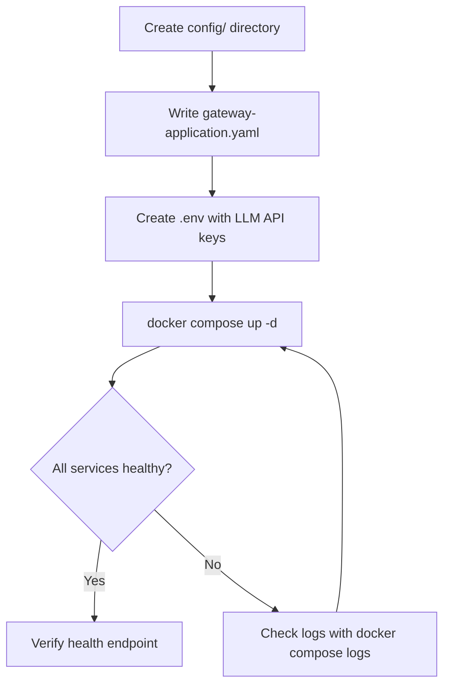

The [Getting Started quickstarts](../getting_started/quickstart.mdx) use `DevProvider` with no authentication. This guide configures a production Docker Compose deployment with a real authentication provider.



*Figure: Docker Compose deployment steps for a production stack.*

## Differences from the quickstart

| | Getting Started | Production |
|---|---|---|
| Gateway provider | `DevProvider` (no auth) | `FlowerDocsProvider` or custom |
| Spring profile | `dev` | _(default)_ |
| Context path | `/` | `/gui/gateway/uxopian-ai` |
| TLS | None | Handled by reverse proxy |

## Compose file structure

A production stack requires the same three services as the quickstart. Use the `${VAR:-fallback}` pattern for image versions so the stack works without a `.env` file and stays in sync with the version management script.

```yaml
services:
  opensearch:
    image: opensearchproject/opensearch:${OPENSEARCH_VERSION:-3.3.2}
    environment:
      - discovery.type=single-node
      - DISABLE_SECURITY_PLUGIN=true
      - OPENSEARCH_JAVA_OPTS=-Xms512m -Xmx512m
    volumes:
      - opensearch-data:/usr/share/opensearch/data
    healthcheck:
      test: ["CMD-SHELL", "curl -f http://localhost:9200/_cluster/health || exit 1"]
      interval: 10s
      timeout: 5s
      retries: 5
      start_period: 20s

  uxopian-ai:
    image: ${REGISTRY:-artifactory.arondor.cloud:5001}/uxopian-ai:${UXOPIAN_VERSION:-2026.0.0-ft3}
    # image: docker.uxopian.com/preview/uxopian-ai:${UXOPIAN_VERSION:-2026.0.0-ft3}
    depends_on:
      opensearch:
        condition: service_healthy
    environment:
      - JAVA_OPTS=-Xmx768m -Xms512m
      - OPENSEARCH_HOST=opensearch
      - OPENSEARCH_PORT=9200
      - APP_BASE_URL=https://your-domain.example.com
      - CONTEXT_PATH=/gui/gateway/uxopian-ai
      - LLM_DEFAULT_PROVIDER=openai
      - LLM_DEFAULT_MODEL=gpt-4.1
      - LLM_DEFAULT_PROMPT=basePrompt
      - LLM_CONTEXT_SIZE=10
      - OPENAI_API_KEY=${OPENAI_API_KEY:-}
    volumes:
      - ./config:/app/config:ro

  uxopian-gateway:
    image: ${REGISTRY:-artifactory.arondor.cloud:5001}/uxopian-gateway:${UXOPIAN_VERSION:-2026.0.0-ft3}
    # image: docker.uxopian.com/preview/uxopian-gateway:${UXOPIAN_VERSION:-2026.0.0-ft3}
    depends_on:
      - uxopian-ai
    ports:
      - "8085:8085"
    environment:
      - JAVA_OPTS=-Xmx256m -Xms256m
    volumes:
      - ./gateway-application.yaml:/app/application.yaml:ro

volumes:
  opensearch-data:
```

The Cloudsmith public registry (`docker.uxopian.com/preview/`) does not require login. Uncomment the `docker.uxopian.com` image lines and remove the default registry lines to use it instead of Artifactory.

## Gateway configuration

The `gateway-application.yaml` file mounted into uxopian-gateway defines the routes and authentication provider. For a FlowerDocs deployment:

```yaml
app:
  routes:
    - id: uxopian-ai
      uri: http://uxopian-ai:8080
      prefix: /gui/gateway/uxopian-ai/
      path: /gui/gateway/uxopian-ai/**
      provider: FlowerDocsProvider
      security:
        - path: /.well-known/**
          public: true
        - path: /assets/**
          public: true
        - path: /actuator/health
          public: true
        - path: /prompt/**
          roles: ["ADMIN"]
        - path: /goal/**
          roles: ["ADMIN"]
        - path: /prompt-statistics
          roles: ["ADMIN"]
    - id: uxopian-ai-ws
      uri: ws://uxopian-ai:8080
      path: /gui/gateway/uxopian-ai/ws/**
      prefix: /gui/gateway/uxopian-ai/ws/
      security:
        - path: /**
          public: true
server:
  port: 8085
```

For other authentication providers, replace `FlowerDocsProvider` with the appropriate provider name. See [Authentication and gateway](../understanding/authentication.md).

## Config files

Mount a `config/` directory into uxopian-ai at `/app/config`. The quickstart Docker example ZIP includes a ready-to-use `config/` directory. In production, the files that typically need adjustment are:

- `llm-clients-config.yml` — provider, model, timeouts, API key references
- `prompts.yml` — system prompt customization
- `application.yml` — base URL and context path overrides

See [Getting Started: Docker quickstart](../getting_started/quickstart.mdx) for the full list of config files.

## Environment file

Create a `.env` file alongside the Compose file to supply LLM API keys:

```bash
OPENAI_API_KEY=sk-your-key
# ANTHROPIC_API_KEY=your-key
# GEMINI_API_KEY=your-key
```

Set at least one key matching the `LLM_DEFAULT_PROVIDER` configured in the service environment.

## TLS and reverse proxy

Expose port `8085` of `uxopian-gateway` behind a reverse proxy (nginx, Traefik, or a cloud load balancer) that terminates TLS. The gateway itself runs plain HTTP internally.

## Start and verify

```bash
docker compose up -d
```

```bash
curl http://localhost:8085/gui/gateway/uxopian-ai/actuator/health
```

Expected:

```json
{"status":"UP"}
```
