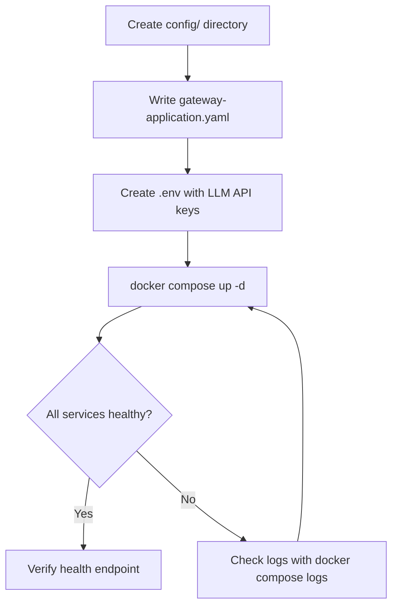
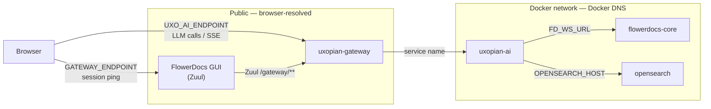

The [Getting Started quickstarts](../getting_started/quickstart.mdx) use `DevProvider` with no authentication. This guide configures a production Docker Compose deployment with a real authentication provider.



*Figure: Docker Compose deployment steps for a production stack.*

## Differences from the quickstart

| | Getting Started | Production |
|---|---|---|
| Gateway provider | `DevProvider` (no auth) | `FlowerDocsProvider` or custom |
| Spring profile | `dev` | _(default)_ |
| Context path | `/` | `/gui/gateway/uxopian-ai` |
| TLS | None | Handled by reverse proxy |

## Compose file structure

A production stack requires the same three services as the quickstart. Use the `${VAR:-fallback}` pattern for image versions so the stack works without a `.env` file and stays in sync with the version management script.

```yaml
services:
  opensearch:
    image: opensearchproject/opensearch:${OPENSEARCH_VERSION:-3.6.0}
    environment:
      - discovery.type=single-node
      - DISABLE_SECURITY_PLUGIN=true
      - OPENSEARCH_JAVA_OPTS=-Xms512m -Xmx512m
    volumes:
      - opensearch-data:/usr/share/opensearch/data
    healthcheck:
      test: ["CMD-SHELL", "curl -f http://localhost:9200/_cluster/health || exit 1"]
      interval: 10s
      timeout: 5s
      retries: 5
      start_period: 20s

  uxopian-ai:
    image: ${REGISTRY:-artifactory.arondor.cloud:5001}/uxopian-ai:${UXOPIAN_VERSION:-2026.0.0-ft5}
    # image: docker.uxopian.com/preview/uxopian-ai:${UXOPIAN_VERSION:-2026.0.0-ft5}
    depends_on:
      opensearch:
        condition: service_healthy
    environment:
      - JAVA_OPTS=-Xmx768m -Xms512m
      - OPENSEARCH_HOST=opensearch
      - OPENSEARCH_PORT=9200
      - APP_BASE_URL=https://your-domain.example.com
      - CONTEXT_PATH=/gui/gateway/uxopian-ai
      - LLM_DEFAULT_PROVIDER=openai
      - LLM_DEFAULT_MODEL=gpt-4.1
      - LLM_DEFAULT_PROMPT=basePrompt
      - LLM_CONTEXT_SIZE=10
      - OPENAI_API_KEY=${OPENAI_API_KEY:-}
    volumes:
      - ./config:/app/config:ro

  uxopian-gateway:
    image: ${REGISTRY:-artifactory.arondor.cloud:5001}/uxopian-gateway:${UXOPIAN_VERSION:-2026.0.0-ft5}
    # image: docker.uxopian.com/preview/uxopian-gateway:${UXOPIAN_VERSION:-2026.0.0-ft5}
    depends_on:
      - uxopian-ai
    ports:
      - "8085:8085"
    environment:
      - JAVA_OPTS=-Xmx256m -Xms256m
    volumes:
      - ./gateway-application.yaml:/app/application.yaml:ro

volumes:
  opensearch-data:
```

The Cloudsmith public registry (`docker.uxopian.com/preview/`) does not require login. Uncomment the `docker.uxopian.com` image lines and remove the default registry lines to use it instead of Artifactory.

## Gateway configuration

The `gateway-application.yaml` file mounted into uxopian-gateway defines the routes and authentication provider. For a FlowerDocs deployment:

```yaml
app:
  routes:
    - id: uxopian-ai
      uri: http://uxopian-ai:8080
      prefix: /gui/gateway/uxopian-ai/
      path: /gui/gateway/uxopian-ai/**
      provider: FlowerDocsProvider
      security:
        - path: /.well-known/**
          public: true
        - path: /assets/**
          public: true
        - path: /actuator/health
          public: true
        - path: /prompt/**
          roles: ["ADMIN"]
        - path: /goal/**
          roles: ["ADMIN"]
        - path: /prompt-statistics
          roles: ["ADMIN"]
    - id: uxopian-ai-ws
      uri: ws://uxopian-ai:8080
      path: /gui/gateway/uxopian-ai/ws/**
      prefix: /gui/gateway/uxopian-ai/ws/
      security:
        - path: /**
          public: true
server:
  port: 8085
```

For other authentication providers, replace `FlowerDocsProvider` with the appropriate provider name. See [Authentication and gateway](../understanding/authentication.md).

## Config files

Mount a `config/` directory into uxopian-ai at `/app/config`. The quickstart Docker example ZIP includes a ready-to-use `config/` directory. In production, the files that typically need adjustment are:

- `llm-clients-config.yml` — provider, model, timeouts, API key references
- `prompts.yml` — system prompt customization
- `application.yml` — base URL and context path overrides

See [Getting Started: Docker quickstart](../getting_started/quickstart.mdx) for the full list of config files.

## Environment file

Create a `.env` file alongside the Compose file to supply LLM API keys:

```bash
OPENAI_API_KEY=sk-your-key
# ANTHROPIC_API_KEY=your-key
# GEMINI_API_KEY=your-key
```

Set at least one key matching the `LLM_DEFAULT_PROVIDER` configured in the service environment.

## Docker networking and URL configuration

This is the most common source of misconfiguration. Containers communicate differently depending on whether the caller is another container or a user's browser.

### The two-URL rule

Every URL in the stack belongs to one of two contexts:

| Context | Who resolves it | Use |
|---|---|---|
| **Container → container** | Docker DNS, inside the network | Service-to-service calls (uxopian-ai → OpenSearch, uxopian-ai → FlowerDocs core, gateway → uxopian-ai) |
| **Browser → server** | Public DNS / host machine | URLs loaded in user browsers (gateway public URL, `UXOPIAN_AI_HOST`, JS `GATEWAY_ENDPOINT`) |

**Container-to-container URLs use the Docker service name as hostname.** This name is the key under `services:` in the Compose file (not `container_name`). Docker's embedded DNS resolves it to the container's internal IP automatically.

```yaml
services:
  opensearch:          # ← Docker service name → hostname "opensearch"
    ...
  uxopian-ai:          # ← hostname "uxopian-ai"
    environment:
      - OPENSEARCH_HOST=opensearch   # ✓ service name
      - OPENSEARCH_HOST=localhost    # ✗ localhost = the uxopian-ai container itself
      - OPENSEARCH_HOST=192.168.1.x  # ✗ host IP — fragile, breaks in CI/CD
```

:::warning[localhost means the container, not the host machine]
Inside a Docker container, `localhost` and `127.0.0.1` resolve to the container itself, not to the Docker host. A URL like `http://localhost:8080/core/` set in `FD_WS_URL` will always fail — even if FlowerDocs is running on port 8080 on the host.
:::

### Environment variable mapping

The variables listed below split cleanly into the two contexts. Set them accordingly:

**Container-to-container (use Docker service names):**

| Variable | Who reads it | Points to |
|---|---|---|
| `OPENSEARCH_HOST` | uxopian-ai | OpenSearch service name (e.g. `opensearch`) |
| `FD_WS_URL` | uxopian-ai | FlowerDocs Core service (e.g. `http://flowerdocs-core:8080/core/`) |
| `RENDITION_BASE_URL` | uxopian-ai | ARender DSB service (e.g. `http://dsb-service:8761`) |
| `ALFRESCO_BASE_URL` | uxopian-ai | Alfresco repository (e.g. `http://alfresco:8080`) |
| `app.routes[].uri` | gateway | uxopian-ai service (e.g. `http://uxopian-ai:8080`) |

**Browser-side (use public host URL or IP):**

| Variable | Who reads it | Points to |
|---|---|---|
| `APP_BASE_URL` | uxopian-ai (link generation) | Public gateway URL (e.g. `https://my-server.example.com`) |
| `UXOPIAN_AI_HOST` | ARender UI, Alfresco Share | Public gateway URL as seen by browsers |
| `GATEWAY_ENDPOINT` (in FlowerDocs scope JS `consts/`) | User's browser | Public gateway URL routed through FlowerDocs |

### All services on the same network

Services that need to communicate must be on the same Docker network. Declare a named network and attach all services to it:

```yaml
services:
  opensearch:
    networks:
      - uxopian-ai-net

  uxopian-ai:
    networks:
      - uxopian-ai-net

  uxopian-gateway:
    ports:
      - "8085:8085"    # Only the gateway is exposed to the host
    networks:
      - uxopian-ai-net

networks:
  uxopian-ai-net:      # Named network — Docker creates it automatically
```

Only `uxopian-gateway` has a `ports:` mapping. `uxopian-ai` and `opensearch` use `expose:` or no port mapping — they are reachable within the network but not from outside.

### Connecting to an external service (FlowerDocs, Alfresco, ARender)

When the host application runs in a separate Docker Compose stack, uxopian-ai must join its network to reach it by service name — or use the host machine's IP.

**Option A — Join the external network (recommended):**

```yaml
# In the Uxopian AI docker-compose.yml
services:
  uxopian-ai:
    environment:
      - FD_WS_URL=http://flowerdocs-core:8080/core/   # Service name from the FD stack
    networks:
      - uxopian-ai-net
      - flowerdocs-net                                  # Join the FD network

networks:
  uxopian-ai-net:
  flowerdocs-net:
    external: true     # References a network created by the FlowerDocs Compose stack
    name: flowerdocs_default  # Exact name — check with: docker network ls
```

Find the exact network name with:
```bash
docker network ls
docker inspect <flowerdocs-container> | grep -i network
```

**Option B — Use the host machine IP:**

```yaml
FD_WS_URL=http://172.17.0.1:8080/core/   # Docker bridge gateway IP (Linux default)
# or
FD_WS_URL=http://host.docker.internal:8080/core/   # Works on Mac/Windows Docker Desktop
```

This option works without network changes but binds the config to a specific IP. Prefer Option A in production.

### FlowerDocs integration — complete network picture

In a FlowerDocs deployment, three URL contexts coexist:



Three URL contexts:
- **`GATEWAY_ENDPOINT`** (`/gui/plugins/<scope>/gateway/**`) — goes through FlowerDocs Zuul for the session warm-up ping.
- **`UXO_AI_ENDPOINT`** (`/gui/gateway/**`) — goes directly to uxopian-gateway for all LLM calls and SSE streaming.
- **`FD_WS_URL`** — container-to-container, must use the Docker service name (`flowerdocs-core`), never `localhost`.

### Checking service name resolution

From inside a container, verify DNS resolution and connectivity:

```bash
# Enter the uxopian-ai container
docker exec -it <uxopian-ai-container> sh

# Check service name resolution
nslookup flowerdocs-core
ping -c1 flowerdocs-core

# Check the actual URL works
curl http://flowerdocs-core:8080/core/actuator/health
curl http://dsb-service:8761/ActionsAPI
curl http://opensearch:9200/_cluster/health
```

If `nslookup` returns `NXDOMAIN`, the two containers are not on the same Docker network. Fix by joining the external network (see Option A above) or by using the host IP (Option B).

## TLS and reverse proxy

Expose port `8085` of `uxopian-gateway` behind a reverse proxy (nginx, Traefik, or a cloud load balancer) that terminates TLS. The gateway itself runs plain HTTP internally.

## Start and verify

```bash
docker compose up -d
```

```bash
curl http://localhost:8085/gui/gateway/uxopian-ai/actuator/health
```

Expected:

```json
{"status":"UP"}
```
