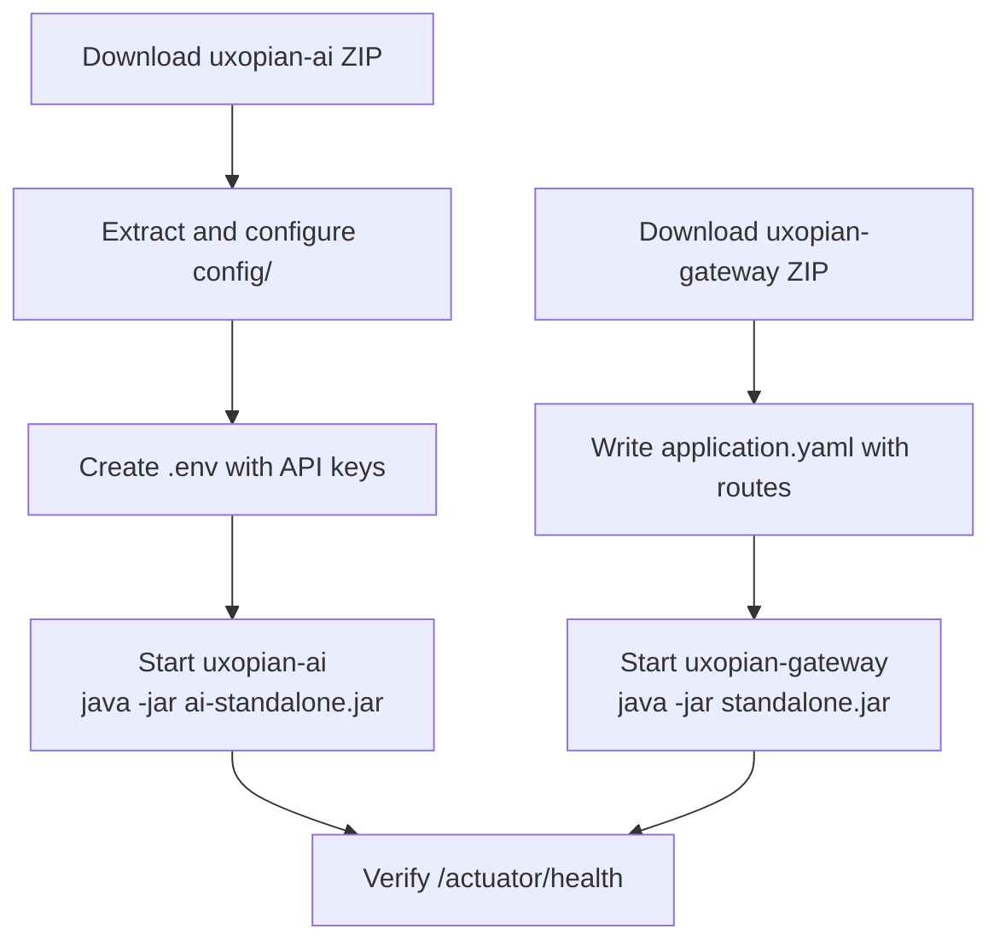

Running uxopian-ai and uxopian-gateway without Docker or Kubernetes, from their complete package ZIPs. Suitable for environments where a container runtime is not available.



*Figure: Bare archive deployment steps for both services.*

## Prerequisites

- Java 21
- OpenSearch `3.3.2` reachable on the host network
- LLM provider API key
- Credentials for `artifactory.arondor.cloud` (or access to the Cloudsmith public channel for preview releases)

## uxopian-ai

### Package contents

Releases publish a self-contained ZIP named `ai-standalone-<version>-complete-package.zip`:

```text
ai-standalone-2026.0.0-ft2/
  ai-standalone-2026.0.0-ft2.jar   ← Spring Boot fat JAR
  application.yaml                  ← Spring config (imports ./config/* files)
  config/
    application.yml
    llm-clients-config.yml          ← LLM provider and model configuration
    llm-clients-config.yml.example
    prompts.yml
    goals.yml
    opensearch.yml
    metrics.yml
    hazelcast.yml
    mcp-server.yml
  plugins/
    flowerdocs-2026.0.0-ft2.jar     ← FlowerDocs integration
    arender-2026.0.0-ft2.jar        ← ARender integration
    files-2026.0.0-ft2.jar          ← File tools integration
  llm-clients/
    llm-clients-2026.0.0-ft2.jar
```

The `plugins/` directory is scanned at runtime by `IntegrationLoader`. Only the JARs present at startup are activated. Remove plugin JARs for integrations you do not use.

:::tip[Download]
**<a href="https://artifactory.arondor.cloud/artifactory/arondor-release/com/uxopian/ai/ai-standalone/2026.0.0-ft2/ai-standalone-2026.0.0-ft2-complete-package.zip" download="ai-standalone-2026.0.0-ft2-complete-package.zip">ai-standalone-2026.0.0-ft2-complete-package.zip</a>**
:::

### Configure LLM provider

Edit `config/llm-clients-config.yml`. At minimum, set the default provider and model, and provide the API key reference:

```yaml
llm:
  default:
    provider: openai
    model: gpt-4.1
    base-prompt: basePrompt
  context: 10

openai:
  api-key: ${OPENAI_API_KEY:}
  model-name: gpt-4.1
  timeout: 120s
```

### Environment variables

Create a `.env` file in the extraction directory (same level as the JAR). The `spring-dotenv` library loads it automatically at startup:

```bash
OPENAI_API_KEY=sk-your-key
# ANTHROPIC_API_KEY=your-key
# GEMINI_API_KEY=your-key

OPENSEARCH_HOST=localhost
OPENSEARCH_PORT=9200
APP_BASE_URL=https://your-domain.example.com
CONTEXT_PATH=/gui/gateway/uxopian-ai
LLM_DEFAULT_PROVIDER=openai
LLM_DEFAULT_MODEL=gpt-4.1
LLM_DEFAULT_PROMPT=basePrompt
LLM_CONTEXT_SIZE=10
```

### Start

From the extraction directory:

```bash
java -Xmx768m -Xms512m -jar ai-standalone-2026.0.0-ft2.jar
```

The service starts on port `8080` by default. Override with `UXOPIAN_AI_PORT`.

---

## uxopian-gateway

### Package contents

The gateway ZIP named `standalone-<version>-complete-package.zip` contains the JAR and its authentication provider plugins:

```
standalone.jar                       ← Spring Boot fat JAR
provider/
  flowerdocs-provider.jar            ← FlowerDocs JWT auth provider
  fast2-provider.jar                 ← Fast2 JWT auth provider
  development-provider.jar           ← Dev mock provider (no real auth)
```

Providers are scanned from the `provider/` directory at runtime by `AuthProviderLoader`. Remove provider JARs that are not needed.

:::tip[Download]
**<a href="https://artifactory.arondor.cloud/artifactory/arondor-release/com/uxopian/gateway/standalone/2026.0.0-ft2/standalone-2026.0.0-ft2-complete-package.zip" download="standalone-2026.0.0-ft2-complete-package.zip">standalone-2026.0.0-ft2-complete-package.zip</a>**
:::

### Configure routes

The ZIP does not include an `application.yaml`. Create one alongside the JAR to configure routes, backend URL, and security rules:

```yaml
app:
  routes:
    - id: uxopian-ai
      uri: http://localhost:8080
      prefix: /gui/gateway/uxopian-ai/
      path: /gui/gateway/uxopian-ai/**
      provider: FlowerDocsProvider
      security:
        - path: /.well-known/**
          public: true
        - path: /assets/**
          public: true
        - path: /actuator/health
          public: true
        - path: /prompt/**
          roles: ["ADMIN"]
        - path: /goal/**
          roles: ["ADMIN"]
        - path: /prompt-statistics
          roles: ["ADMIN"]
    - id: uxopian-ai-ws
      uri: ws://localhost:8080
      path: /gui/gateway/uxopian-ai/ws/**
      prefix: /gui/gateway/uxopian-ai/ws/
      security:
        - path: /**
          public: true
server:
  port: 8085
```

For other authentication providers, replace `FlowerDocsProvider` with the appropriate provider name. See [Authentication and gateway](../understanding/authentication.md).

### Start

```bash
java -Xmx256m -Xms256m \
  -jar standalone.jar \
  --spring.config.location=./application.yaml
```

---

## Environment variables reference (uxopian-ai)

| Variable | Description |
|---|---|
| `OPENSEARCH_HOST` | OpenSearch hostname |
| `OPENSEARCH_PORT` | OpenSearch port (default `9200`) |
| `APP_BASE_URL` | Public URL of the application |
| `CONTEXT_PATH` | Servlet context path (must match gateway prefix) |
| `LLM_DEFAULT_PROVIDER` | Default LLM provider (`openai`, `anthropic`, `gemini`, ...) |
| `LLM_DEFAULT_MODEL` | Default model name |
| `LLM_DEFAULT_PROMPT` | Default prompt id (`basePrompt`) |
| `LLM_CONTEXT_SIZE` | Number of conversation turns kept in context |
| `OPENAI_API_KEY` | OpenAI API key |
| `ANTHROPIC_API_KEY` | Anthropic API key |
| `GEMINI_API_KEY` | Google Gemini API key |
| `AZURE_OPENAI_API_KEY` | Azure OpenAI API key |
| `UXOPIAN_AI_PORT` | HTTP port override (default `8080`) |
| `PLUGINS_ROOT_PATH` | Path to the plugins directory (default `plugins/`) |

## Verify

```bash
curl http://localhost:8085/gui/gateway/uxopian-ai/actuator/health
```

Expected:

```json
{"status":"UP"}
```
