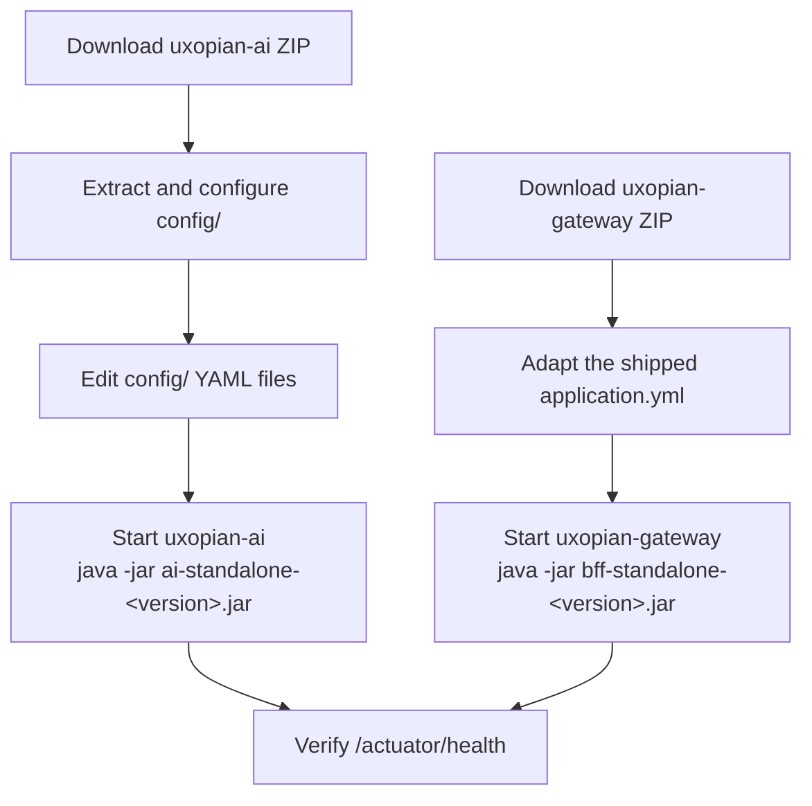

Running uxopian-ai and uxopian-gateway without Docker or Kubernetes, from their complete package ZIPs. Suitable for environments where a container runtime is not available.



*Figure: Bare archive deployment steps for both services.*

## Prerequisites

- Java 21
- OpenSearch `3.6.0` reachable on the host network
- LLM provider API key
- Credentials for `artifactory.arondor.cloud` (or access to the Cloudsmith public channel for preview releases)

## uxopian-ai

### Package contents

Releases publish a self-contained ZIP named `ai-standalone-<version>-complete-package.zip`:

```text
ai-standalone-2026.0.0-ft5/
  ai-standalone-2026.0.0-ft5.jar   ← Spring Boot fat JAR
  application.yaml                  ← Spring config (imports ./config/* files)
  config/
    application.yml
    llm-clients-config.yml          ← LLM provider and model configuration
    llm-clients-config.yml.example
    prompts.yml
    goals.yml
    opensearch.yml
    metrics.yml
    hazelcast.yml
    mcp-server.yml
  plugins/
    flowerdocs-2026.0.0-ft5.jar     ← FlowerDocs integration
    alfresco-2026.0.0-ft5.jar       ← Alfresco integration
    filenet-2026.0.0-ft5.jar        ← FileNet integration
    arender-2026.0.0-ft5.jar        ← ARender integration
    files-2026.0.0-ft5.jar          ← File tools
    interaction-2026.0.0-ft5.jar    ← Interactive choices tools
    common-2026.0.0-ft5.jar         ← Shared tools (text chunking, etc.)
  llm-clients/
    llm-clients-2026.0.0-ft5.jar
```

The `plugins/` directory is scanned at runtime by `IntegrationLoader`. Only the JARs present at startup are activated. Remove plugin JARs for integrations you do not use.

:::tip[Download]
**<a href="https://artifactory.arondor.cloud/artifactory/arondor-release/com/uxopian/ai/ai-standalone/2026.0.0-ft5/ai-standalone-2026.0.0-ft5-complete-package.zip" download="ai-standalone-2026.0.0-ft5-complete-package.zip">ai-standalone-2026.0.0-ft5-complete-package.zip</a>**
:::

### Configure LLM provider

Edit `config/llm-clients-config.yml`. At minimum, set the default provider and model, and provide the API key reference:

```yaml
llm:
  default:
    provider: openai
    model: gpt-4.1
    base-prompt: basePrompt
  context: 10

openai:
  api-key: sk-your-key
  model-name: gpt-4.1
  timeout: 120s
```

### Configure YAML files

Edit the files in `config/` directly — `.env` files are not supported in bare archive deployments.

**`config/opensearch.yml`** — OpenSearch connection:

```yaml
opensearch:
  host: localhost
  port: 9200
  scheme: http
```

**`config/application.yml`** — application URL and context path:

```yaml
app:
  base-url: https://your-domain.example.com

server:
  servlet:
    context-path: /gui/gateway/uxopian-ai
  port: 8080
```

### Start

From the extraction directory:

```bash
java -Xmx768m -Xms512m -jar ai-standalone-2026.0.0-ft5.jar
```

The service starts on port `8080` by default. Override with `UXOPIAN_AI_PORT`.

---

## uxopian-gateway

### Package contents

The gateway ZIP named `standalone-<version>-complete-package.zip` extracts into a versioned root directory containing the JAR, a starter `application.yml`, and its authentication provider plugins:

```
uxopian-gateway-<version>/
  bff-standalone-<version>.jar       ← Spring Boot fat JAR
  application.yml                    ← Starter config: security defaults, sample routes for
                                        every backend (FlowerDocs, Alfresco, FileNet) — trim
                                        it down to the routes you actually need
  provider/
    flowerdocs-provider.jar           ← FlowerDocs JWT auth provider
    fast2-provider.jar                ← Fast2 JWT auth provider
    alfresco-provider.jar             ← Alfresco JWT auth provider
    filenet-provider.jar              ← FileNet ICN-signed JWT auth provider
    development-provider.jar          ← Dev mock provider (no real auth)
```

Providers are scanned from the `provider/` directory at runtime by `AuthProviderLoader`. Remove provider JARs that are not needed.

:::tip[Download]
**<a href="https://artifactory.arondor.cloud/artifactory/arondor-release/com/uxopian/gateway/standalone/2026.0.0-ft5/standalone-2026.0.0-ft5-complete-package.zip" download="standalone-2026.0.0-ft5-complete-package.zip">standalone-2026.0.0-ft5-complete-package.zip</a>**
:::

### Configure routes

The shipped `application.yml` already declares one route per backend integration (FlowerDocs, Alfresco, FileNet), each with matching HTTP and WebSocket entries and the standard security rules pre-filled. Delete the routes for backends you don't use and adjust `uri` to your uxopian-ai host — the shipped file points at `http://ai-standalone-service:8080` (a Kubernetes-style hostname), which won't resolve on a bare-metal host:

```yaml
app:
  routes:
    - id: uxopian-ai
      uri: http://localhost:8080
      prefix: /gui/gateway/uxopian-ai/
      path: /gui/gateway/uxopian-ai/**
      provider: FlowerDocsProvider
      security:
        - path: /.well-known/**
          public: true
        - path: /assets/**
          public: true
        - path: /actuator/health
          public: true
        - path: /prompt/**
          roles: ["ADMIN"]
        - path: /goal/**
          roles: ["ADMIN"]
        - path: /prompt-statistics
          roles: ["ADMIN"]
    - id: uxopian-ai-ws
      uri: ws://localhost:8080
      path: /gui/gateway/uxopian-ai/ws/**
      prefix: /gui/gateway/uxopian-ai/ws/
      security:
        - path: /**
          public: true
server:
  port: 8085
```

For other authentication providers, replace `FlowerDocsProvider` with the appropriate provider name. See [Authentication and gateway](../understanding/authentication.md) and, if you need to serve several tenants of the same provider type, [Configuration reference — named provider instances](../reference/configuration.md#named-provider-instances-appproviders).

### Start

```bash
java -Xmx256m -Xms256m \
  -jar bff-standalone-<version>.jar \
  --spring.config.location=./application.yml
```

---

## Configuration reference (uxopian-ai)

| Setting | YAML property | File |
|---|---|---|
| OpenSearch hostname | `opensearch.host` | `config/opensearch.yml` |
| OpenSearch port | `opensearch.port` | `config/opensearch.yml` |
| Public URL | `app.base-url` | `config/application.yml` |
| Context path | `server.servlet.context-path` | `config/application.yml` |
| HTTP port | `server.port` | `config/application.yml` |
| Default LLM provider | `llm.default.provider` | `config/llm-clients-config.yml` |
| Default model | `llm.default.model` | `config/llm-clients-config.yml` |
| Default prompt | `llm.default.base-prompt` | `config/llm-clients-config.yml` |
| Conversation context size | `llm.context` | `config/llm-clients-config.yml` |
| OpenAI API key | `openai.api-key` | `config/llm-clients-config.yml` |
| Anthropic API key | `anthropic.api-key` | `config/llm-clients-config.yml` |
| Google Gemini API key | `gemini.api-key` | `config/llm-clients-config.yml` |
| Azure OpenAI API key | `azure.openai.api-key` | `config/llm-clients-config.yml` |
| Plugins directory path | `PLUGINS_ROOT_PATH` env var | system environment |

## Verify

```bash
curl http://localhost:8085/gui/gateway/uxopian-ai/actuator/health
```

Expected:

```json
{"status":"UP"}
```
