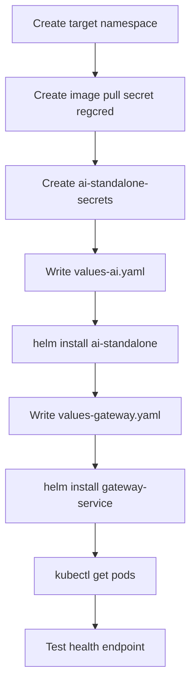
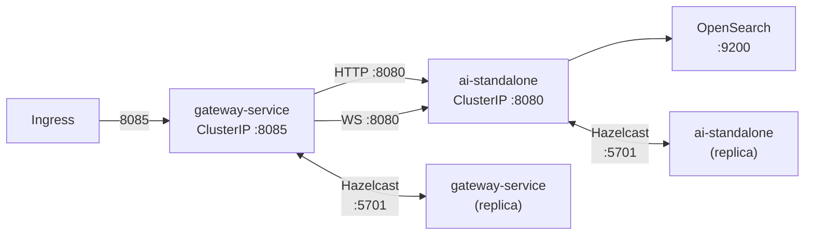

import Tabs from '@theme/Tabs';
import TabItem from '@theme/TabItem';

Two Helm charts cover the full deployment: `ai-standalone` for the AI backend and `gateway-service` for the routing and authentication layer.



*Figure: Kubernetes deployment steps for a full Uxopian AI stack.*



*Figure: Kubernetes service topology. Each service maintains its own Hazelcast cluster for session state.*

## Prerequisites

- Kubernetes 1.24+
- `helm` 3.x
- `kubectl` configured for the target cluster
- Image pull secret (`regcred`) in the target namespace
- An OpenSearch instance reachable from the cluster

## Image pull secret

```bash
kubectl create secret docker-registry regcred \
  --docker-server=artifactory.arondor.cloud:5001 \
  --docker-username=<your-username> \
  --docker-password=<your-password> \
  --namespace=<your-namespace>
```

## Deploy ai-standalone

### Configure values

Create a `values-ai.yaml` overriding the defaults for your environment:

```yaml
image:
  registry: artifactory.arondor.cloud:5001
  repository: uxopian-ai
  tag: "2026.0.0-ft3"

appConfig:
  openSearch:
    host: "opensearch-service"        # OpenSearch service name in the cluster
    port: "9200"
  externalUrls:
    appBaseUrl: "https://your-domain.example.com"
    renditionBaseUrl: "http://arender-rendition-broker:8761"   # ARender only
    flowerDocsWsUrl: "http://flowerdocs-core:8081/core/"       # FlowerDocs only
  contextPath: "/gui/gateway/uxopian-ai"
  llm:
    defaultProvider: "openai"
    defaultModel: "gpt-4.1"
    defaultPrompt: "basePrompt"
    contextSize: "10"

resources:
  requests:
    memory: "512Mi"
    cpu: "500m"
  limits:
    memory: "1Gi"
    cpu: "1000m"
```

### Create the API keys secret

The chart reads LLM API keys from a Kubernetes secret named `ai-standalone-secrets`. Create it before deploying:

```bash
kubectl create secret generic ai-standalone-secrets \
  --from-literal=OPENAI_API_KEY=sk-your-key \
  --namespace=<your-namespace>
```

Add keys for any other providers you use (`ANTHROPIC_API_KEY`, `GEMINI_API_KEY`, `AZURE_OPENAI_API_KEY`, `NUEXTRACT_API_KEY`). Keys for unused providers can be omitted.

### Install

```bash
helm install ai-standalone ./component-ai \
  -f values-ai.yaml \
  --namespace <your-namespace>
```

### Upgrade

```bash
helm upgrade ai-standalone ./component-ai \
  -f values-ai.yaml \
  --namespace <your-namespace>
```

## Deploy gateway-service

### Configure values

Create a `values-gateway.yaml`. The most important section is `files.application.yaml`, which defines the routes and authentication provider.

<Tabs>
  <TabItem value="flowerdocs" label="FlowerDocsProvider">

```yaml
image:
  repository: artifactory.arondor.cloud:5001/uxopian-gateway
  tag: "2026.0.0-ft3"

hazelcast:
  enabled: true
  clusterName: "uxopian-gateway-cluster"
  javaOpts: "-Xmx256m -Xms256m"

files:
  application.yaml: |
    app:
      routes:
        - id: uxopian-ai
          uri: http://ai-standalone-service:8080
          prefix: /gui/gateway/uxopian-ai/
          path: /gui/gateway/uxopian-ai/**
          provider: FlowerDocsProvider
          security:
            - path: /.well-known/**
              public: true
            - path: /assets/**
              public: true
            - path: /v3/**
              public: true
            - path: /actuator/health
              public: true
            - path: /prompt/**
              roles: ["ADMIN"]
            - path: /goal/**
              roles: ["ADMIN"]
            - path: /prompt-statistics
              roles: ["ADMIN"]
        - id: uxopian-ai-ws
          uri: ws://ai-standalone-service:8080
          path: /gui/gateway/uxopian-ai/ws/**
          prefix: /gui/gateway/uxopian-ai/ws/
          security:
            - path: /**
              public: true
    server:
      port: 8085
```

  </TabItem>
  <TabItem value="devprovider" label="DevProvider (dev only)">

```yaml
files:
  application.yaml: |
    app:
      routes:
        - id: uxopian-ai
          uri: http://ai-standalone-service:8080
          prefix: /
          path: /**
          provider: DevProvider
          security:
            - path: /actuator/health
              public: true
    server:
      port: 8085
```

:::warning
`DevProvider` disables authentication. Use only in development namespaces.
:::

  </TabItem>
</Tabs>

### Install

```bash
helm install gateway-service ./gateway-service \
  -f values-gateway.yaml \
  --namespace <your-namespace>
```

## Hazelcast clustering

Both services discover cluster peers through a Kubernetes headless service. The headless service (`<name>-headless`) and the required RBAC resources (ServiceAccount, ClusterRole, ClusterRoleBinding) are created automatically by the charts.

The two Hazelcast clusters are independent:
- `uxopian-ai-cluster` — session token cache shared across ai-standalone replicas
- `uxopian-gateway-cluster` — session validation cache shared across gateway replicas

No additional configuration is needed beyond setting `hazelcast.enabled: true` (the default).

## Verification

Check that both pods are running:

```bash
kubectl get pods -n <your-namespace>
```

Test the gateway health endpoint:

```bash
curl https://your-domain.example.com/gui/gateway/uxopian-ai/actuator/health
```

Expected response:

```json
{"status":"UP"}
```

## Key values reference

<Tabs>
  <TabItem value="ai" label="ai-standalone">

| Path | Description |
|---|---|
| `image.tag` | Image version — use `2026.0.0-ft3` |
| `appConfig.openSearch.host` | OpenSearch service hostname |
| `appConfig.openSearch.port` | OpenSearch port (default `9200`) |
| `appConfig.externalUrls.appBaseUrl` | Public URL of the application (used in generated links) |
| `appConfig.externalUrls.renditionBaseUrl` | ARender DSB URL (ARender integration only) |
| `appConfig.externalUrls.flowerDocsWsUrl` | FlowerDocs core web service URL (FlowerDocs integration only) |
| `appConfig.contextPath` | Servlet context path, must match gateway route prefix |
| `appConfig.llm.defaultProvider` | Default LLM provider (`openai`, `anthropic`, `gemini`, etc.) |
| `appConfig.llm.defaultModel` | Default model name |
| `appConfig.javaOpts` | JVM flags (default `-Xmx768m -Xms512m`) |
| `existingSecret` | Name of the K8s secret holding LLM API keys |
| `hazelcast.enabled` | Enable K8s-based Hazelcast peer discovery |

  </TabItem>
  <TabItem value="gateway" label="gateway-service">

| Path | Description |
|---|---|
| `image.tag` | Image version — use `2026.0.0-ft3` |
| `hazelcast.javaOpts` | JVM flags (default `-Xmx256m -Xms256m`) |
| `hazelcast.clusterName` | Hazelcast cluster name — keep distinct from ai-standalone |
| `files.application.yaml` | Full gateway config: routes, providers, security rules |

  </TabItem>
</Tabs>
