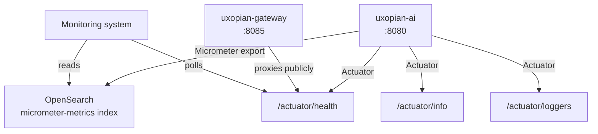

uxopian-ai exposes Spring Boot Actuator endpoints for health checks and metrics export. Metrics are collected by Micrometer and can be exported directly to OpenSearch.



_Figure: Monitoring integration: Actuator endpoints and Micrometer metrics export to OpenSearch._

## Actuator endpoints

By default, the following endpoints are enabled:

| Endpoint  | Path                | Purpose                      |
| --------- | ------------------- | ---------------------------- |
| `health`  | `/actuator/health`  | Service health (UP/DOWN)     |
| `info`    | `/actuator/info`    | Build info                   |
| `loggers` | `/actuator/loggers` | Runtime log level management |

All paths are relative to the service's context path. In a standard production deployment the full URL is:

```
https://your-domain.example.com/gui/gateway/uxopian-ai/actuator/health
```

The gateway exposes this path publicly (no authentication required). See the `security` section of the gateway config in [Docker Compose](./docker.md) and [Kubernetes](./kubernetes.mdx).

To enable additional endpoints (e.g. `prometheus`, `metrics`, `env`), add to `metrics.yml`:

```yaml
management:
    endpoints:
        web:
            exposure:
                include: health,info,loggers,prometheus
```

## Metrics export

uxopian-ai ships with Micrometer and can export metrics directly to OpenSearch. This is configured in `config/metrics.yml`:

```yaml
management:
    elastic:
        metrics:
            export:
                enabled: true
                host: http://${opensearch.host}:${opensearch.port}
                index: micrometer-metrics
                auto-create-index: true
    endpoints:
        web:
            exposure:
                include: health,info,loggers
    metrics:
        uxopian-ai:
            enable: true
        enable:
            application: false
            tomcat: false
            logback: false
            jvm: false
            system: false
            http: false
            process: false
            disk: false
            executor: false
```

This writes uxopian-ai-specific metrics to the `micrometer-metrics` index in the same OpenSearch instance used for the knowledge base. Metrics for JVM, HTTP, Tomcat, and system internals are disabled by default to keep the index clean. Enable them individually if needed:

```yaml
management:
    metrics:
        enable:
            jvm: true
            http: true
```

## Kubernetes probes

Configure liveness and readiness probes on the `ai-standalone` container using the health endpoint:

```yaml
livenessProbe:
    httpGet:
        path: /gui/gateway/uxopian-ai/actuator/health
        port: 8080
    initialDelaySeconds: 60
    periodSeconds: 30
    failureThreshold: 3

readinessProbe:
    httpGet:
        path: /gui/gateway/uxopian-ai/actuator/health
        port: 8080
    initialDelaySeconds: 30
    periodSeconds: 10
    failureThreshold: 3
```

Add these under `spec.containers[0]` in the deployment, or pass them through the Helm chart's `values.yaml` if the chart exposes probe overrides.

The gateway service uses the same health path on port `8085`.

## Log level management

The `loggers` endpoint allows changing log levels at runtime without a restart:

```bash
# List all loggers
curl http://localhost:8080/gui/gateway/uxopian-ai/actuator/loggers

# Set a specific logger to DEBUG
curl -X POST http://localhost:8080/gui/gateway/uxopian-ai/actuator/loggers/com.uxopian \
  -H 'Content-Type: application/json' \
  -d '{"configuredLevel":"DEBUG"}'
```

This endpoint requires the `ADMIN` role in production (enforced by the gateway security config).

## Related pages

- [Monitoring statistics in the admin UI](../admin/monitoring_statistics.md)
- [Configuration file reference (metrics.yml)](../reference/configuration.md#metricsyml)
- [Environment variables reference](../reference/environment_variables.md)
