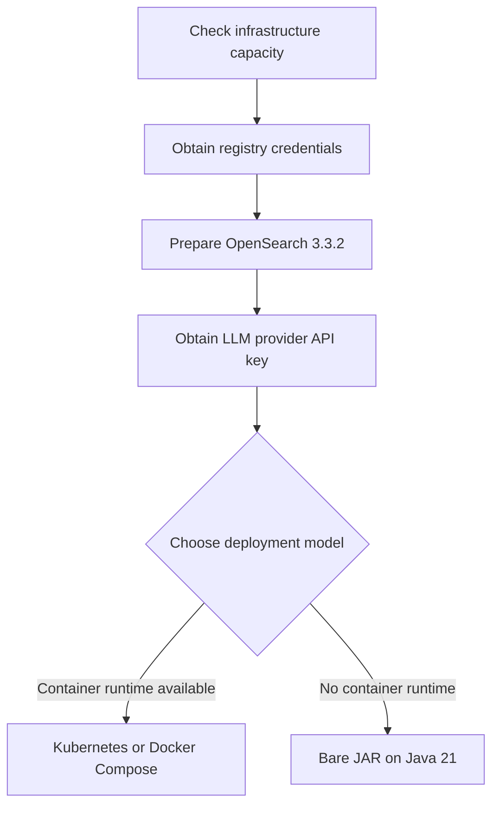

Uxopian AI consists of two services: **uxopian-ai** (the AI backend) and **uxopian-gateway** (the routing and authentication layer). Both must be deployed and reachable from each other.

*Figure: Prerequisite checklist before choosing a deployment model.*

## Infrastructure

| Component | Minimum | Notes |
|---|---|---|
| uxopian-ai | 512 Mi RAM, 0.5 CPU | JVM heap: `-Xmx768m -Xms512m` |
| uxopian-gateway | 256 Mi RAM | JVM heap: `-Xmx256m -Xms256m` |
| OpenSearch | 1 Gi RAM (single node) | Version `3.3.2` required |
| Java | 21 | Required for bare JAR deployment only |

For multi-replica deployments, both services use Hazelcast for session state distribution. See [Kubernetes deployment](./kubernetes.mdx) for cluster configuration.

## OpenSearch

OpenSearch `3.3.2` is the supported version. uxopian-ai connects to OpenSearch on port `9200` by default. The index is created automatically on first startup.

For production, allocate at least 1 Gi heap to OpenSearch and configure persistent volumes for the data directory.

## Image registry access

Container images are distributed through two registries:

| Registry | Access | Images |
|---|---|---|
| `artifactory.arondor.cloud:5001` | Credentials required | `uxopian-ai`, `uxopian-gateway`, ARender images |
| `docker.uxopian.com` | Public (preview channel) | `uxopian-ai`, `uxopian-gateway` |

For Kubernetes deployments, create an image pull secret named `regcred` pointing to the registry you use. See [Kubernetes deployment](./kubernetes.mdx).

## LLM provider

At least one LLM provider API key is required. Supported providers: OpenAI, Anthropic, Azure OpenAI, Google Gemini, NuExtract. The provider and model are configured at runtime — no rebuild is needed to switch.

## Network

- uxopian-gateway must be reachable from user browsers on its configured port (default `8085`).
- uxopian-ai must be reachable from uxopian-gateway (internal network, not exposed externally).
- uxopian-ai must be able to reach OpenSearch and any external service used by plugins (ARender DSB, FlowerDocs core).
