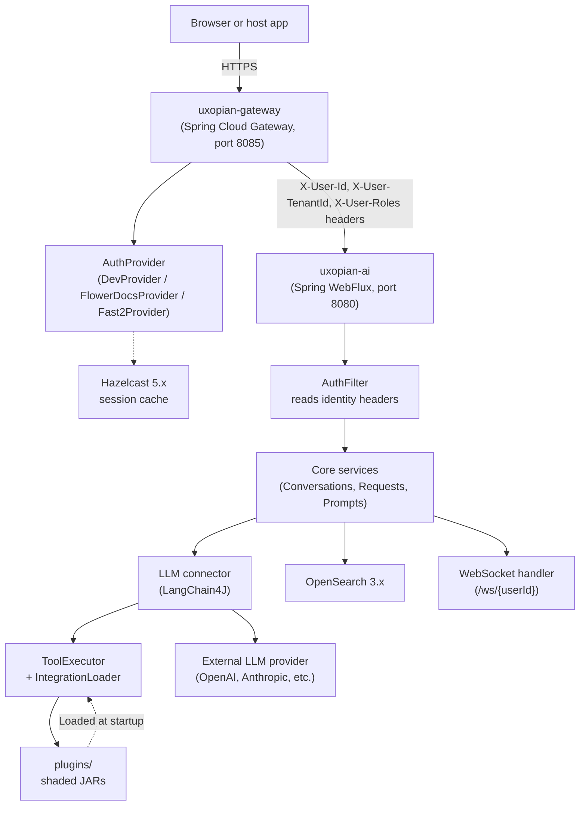

Uxopian AI consists of two services that must always be deployed together: `uxopian-ai` and `uxopian-gateway`. All browser traffic enters through the gateway. The `uxopian-ai` service is never exposed directly.

## Component diagram

*Figure: Full component diagram showing the two-service model, authentication flow, and plugin system.*

## Components

### uxopian-gateway

Handles all inbound traffic from browsers. Performs authentication by delegating to the configured `AuthProvider`. On success, forwards the request to `uxopian-ai` with three identity headers: `X-User-Id`, `X-User-TenantId`, and `X-User-Roles`. The original `Authorization` token is forwarded as `X-User-Token` for integrations that need it (such as the FlowerDocs plugin calling back into FlowerDocs APIs).

Static assets (`/assets/**`) and the WebSocket endpoint (`/ws/**`) can be configured as public in the gateway route security rules.

### uxopian-ai

The core application. Built on Spring WebFlux (reactive). Modules:

| Module | Role |
|---|---|
| `rest` | REST controllers, `AuthFilter`, Spring Security |
| `core` | Business logic: conversations, requests, prompts, `IntegrationLoader` |
| `connector/llm` | LLM provider abstraction, `ToolExecutor`, `LlmClientLoader` |
| `connector/opensearch` | OpenSearch client, `IndexNamingStrategy`, tenant-scoped repositories |
| `connector/hazelcast` | Distributed session cache (used by gateway) |
| `templating` | Thymeleaf prompt rendering engine, `PromptService` |
| `web-socket` | WebSocket handler for real-time streaming |
| `web-components` | React frontend compiled and served as static assets |
| `integrations/*` + `tools/*` | Plugin JARs loaded at runtime |

### AuthFilter

`OncePerRequestFilter` that runs on every request inside uxopian-ai. Reads identity from the four forwarded headers (`X-User-Id`, `X-User-TenantId`, `X-User-Roles`, `X-User-Token`). Builds an `AuthenticatedUser` and opens an `AiContext` scope for the duration of the request. If `SPRING_PROFILES_ACTIVE=dev` is active, it injects fallback defaults (`User-development`, `Tenant-development`) when headers are missing.

### OpenSearch

All persistent data is stored in OpenSearch. Each piece of data is stored in a tenant-scoped index. The `IndexNamingStrategy` service generates index names in the format `{sanitized-tenant-id}-uxopian-ai-{base-name}`.

### Plugin system

Integration JARs are placed in the `plugins/` directory (configurable via `plugins.root.path`, defaults to `plugins/`). `IntegrationLoader` uses ClassGraph to scan JARs at startup. Registration order: internal `@Service`/`@Component` beans, then `@HelperService` beans, then `@ToolService` beans. Adding or removing a plugin requires an application restart.

### WebSocket

`ClientActionSocketHandler` at `/ws/{userId}` provides real-time streaming of LLM responses to the browser. The web component connects via `window.connectWebSocket(wsEndpoint, userId)`. The WebSocket endpoint is separate from the HTTP API.

## Data and control flow

A typical chat request follows this path:

1. Browser calls `POST /api/v1/requests` through the gateway.
2. Gateway authenticates via `AuthProvider`, injects identity headers, forwards request.
3. `AuthFilter` in uxopian-ai reads headers, builds `AuthenticatedUser`, opens `AiContext`.
4. `SecureRequestService` resolves the conversation, loads applicable prompts.
5. `PromptService` renders each prompt template with Thymeleaf. ServiceHelpers (e.g., `documentService`) are called during rendering.
6. LLM connector calls the configured provider via LangChain4J.
7. If the LLM requests tool execution, `ToolExecutor` invokes the registered `@Tool` method.
8. The response is streamed back to the browser over WebSocket and also returned in the HTTP response.
9. The request (inputs, answer, token counts, model metadata) is stored in OpenSearch.

## Important constraints

- `uxopian-ai` must never be exposed directly to the public internet or browsers. The gateway is the sole entry point.
- The `dev` Spring profile disables authentication in `uxopian-ai`. Use it only on a local machine.
- Adding or removing plugins requires a restart. There is no hot-reload for plugins.
- The WebSocket endpoint and `/assets/**` are typically served as public routes in the gateway configuration to avoid authentication for static resources and streaming connections.

## Related pages

- [Authentication and gateway](./authentication.md)
- [Multi-tenancy](./multi_tenancy.md)
- [Plugin system](./plugin_system.md)
- [LLM providers](./llm_providers.md)
