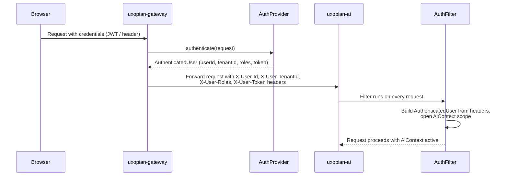

Authentication in Uxopian AI is handled entirely by `uxopian-gateway`. The backend (`uxopian-ai`) does not perform authentication itself. It receives identity information through HTTP headers that the gateway injects after a successful authentication check.

## Authentication flow



*Figure: Authentication flow from browser through gateway to uxopian-ai.*

## The AuthProvider interface

The gateway authenticates every request by calling an `AuthProvider`. An `AuthProvider` inspects the request and returns an `AuthenticatedUser` carrying `userId`, `roles`, `tenantId`, and the original token. If authentication fails, the request is rejected at the gateway.

Three built-in providers are included:

| Provider | When to use |
|---|---|
| `DevProvider` | Local development only. Reads identity from `X-User-Id`, `X-User-Roles`, `X-User-TenantId` request headers with no validation. |
| `FlowerDocsProvider` | FlowerDocs deployments. Validates FlowerDocs JWTs from `Authorization: Bearer` or `SESSION` cookie. Caches sessions in Hazelcast. |
| `Fast2Provider` | Fast2 deployments. Validates Fast2 JWT tokens from `Authorization: Bearer`. |

The active provider is set per route in `gateway-application.yaml`:

```yaml
app:
  routes:
    - id: uxopian-ai
      uri: http://uxopian-ai:8080
      path: /**
      provider: DevProvider
```

## Identity headers

After authentication, the gateway forwards four headers to `uxopian-ai`:

| Header | Content |
|---|---|
| `X-User-Id` | Unique user identifier |
| `X-User-TenantId` | Tenant identifier — drives all data isolation |
| `X-User-Roles` | Comma-separated list of user roles |
| `X-User-Token` | Original credential token (forwarded for integrations that call back into the source system) |

## AuthFilter in uxopian-ai

`AuthFilter` (`OncePerRequestFilter`) reads these headers on every incoming request. It builds an `AuthenticatedUser` and opens an `AiResourceContext` scope using `AiContext.builder().withUser(authUser).open()`. All downstream services read tenant identity from `AiContext` rather than receiving it as parameters.

If `X-User-TenantId` is absent and the `dev` profile is not active, the request proceeds without a security context. Operations that require tenant data will fail because no tenant is resolvable.

## Dev profile

When `SPRING_PROFILES_ACTIVE=dev` is set on `uxopian-ai`, `AuthFilter` injects fallback defaults when headers are missing:

- `userId` defaults to `User-development`
- `tenantId` defaults to `Tenant-development`

This means any request reaches the backend without authentication. Never use the `dev` profile in a production or publicly accessible environment.

In the Docker Compose quickstart, the gateway uses `DevProvider`, which reads identity from request headers. Combined with the `dev` profile on `uxopian-ai`, this allows browser testing without any credentials.

## Public routes

Some paths bypass authentication in the gateway. The default gateway configuration marks the following as public:

- `/assets/**`: static web component bundles
- `/actuator/health`: health check endpoint
- `/v3/**` and `/swagger-ui/**`: API documentation
- `/ws/**`: WebSocket endpoint for streaming

Admin API routes (`/api/v1/admin/**`) can be restricted by role using the `roles` field in the gateway security configuration.

## Custom auth providers

A custom `AuthProvider` can be implemented in the gateway by writing a Spring bean that implements the `AuthProvider` interface (returns `Mono<AuthenticatedUser>`). The gateway configuration references the provider by its Spring bean name.

## Related pages

- [System architecture](./architecture.md)
- [Multi-tenancy](./multi_tenancy.md)
- [Quickstart with Docker Compose](../getting_started/quickstart.md)
