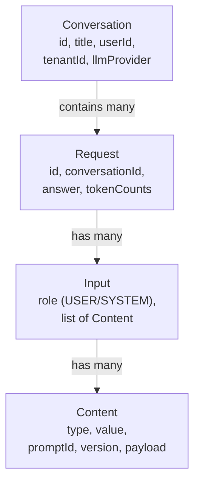

Conversations and requests are the two core runtime objects in Uxopian AI. A conversation is a chat session. A request is a single LLM round-trip within that conversation.

## Data model



*Figure: Relationship between Conversation, Request, Input, and Content objects.*

## Conversation

A conversation is a container for a series of requests. It stores metadata: title, userId, tenantId, the LLM provider and model used, and timestamps. Conversations are stored in the `conversations` OpenSearch index.

Creating a conversation is done implicitly when the first request is sent: the web component calls `createChat()`, which creates a conversation then submits the first request. Conversations can also be created explicitly via `POST /api/v1/conversations`.

### Automatic title generation

Starting with 2026.0.0-ft3, uxopian-ai asks the LLM to generate a meaningful conversation title when the first request of a new conversation (or the first request sent to a freshly created conversation) is processed. The title is produced through LangChain4J's structured-output feature: the same request returns both the user-facing answer and a short title used to label the conversation in the sidebar.

- Title-generation traffic is tracked as a **hidden request** attached to the same conversation: it counts in cost and token statistics but is not displayed to the end user in the conversation history.
- The feature relies on `ResponseFormat` support in the LLM request pipeline, so the configured default model must support structured output. Models that don't are silently skipped and the conversation keeps its default (first-message-derived) title.
- Titles are stored on the `Conversation` object and can be overridden manually via `PUT /api/v1/conversations/{id}`.

## Request

A request represents one LLM round-trip. It stores:

- `inputs`: the list of messages sent to the LLM, each as an `Input` object with a role and content parts
- `answer`: the LLM's response
- `inputTokenCount` and `outputTokenCount`: token usage
- `llmName`: the model that generated the response
- `feedback`: optional feedback ID attached to the response

Requests are stored in the `requests` OpenSearch index. The context window (number of previous requests included in each LLM call) is controlled by `llm.context` in `llm-clients-config.yml` (default: 10).

## Content types

Each `Input` has a list of `Content` items. The `type` field determines how the content is interpreted:

| Type | Value field | Description |
|---|---|---|
| `text` | Free text | Sent to the LLM as literal text |
| `prompt` | Prompt ID | Resolved to the named prompt template and rendered with Thymeleaf |
| `image` | Base64-encoded image | Sent to the LLM as an image (requires a multimodal model) |

A `prompt` content item also accepts an optional `version` field (integer). Omitted, the request renders whichever version is currently **published**. Set it explicitly to render any other version instead — including an unpublished **draft** ([Managing prompts](../admin/managing_prompts.md#prompt-detail-page)). That's the actual point of drafting a prompt rather than editing it in place: a caller can exercise the draft through a real conversation, with real context and payloads, before anyone publishes it and makes it the version everyone else gets.

## Sending a request

The REST endpoint is `POST /api/v1/requests`. The request body follows the `Request` schema:

```json
{
  "conversation": "conv-id-or-null",
  "inputs": [
    {
      "role": "user",
      "content": [
        { "type": "prompt", "value": "arenderContext", "payload": { "documentId": "doc-123" } },
        { "type": "text", "value": "Summarize this document." }
      ]
    }
  ]
}
```

Optional query parameters:
- `provider`: override the LLM provider for this request
- `model`: override the LLM model for this request
- `conversationId`: attach to an existing conversation

## Streaming

Responses can be streamed over WebSocket. The client calls `window.connectWebSocket(wsEndpoint, userId)` to open a persistent connection to `/ws/{userId}`. While a request is being processed, tokens are sent over the WebSocket as they are generated by the LLM. The full response is also returned in the HTTP response body when the request completes.

## Request builders (JavaScript)

The web components bundle exposes three builder classes on the `window` object:

```javascript
const request = new window.RequestBuilder()
  .addInput(
    new window.InputBuilder()
      .role('USER')
      .addContent(
        new window.ContentBuilder().type('prompt').value('arenderContext').payload({ documentId: 'doc-123' }).build()
      )
      .addContent(
        new window.ContentBuilder().type('text').value('Summarize this document.').build()
      )
      .build()
  )
  .build();

window.createChat({ endpoint: '', wsEndpoint: '/ws', request });
```

## Feedback

After a request completes, users can attach feedback by calling `PUT /api/v1/requests/{requestId}/feedback`. The feedback is stored as a string value on the request object and is visible in usage statistics.

## Related pages

- [Web components](./web_components.md)
- [Prompts and templating](./prompts_and_templating.md)
- [Managing users in the admin UI](../admin/managing_users.md)
- [Embed in a web application](../how_to/embed_in_web_application.md)
