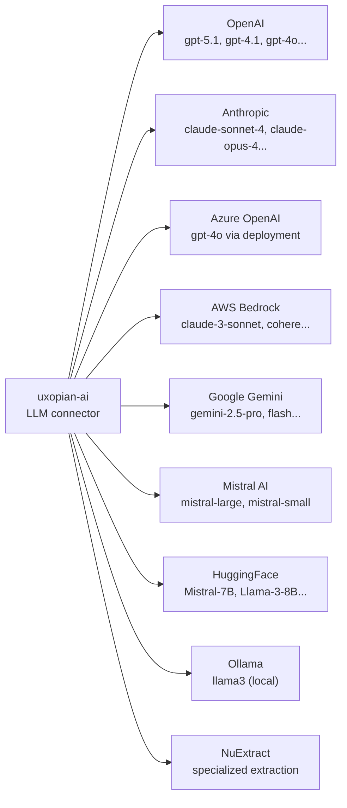

Uxopian AI supports nine LLM providers. Provider configurations are loaded from `llm-clients-config.yml` at startup into OpenSearch, then managed at runtime via the Admin API.

## Provider overview



*Figure: The nine LLM providers supported by uxopian-ai.*

## Configuration structure

Each provider is configured in `llm-clients-config.yml` under `llm.provider.globals`:

```yaml
llm:
  default:
    provider: ${LLM_DEFAULT_PROVIDER:openai}
    model: ${LLM_DEFAULT_MODEL:gpt-5.1}
    base-prompt: ${LLM_DEFAULT_PROMPT:basePrompt}
  context: ${LLM_CONTEXT_SIZE:10}
  provider:
    globals:
      - provider: openai
        defaultLlmModelConfName: gpt5
        globalConf:
          apiSecret: ${OPENAI_API_KEY:}
          temperature: 1
          timeout: 60s
          maxRetries: 3
        llModelConfs:
          - llmModelConfName: gpt5
            modelName: gpt-5.1
            multiModalSupported: true
            functionCallSupported: true
```

### Global configuration fields

| Field | Description |
|---|---|
| `provider` | Provider identifier (see table below) |
| `defaultLlmModelConfName` | Default model configuration name for this provider |
| `globalConf.apiSecret` | API key or secret credential |
| `globalConf.endpointUrl` | Base URL for the provider API |
| `globalConf.temperature` | Sampling temperature (0.0 to 1.0+) |
| `globalConf.timeout` | Request timeout (e.g., `60s`) |
| `globalConf.maxRetries` | Number of retry attempts on failure |
| `globalConf.extras` | Provider-specific additional parameters |

### Model configuration fields

| Field | Description |
|---|---|
| `llmModelConfName` | Internal name used to reference this model |
| `modelName` | Actual model name sent to the provider API |
| `multiModalSupported` | Whether this model accepts image inputs |
| `functionCallSupported` | Whether this model supports function calling (required for tools) |

## Supported providers

| Provider | `provider` value | Auth field | Notes |
|---|---|---|---|
| OpenAI | `openai` | `apiSecret` (API key) | |
| Anthropic | `anthropic` | `apiSecret` (API key), `endpointUrl` | |
| Azure OpenAI | `azure` | `apiSecret` (API key), `endpointUrl`, `extras.deploymentName` | Requires deployment name |
| AWS Bedrock | `bedrock` | `extras.accessKey`, `extras.secretKey`, `extras.region` | No top-level apiSecret |
| Google Gemini | `gemini` | `apiSecret` (API key) | |
| Mistral AI | `mistral` | `apiSecret` (API key), `endpointUrl` | |
| HuggingFace | `huggingface` | `apiSecret` (API key) | |
| Ollama | `ollama` | `endpointUrl` (local server URL, no key needed) | For local model serving |
| NuExtract | `nu-extract` | `apiSecret`, `endpointUrl`, `extras.modelId` | Specialized extraction |

## Credential encryption

API keys are encrypted with AES/GCM before being stored in OpenSearch. The encryption key is configured via `app.security.secret-key` in `application.yml`. If not set, a default development key is used. Set a unique key in production.

## Default provider and model

The default provider and model used when none is specified per-request:

- `LLM_DEFAULT_PROVIDER`: provider identifier (default: `openai`)
- `LLM_DEFAULT_MODEL`: model name (default: `gpt-5.1`)
- `LLM_DEFAULT_PROMPT`: base prompt ID (default: `basePrompt`)

These can be overridden per-request via query parameters (`provider`, `model`) on the requests endpoint.

## Context size

`llm.context` (or `LLM_CONTEXT_SIZE`) controls how many previous requests from the conversation are included in each LLM call. Default: `10`.

## Tenant overrides

Per-tenant LLM provider configurations can be defined under `llm.provider.tenants` with a `mergeStrategy` of `MERGE`, `OVERWRITE`, or `CREATE_IF_MISSING`. This allows different tenants to use different API keys or models. See [Multi-tenancy](./multi_tenancy.md).

## Related pages

- [Configure LLM providers](../how_to/configure_llm_providers.md)
- [Multi-tenancy](./multi_tenancy.md)
- [Configuration file reference](../reference/configuration.md)
- [Environment variables reference](../reference/environment_variables.md)
