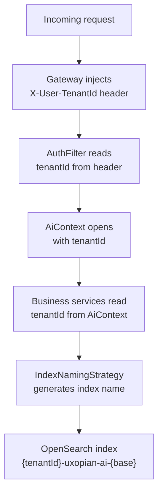

Uxopian AI is multi-tenant by design. Every piece of data, configuration, and LLM provider configuration is scoped to a tenant. Tenants are isolated at the OpenSearch index level. There is no shared data between tenants.

## How tenancy works



*Figure: How a tenant ID travels from an incoming request to an OpenSearch index name.*

## AiContext

`AiContext` is a thread-local container that holds the `AuthenticatedUser` for the current request. It is opened by `AuthFilter` at the start of each HTTP request and closed when the request completes. All downstream services call `AiContext.get()` to retrieve the tenant ID without it being passed as a parameter.

## IndexNamingStrategy

`IndexNamingStrategy` generates the OpenSearch index name for each piece of tenant data. The pattern is:

```
{sanitized-tenant-id}-uxopian-ai-{base-name}
```

The tenant ID is sanitized before use: trimmed, lowercased, and non-alphanumeric characters replaced with `-`. For example, tenant ID `FlowerDocs-EU` becomes index name `flowerdocs-eu-uxopian-ai-conversations`.

The index prefix (`uxopian-ai` in the example above) is configurable via `opensearch.index-prefix` in `opensearch.yml`.

## Auto-provisioning

Tenants do not need to be pre-created. When a request arrives for a tenant that has no data yet, OpenSearch indexes are created automatically on first write. There is no tenant registration step.

## What is tenant-scoped

Everything is tenant-scoped:

| Data type | OpenSearch index (example) |
|---|---|
| Conversations | `tenant-uxopian-ai-conversations` |
| Requests | `tenant-uxopian-ai-requests` |
| Prompts | `tenant-uxopian-ai-prompts` |
| Goal configurations | `tenant-uxopian-ai-goals` |
| LLM provider configurations | `tenant-uxopian-ai-llm-providers` |
| Usage metrics | exported to `micrometer-metrics` index (not tenant-scoped) |

## Per-tenant configuration overrides

### LLM providers

`llm-clients-config.yml` defines global LLM providers under `llm.provider.globals`. These apply to all tenants. Per-tenant overrides are defined under `llm.provider.tenants`. Each tenant entry specifies a `mergeStrategy`:

- `MERGE`: existing global provider configurations are updated with tenant-specific values.
- `OVERWRITE`: the tenant's configuration completely replaces the global configuration.
- `CREATE_IF_MISSING`: the tenant configuration is applied only if the provider does not already exist for that tenant.

```yaml
llm:
  provider:
    tenants:
      - tenantId: tenant-A
        mergeStrategy: MERGE
        providers:
          - provider: openai
            globalConf:
              apiSecret: sk-tenant-a-key
```

### Prompts

`prompts.yml` defines global prompts under `prompts.globals`. Tenant-specific overrides are defined under `prompts.tenants`. Each tenant entry specifies a `mergeStrategy` (`merge` or `replace`) and lists the prompts to add or override.

### Goals

`goals.yml` defines global goal groups under `goals.globals`. Tenant-specific overrides follow the same pattern under `goals.tenants`.

Both prompts and goals can also be managed at runtime via the Admin API without restarting the application.

## Important constraints

- If `X-User-TenantId` is absent from the request and the `dev` profile is not active, the request proceeds without a tenant context. Operations that access tenant data will fail.
- Tenant IDs are sanitized before use. A tenant ID that becomes empty after sanitization (e.g., one containing only special characters) will cause a startup error.
- The index prefix can be changed via `opensearch.index-prefix`, but changing it on an existing deployment does not migrate existing indexes.

## Related pages

- [Authentication and gateway](./authentication.md)
- [System architecture](./architecture.md)
- [Configuration file reference](../reference/configuration.md)
