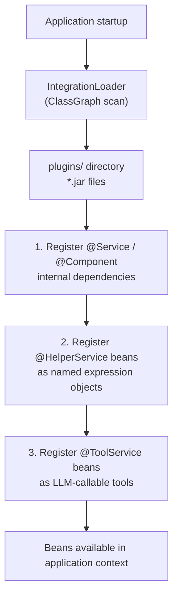

Uxopian AI extends its capabilities through plugins. A plugin is a shaded JAR placed in the `plugins/` directory. At startup, `IntegrationLoader` scans all JARs in that directory and registers their Spring beans in the application context.

## Why plugins exist

The core `uxopian-ai` image is kept independent of specific enterprise integrations. ARender, FlowerDocs, and custom tools are shipped as separate JARs that are loaded on demand. This allows deploying only the integrations relevant to a given environment.

## How plugins are loaded



*Figure: Registration order within each scanned plugin JAR.*

## Plugin directory

The default plugins directory is `plugins/` relative to the working directory. It is configurable via the `plugins.root.path` property (or `PLUGINS_ROOT_PATH` environment variable). In the Docker Compose example, plugin JARs are included in the image and unpacked to the configured path at startup.

## Registration order

Within each JAR, `IntegrationLoader` registers beans in this order:

1. **Internal `@Service`/`@Component` beans**: dependencies of helpers and tools. These are registered first so that helpers and tools can autowire them.
2. **`@HelperService` beans**: registered under the name specified in `@HelperService(name="...")`. This name is how Thymeleaf prompt templates reference the helper.
3. **`@ToolService` beans**: registered and collected by `ToolExecutor` to build the list of LLM-callable methods.

If a bean name conflicts with an already-registered bean, `IntegrationLoader` logs a warning and skips the duplicate.

## Shipped plugins

Starting with 2026.0.0-ft3, each integration is packaged as a single shaded JAR per domain — `connector` and `helper` classes are shaded into the `tool` (or, for integrations without a tool, directly into the helper JAR). The distribution ZIP unpacks one JAR per integration into `plugins/`.

| Plugin | Source module | Content | Tool tag |
|---|---|---|---|
| ARender | `integrations/arender/{connector,helper}` | `RenditionService`, `OcrDocumentParser` interface, `DocumentService` (`@HelperService(name="documentService")`) | — |
| FlowerDocs | `integrations/flowerdocs/{connector,helper,tool}` | FlowerDocs API client, `FlowerDocsServiceHelper`, `DocumentSummarizer`, `TagHelper`, `FlowerDocsSearchService`, `FlowerDocsDocumentService`, `FlowerDocsRedactService` | `flowerdocs` |
| Alfresco | `integrations/alfresco/{connector,helper,tool}` | `AlfrescoWebClient`, `AlfrescoSearchService`, `AlfrescoDocumentService`, `AlfrescoModelService`, `AlfrescoHelper`, `AlfrescoSearchToolService`, `AlfrescoDocumentToolService`, `AlfrescoMetadataToolService` | `alfresco` |
| Files tool | `tools/files` | Generic file utilities tool | `files` |

## Filtering tools by tag

In 2026.0.0-ft3, `@ToolService` accepts a `tags` attribute (`String[]`, default `{}`). The `plugins.tools.enabled-tags` property (env `PLUGINS_TOOLS_ENABLED_TAGS`) is a comma-separated whitelist used by `IntegrationLoader` to decide which tool sets to register:

| Whitelist state | Behaviour |
|---|---|
| Empty list | All `@ToolService` beans are registered regardless of their tags (backward compatible). |
| Non-empty list | A `@ToolService` is registered only if at least one of its tags matches the whitelist. |
| `@ToolService` with no tags | Always registered, regardless of whitelist. This keeps custom in-house tools from being filtered out accidentally. |

The default value shipped in `application.yaml` is `flowerdocs,files`, so Alfresco tools are present in `plugins/` but not registered unless you opt in.

### Choosing a document management backend

`flowerdocs` and `alfresco` are two separate tool suites that both expose document search, retrieval, and metadata operations — but for different ECM backends and with incompatible query APIs. Loading both simultaneously is not recommended: the LLM would see two distinct sets of tools for the same operations and may call either one unpredictably.

Pick **exactly one** backend per deployment:

| Deployment target | `PLUGINS_TOOLS_ENABLED_TAGS` |
|---|---|
| FlowerDocs (default) | `flowerdocs,files` |
| Alfresco | `alfresco,files` |
| No ECM backend | `files` |

```yaml
# FlowerDocs (default — no change needed)
plugins:
  tools:
    enabled-tags: flowerdocs,files

# Alfresco
plugins:
  tools:
    enabled-tags: alfresco,files

# No ECM backend
plugins:
  tools:
    enabled-tags: files
```

For Spring Boot tests that use classpath component scan, add `@TestPropertySource(properties = "plugins.tools.enabled-tags=...")` and rely on `ToolServiceTagFilter` (a `BeanDefinitionRegistryPostProcessor`) to strip non-matching beans from the registry.

## Disabling tools globally

To disable tool execution entirely, set `tools.enabled=false` (or `TOOLS_ENABLED=false`). `ToolExecutor` then skips initialization and sends no tool specifications to the LLM. This setting is independent of the tag whitelist: `tools.enabled=false` wins regardless of `enabled-tags`.

## Adding and removing plugins

Drop a shaded JAR into the `plugins/` directory and restart the application. The new plugin's beans are registered on the next startup. To remove a plugin, delete its JAR and restart.

There is no hot-reload. A restart is always required after adding or removing plugins.

## Related pages

- [Write and deploy custom tools](../extending/custom_tools.md)
- [Write custom service helpers](../extending/custom_service_helpers.md)
- [System architecture](./architecture.md)
- [Environment variables reference](../reference/environment_variables.md)
