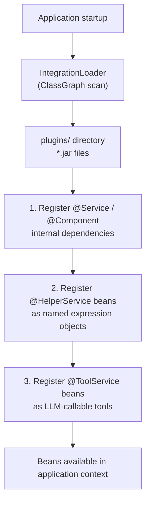

Uxopian AI extends its capabilities through plugins. A plugin is a shaded JAR placed in the `plugins/` directory. At startup, `IntegrationLoader` scans all JARs in that directory and registers their Spring beans in the application context.

## Why plugins exist

The core `uxopian-ai` image is kept independent of specific enterprise integrations. ARender, FlowerDocs, and custom tools are shipped as separate JARs that are loaded on demand. This allows deploying only the integrations relevant to a given environment.

## How plugins are loaded

*Figure: Registration order within each scanned plugin JAR.*

## Plugin directory

The default plugins directory is `plugins/` relative to the working directory. It is configurable via the `plugins.root.path` property (or `PLUGINS_ROOT_PATH` environment variable). In the Docker Compose example, plugin JARs are included in the image and unpacked to the configured path at startup.

## Registration order

Within each JAR, `IntegrationLoader` registers beans in this order:

1. **Internal `@Service`/`@Component` beans**: dependencies of helpers and tools. These are registered first so that helpers and tools can autowire them.
2. **`@HelperService` beans**: registered under the name specified in `@HelperService(name="...")`. This name is how Thymeleaf prompt templates reference the helper.
3. **`@ToolService` beans**: registered and collected by `ToolExecutor` to build the list of LLM-callable methods.

If a bean name conflicts with an already-registered bean, `IntegrationLoader` logs a warning and skips the duplicate.

## Shipped plugins

| Plugin | JAR location | Content |
|---|---|---|
| ARender connector | `integrations/arender/connector` | `RenditionService`, `OcrDocumentParser` interface |
| ARender helper | `integrations/arender/helper` | `DocumentService` (`@HelperService(name="documentService")`) |
| FlowerDocs connector | `integrations/flowerdocs/connector` | FlowerDocs API client services |
| FlowerDocs helper | `integrations/flowerdocs/helper` | `FlowerDocsServiceHelper`, `DocumentSummarizer`, `TagHelper` |
| FlowerDocs tool | `integrations/flowerdocs/tool` | `FlowerDocsSearchService`, `FlowerDocsRedactService` (`@ToolService`) |
| Files tool | `tools/files` | Generic file utilities tool |

## Disabling tools

All tools can be disabled globally by setting `tools.enabled=false` (or `TOOLS_ENABLED=false`). This prevents `ToolExecutor` from collecting any `@ToolService` beans and sends no tool specifications to the LLM.

## Adding and removing plugins

Drop a shaded JAR into the `plugins/` directory and restart the application. The new plugin's beans are registered on the next startup. To remove a plugin, delete its JAR and restart.

There is no hot-reload. A restart is always required after adding or removing plugins.

## Related pages

- [Write and deploy custom tools](../extending/custom_tools.md)
- [Write custom service helpers](../extending/custom_service_helpers.md)
- [System architecture](./architecture.md)
- [Environment variables reference](../reference/environment_variables.md)
