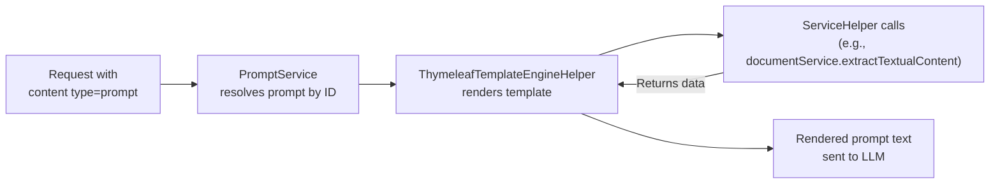

A prompt is a named, reusable message template. Prompts are rendered by a Thymeleaf engine at request time, which allows them to call ServiceHelper methods to inject dynamic content, such as extracting text from a document.

## What a prompt is

A prompt has:

- `id`: unique identifier referenced in requests and goals
- `role`: `SYSTEM`, `USER`, or `ASSISTANT`
- `content`: a Thymeleaf template string
- `requiresMultiModalModel`: if `true`, the request requires a multimodal LLM
- `requiresFunctionCallingModel`: if `true`, the request requires a function-calling LLM
- `reasoningDisabled`: if `true`, tool calls are disabled for this prompt
- `defaultLlmProvider` and `defaultLlmModel`: optional model override for this specific prompt

## Rendering pipeline



*Figure: Prompt rendering pipeline from request input to rendered LLM message.*

## Thymeleaf syntax in prompts

Prompt templates use Thymeleaf TEXT mode. Variable expressions use double brackets instead of the standard `${}` syntax:

| Usage | Syntax |
|---|---|
| Variable expression | `[[${variable}]]` |
| Conditional expression | `[[${condition ? 'yes' : 'no'}]]` |
| Iteration | `[# th:each="item : ${list}"]...[/]` |
| Null-safe expression | `[[${variable != null} ? ${variable} : 'default']]` |

## ServiceHelper calls

ServiceHelpers are Spring beans annotated with `@HelperService(name="...")`. They are registered as named expression objects in the Thymeleaf context. A prompt template can call any method on a registered helper using the helper's name:

```
[[${documentService.extractTextualContent(documentId)}]]
```

Here `documentService` is the name of the helper, and `documentId` is a variable passed in the request payload. See [ServiceHelpers](../extending/custom_service_helpers.md) for how to write custom ones.

## Built-in prompts

The default `prompts.yml` ships with several ready-to-use prompts:

| Prompt ID | Role | Purpose |
|---|---|---|
| `basePrompt` | SYSTEM | Default assistant persona and safety rules |
| `arenderContext` | USER | Extracts document text via `documentService.extractTextualContent(documentId)` |
| `summarizeDocumentText` | USER | Summarizes document content as plain text |
| `summarizeDocumentMarkdown` | USER | Summarizes document content with Markdown formatting |
| `translate` | USER | Translates document content to a specified language |
| `genericComparison` | SYSTEM | Compares two documents (leftDocumentId, rightDocumentId) |
| `detailedComparison` | USER | Detailed point-by-point comparison of multiple documents |
| `markdownResponse` | USER | Instructs the LLM to respond with Markdown and inline HTML |

## Payload variables

When a request includes a `content` item with `type: prompt`, the `payload` map is passed into the Thymeleaf context as variables. The template can then access them by name:

```json
{
  "type": "prompt",
  "value": "arenderContext",
  "payload": { "documentId": "doc-123" }
}
```

Inside the template, `[[${documentId}]]` resolves to `doc-123`.

## Tenant overrides

Prompts are loaded from `prompts.yml` at startup and stored in OpenSearch. The file supports per-tenant overrides:

```yaml
prompts:
  globals:
    - id: basePrompt
      role: SYSTEM
      content: |
        You are a helpful assistant.

  tenants:
    - tenantId: my-tenant
      mergeStrategy: merge
      prompts:
        - id: basePrompt
          role: SYSTEM
          content: |
            You are a specialized assistant for my-tenant.
```

`mergeStrategy: merge` updates matching prompts for the tenant. `mergeStrategy: replace` replaces the entire tenant prompt list.

Prompts can also be created or updated at runtime via the Admin API (`/api/v1/admin/prompts`) without restarting the application.

## Backup

`prompts.yml` can specify a backup path (`prompts.backup.path`). If set, the application writes a backup of current prompts to that path. The environment variable is `PROMPTS_BACKUP_PATH`.

## Related pages

- [Goals](./goals.md)
- [Write prompts](../extending/writing_prompts.md)
- [Custom service helpers](../extending/custom_service_helpers.md)
- [Configuration file reference](../reference/configuration.md)
