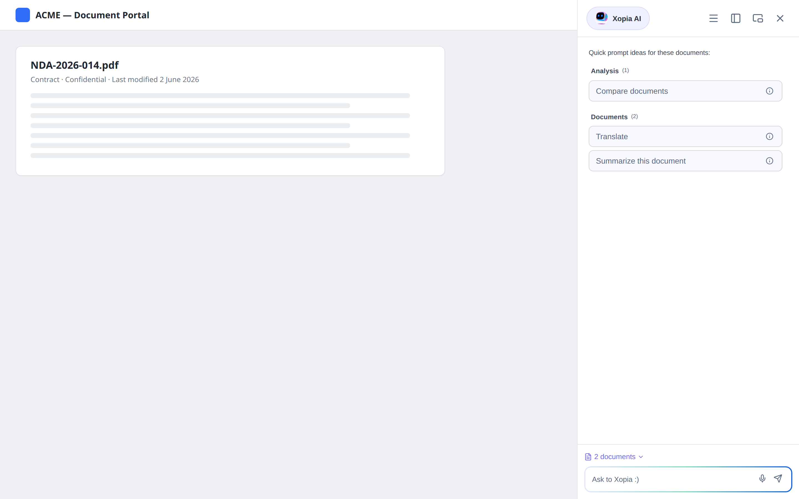
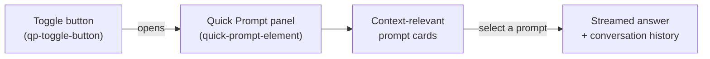

Quick Prompt is a context-aware assistant panel that embeds in a host application alongside — or instead of — the standard chat. Unlike the chat, which the user drives entirely by typing, Quick Prompt **watches the user's navigation**, captures the context of what is on screen (the current document, task, or folder, plus search results), and offers a curated list of prompts relevant to that context.

It is delivered as a separate web component and is the recommended way to surface AI assistance directly inside an ECM application such as FlowerDocs.

## What the user sees



*Figure: Quick Prompt embedded in a host application. The panel offers prompts relevant to the documents currently in view, grouped by category.*



*Figure: Quick Prompt opens a side panel of context-relevant prompts; selecting one streams an answer.*

- A **toggle button** opens the panel from the host application's UI.
- The panel lists the prompts that apply to the current screen, **grouped by category** and **ordered by priority**.
- Selecting a prompt runs it against the captured context and **streams** the answer.
- The panel keeps a **conversation history** (searchable), and supports copy, feedback, retry, and speech-to-text input.
- It can be **docked, dragged as a floating window, resized, or popped out** as a browser Picture-in-Picture window.

## How context is captured

The host application tells Quick Prompt how to derive the current context from the page. As the user navigates, Quick Prompt updates a **context payload** that can include:

| Context element | Description |
|---|---|
| `user` | The signed-in user (id, name, roles, groups, …) |
| `tenant` | The current tenant |
| `documents` | One or more documents in view (id, type, title, properties, tags) |
| `tasks` | One or more tasks in view |
| `folders` | One or more folders in view |
| `injected` | Arbitrary extra values the host pushes (e.g. the current view type) |
| `capabilities` | Boolean feature flags the host advertises |

When a prompt is run, this payload is serialized and sent to the configured LLM as **supplementary context**, in addition to the prompt template itself.

:::caution Data sent to the LLM
The captured document/task/folder properties become part of the request sent to the configured LLM provider. Only expose prompts — and push context fields — that are appropriate to share with your provider.
:::

## How prompts are selected for display

Which prompts appear in the panel is controlled by each prompt's **Display Settings** (configured in the admin panel — see [Managing prompts](../admin/managing_prompts.md#display-settings-tab-quick-prompt)). A prompt is shown only when **both** are true:

1. Its display settings are **enabled**, and
2. Its **display condition** — a JavaScript expression evaluated against the current context — returns `true`.

Display conditions are evaluated **client-side in a restricted sandbox**: only literals, property access, comparisons, logical/conditional operators, and a small set of helpers (`includes`, `startsWith`, `endsWith`, `some`, `every`, `find`) are allowed; there is no access to `eval`, `Function`, or global objects. A condition that fails to parse or throws at runtime evaluates to `false`, so the prompt is simply hidden.

Examples of display conditions:

```javascript
// Show only when a single PDF document is in view
documents.length === 1 && documents[0].type === 'pdf'

// Show only for users with a reviewer role
user.roles.includes('REVIEWER')

// Show only in a folder view
injected.viewType === 'folder'
```

End users only ever receive each prompt's display settings (label, category, priority, description, condition) — never the prompt template content or its LLM configuration.

## Relationship to the chat component

Quick Prompt and the chat (`<chat-element>`) share the same backend (conversations, requests, streaming, prompts) but serve different needs:

| | Chat | Quick Prompt |
|---|---|---|
| Driven by | The user typing | The user's navigation + curated prompts |
| Context | What the user types | Auto-captured document/task/folder context |
| Prompt discovery | The user knows what to ask | Context-filtered prompt cards |
| Display | In-page chat panel | Dockable / floating / Picture-in-Picture panel |

## Related pages

- [Embed Quick Prompt](../how_to/embed_quick_prompt.mdx)
- [Managing prompts — Display Settings](../admin/managing_prompts.md#display-settings-tab-quick-prompt)
- [Tools — Interactive choices](./tools.md#built-in-tools-interactive-choices)
- [Web components](./web_components.md)
- [Conversations and requests](./conversations_and_requests.md)
