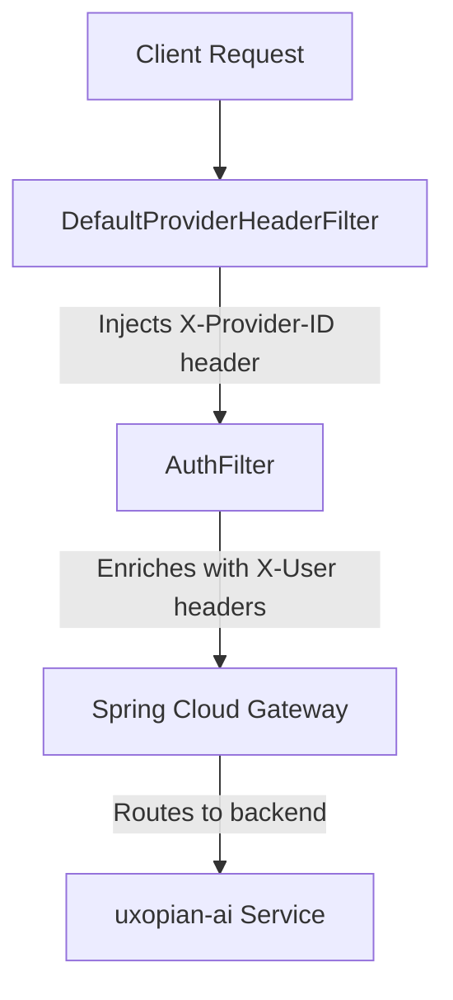

# Security Model (BFF Pattern)

Uxopian-ai is a backend microservice designed to run behind a **BFF (Backend for Frontend)** or **API Gateway**. It should **never** be exposed directly to the public internet. This page explains why, how the Gateway works internally, and how to work without it during development.

---

## Why a BFF Gateway?

The uxopian-ai service does **not** handle authentication itself — by design. This separation provides several advantages:

- **Single responsibility**: The AI service focuses on prompt resolution and LLM orchestration. The Gateway focuses on security.
- **Pluggable authentication**: Your organization can use OAuth2, JWT, SAML, LDAP, or any custom mechanism. The AI service does not need to change.
- **Token propagation**: The Gateway forwards the original user token (`X-User-Token`), which Helpers and integrations can use to call other APIs (FlowerDocs, ARender) on behalf of the authenticated user.
- **Role-based access control**: The Gateway maps roles from your identity provider into the `X-User-Roles` header. The AI service uses this to gate admin operations.
- **Tenant isolation**: The Gateway extracts the organization/scope from the authenticated session and injects it as `X-User-TenantId`, enabling full multi-tenancy.

In a typical deployment, three layers are involved:

1. **Client Application** — The user-facing app (ARender, FlowerDocs, a custom web app).
2. **BFF / Gateway** — Authenticates the user and injects identity headers.
3. **Uxopian-ai Service** — Receives pre-authenticated requests and processes them.

The Gateway is the **only** component exposed to the network.

---

## The Uxopian Gateway

The Uxopian Gateway is a **standalone service**, built and deployed independently from the AI service. It is built on **Spring Cloud Gateway** (reactive) and sits in front of the AI service, handling authentication via a **pluggable provider** system. The built-in auth providers (DevProvider, FlowerDocsProvider, Fast2Provider) are part of the Gateway service.

### Request Processing Pipeline

Every request passes through two filters before reaching the backend:

<div style={{textAlign: 'center'}}>



</div>

1. **`DefaultProviderHeaderFilter`** — Uses `AntPathMatcher` to match the incoming request URL against the configured routes. When a match is found, it injects the `X-Provider-ID` internal header with the provider name from the route config (e.g., `FlowerDocsProvider`, `Fast2Provider`, `DevProvider`).

2. **`AuthFilter`** — Reads the `X-Provider-ID` header, loads the corresponding `AuthProvider` implementation, and calls its `authenticate(request)` method. The provider returns an `AuthenticatedUser` with `id`, `roles`, `tenantId`, and `token`. The filter then **enriches** the downstream request with these headers:

    | Enriched Header    | Source                        |
    | :----------------- | :---------------------------- |
    | `X-User-Id`        | `AuthenticatedUser.id`        |
    | `X-User-Roles`     | `AuthenticatedUser.roles` (comma-joined) |
    | `X-User-TenantId`  | `AuthenticatedUser.tenantId`  |
    | `X-User-Token`     | `AuthenticatedUser.token`     |

    The filter also creates a Spring Security `UsernamePasswordAuthenticationToken` and places it in the reactive `SecurityContext`, enabling role-based path security rules.

3. **Spring Cloud Gateway** — Forwards the enriched request to the backend URI (`http://ai-standalone-service:8080`).

### Pluggable Auth Providers

The Gateway uses a **plugin architecture**. Auth providers are loaded dynamically from JAR files at startup:

- At boot, the Gateway scans the `provider/` directory (configurable via `auth.provider.path`) for provider implementations.
- Each provider is a Spring `@Service` with a name (e.g., `@Service("FlowerDocsProvider")`).
- The route configuration references that name in the `provider:` field.

**Built-in providers:**

| Provider | Authentication Method |
| :------- | :-------------------- |
| `DevProvider` | Reads identity from raw request headers (for development) |
| `FlowerDocsProvider` | Validates FlowerDocs JWT tokens (from `token` header or `SESSION` cookie) |
| `Fast2Provider` | Decrypts Fast2 JWT tokens via a remote public key |

To integrate with your organization's identity system (Keycloak, Azure AD, custom SSO), you implement the `AuthProvider` interface and drop the JAR into the `provider/` directory. See [Adding a Custom Auth Provider](../extending/custom_auth_provider.md).

### Gateway Route Configuration

Routes are defined in the Gateway's `application.yml`:

```yaml
app:
  gateway:
    provider-header: X-Provider-ID
  routes:
    - id: uxopian-ai
      uri: http://ai-standalone-service:8080
      prefix: /gui/gateway/uxopian-ai/
      path: /gui/gateway/uxopian-ai/**
      provider: FlowerDocsProvider        # ← Which auth provider to use
      security:
        - path: /.well-known/**
          public: true                     # ← No auth required
        - path: /swagger-ui/**
          public: true
        - path: /prompt/**
          roles: [ "ADMIN" ]              # ← Requires ADMIN role
        - path: /goal/**
          roles: [ "ADMIN" ]
```

Each route maps a URL pattern to a backend service and specifies which auth provider to use and what security rules apply per path.

---

## Authentication Headers

When deploying in production, your Gateway (Uxopian's or your own) must inject the following headers into every request before it reaches uxopian-ai:

| Header            | Description                                             | Required |
| :---------------- | :------------------------------------------------------ | :------- |
| `X-User-TenantId` | Isolates data per tenant (organization).                | **Yes**  |
| `X-User-Id`       | Unique identifier for the user.                         | **Yes**  |
| `X-User-Roles`    | Comma-separated list of roles (e.g., `admin,user`).     | No       |
| `X-User-Token`    | Original user token (if needed for downstream context). | No       |

The `X-User-Roles` header controls access to admin endpoints. Operations under `/api/v1/admin/*` require the `admin` role. The `X-User-Token` is propagated to Helpers and integrations that need to call external APIs (e.g., FlowerDocs, ARender) on behalf of the user.

---

## Production Mode

In production, the Gateway intercepts every incoming request, validates the user's credentials, and injects the `X-User-*` headers. The uxopian-ai service trusts these headers implicitly.

**Flow:**

1. User sends a request to the Gateway.
2. Gateway selects the appropriate `AuthProvider` based on the route.
3. Provider authenticates (OAuth2, JWT, SAML...) and returns an `AuthenticatedUser`.
4. Gateway enriches the request with `X-User-TenantId`, `X-User-Id`, `X-User-Roles`, `X-User-Token`.
5. Gateway forwards the request to uxopian-ai.
6. Uxopian-ai reads the headers and establishes the security context (`AiContext`).
7. All data access (conversations, prompts, stats) is scoped to the tenant.

:::warning[Never expose uxopian-ai directly]
Without a Gateway, anyone can forge `X-User-*` headers and impersonate any user or tenant. The Gateway is what makes these headers trustworthy.
:::


---

## Development Mode

For local development and testing, there are **two levels** of dev-mode that work together:

### 1. The `DevProvider` (Gateway Side)

The `DevProvider` is a built-in auth provider that trusts raw request headers without any validation. Instead of decrypting a JWT or calling an OAuth endpoint, it simply reads `X-User-Id`, `X-User-Roles`, and `X-User-Tenant` directly from the incoming request.

```java
@Service("DevProvider")
public class DevProvider implements AuthProvider {
    @Override
    public Mono<AuthenticatedUser> authenticate(ServerHttpRequest request) {
        String userId = request.getHeaders().getFirst("X-User-Id");
        String rolesRaw = request.getHeaders().getFirst("X-User-Roles");
        String tenantId = request.getHeaders().getFirst("X-User-Tenant");
        // ... builds AuthenticatedUser from these headers
    }
}
```

To activate it, configure a route with `provider: DevProvider` in the Gateway's `application.yml`. This lets you call the Gateway with plain headers (e.g., from `curl` or Postman) without needing real credentials.

### 2. The `dev` Profile (AI Service Side)

When the uxopian-ai service is started with `SPRING_PROFILES_ACTIVE=dev`, its internal `AuthFilter` injects default credentials if the `X-User-*` headers are missing:

- **Default Tenant:** `Tenant-development`
- **Default User:** `User-development`

This means you can call the AI service **directly** (bypassing the Gateway entirely) and it will still work:

```bash
# No X-User-* headers needed — dev profile fills in defaults
curl http://localhost:8085/api/v1/conversations
```

You can also override specific headers while letting others fall back to defaults:

```bash
# Custom tenant, default user
curl -H "X-User-TenantId: my-test-tenant" http://localhost:8085/api/v1/conversations
```

:::tip[Starter Kit Uses Dev Mode]
The Docker Starter Kit ships with `SPRING_PROFILES_ACTIVE=dev` and no Gateway service. This is why the [Quick Start](../getting_started/quickstart.md) curl commands work directly against `localhost:8085` — the dev profile handles the missing headers automatically.
:::


:::danger[Never use `dev` in production]
The `dev` profile **disables all authentication enforcement**. Any request without headers will be accepted as `User-development` in `Tenant-development`. Combined with no Gateway, this means zero access control.
:::


### When to Use What

| Scenario | Gateway | AI Service Profile | How Auth Works |
| :------- | :------ | :----------------- | :------------- |
| **Production** | Uxopian Gateway + real provider (e.g., `FlowerDocsProvider`) | Default (no `dev`) | Gateway validates credentials, injects headers. AI service rejects requests without headers. |
| **Staging / Integration** | Uxopian Gateway + `DevProvider` | Default (no `dev`) | You pass raw headers through the Gateway. AI service still requires headers. |
| **Local development** | None | `dev` | Call the AI service directly. Missing headers get default values. |

---

## Multi-Tenancy

Every piece of data in uxopian-ai is scoped to a **Tenant ID**:

- **Conversations** belong to a specific tenant.
- **Prompts and Goals** can be global or tenant-specific.
- **Statistics** are aggregated per tenant.

The `X-User-TenantId` header determines which tenant's data a request can access. A user from `tenant-A` cannot see conversations from `tenant-B`, even if they share the same uxopian-ai instance.

This logical separation is enforced at the data layer (OpenSearch queries always include the tenant filter).

---

## Going Further

- [Adding a Custom Auth Provider](../extending/custom_auth_provider.md) — Implement your own authentication logic for the Gateway.
- [Architecture Overview](architecture.md) — See the full component and sequence diagrams.
- [Configuration Files](../reference/config_files.md) — Gateway and AI service configuration reference.
