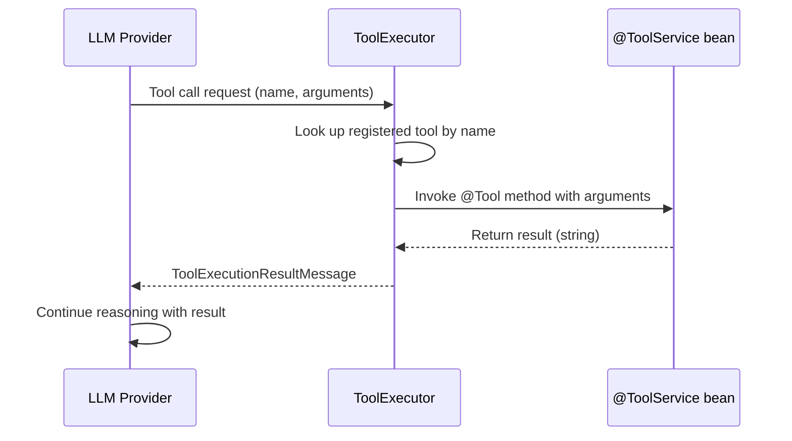

Tools are Java methods that the LLM can call during a conversation. When the LLM decides to use a tool, it emits a tool call request; uxopian-ai executes the corresponding method and returns the result to the LLM, which then incorporates it into its response.

## How tools work



*Figure: Tool execution sequence from LLM tool call to method invocation and result return.*

## Annotations

Tools are defined using three annotations — `@ToolService` is provided by uxopian-ai, `@Tool` and `@P` come from LangChain4J:

| Annotation | Target | Purpose |
|---|---|---|
| `@ToolService(tags = {...})` | Class | Marks the bean as a tool provider. `IntegrationLoader` uses this to register it. The optional `tags` array drives the tool whitelist — see [Filtering tools by tag](#filtering-tools-by-tag). |
| `@Tool` | Method | Marks a method as callable by the LLM. The annotation value is the description sent to the LLM. |
| `@P` | Parameter | Describes a parameter. The description is sent to the LLM so it knows what value to provide. |

Example:

```java
@Service
@ToolService(tags = "alfresco")
public class MySearchService {

    @Tool("Search for documents matching a query string. Returns a list of document titles.")
    public List<String> searchDocuments(
            @P("The search query string") String query,
            @P("Maximum number of results to return") int maxResults) {
        // implementation
    }
}
```

## Registration

`ToolExecutor` collects all beans annotated with `@ToolService` at `ContextRefreshedEvent`. For each bean, it scans public methods annotated with `@Tool` and registers them by name. The tool name defaults to the method name; it can be overridden with `@Tool(name = "...")`.

If tools are disabled via `tools.enabled=false` (or `TOOLS_ENABLED=false`), the `ToolExecutor` skips initialization and no tools are available.

## Filtering tools by tag

In 2026.0.0-ft3, `@ToolService.tags()` + `plugins.tools.enabled-tags` control which tool sets are registered at startup. This lets a single distribution ZIP ship several integrations (Alfresco, FlowerDocs, Files) while the deployer picks which ones the LLM actually sees.

- Default value in the shipped `application.yaml`: `flowerdocs,files` — Alfresco tools are *not* registered unless you opt in.
- Empty list = every `@ToolService` is registered.
- A `@ToolService` without any tag is *always* registered (backward compatible for custom in-tree tools).
- Multi-tagged tools are registered when *any* of their tags matches the whitelist.

See [Plugin system — Filtering tools by tag](./plugin_system.md#filtering-tools-by-tag) for the full mechanism and test-time usage.

## Function-calling model requirement

Tools require a model that supports function calling. If a prompt has `requiresFunctionCallingModel: true`, the LLM provider must have a model configured with `functionCallSupported: true`. If `reasoningDisabled: true` is set on a prompt, tool specifications are not sent to the LLM for that request.

## Standardized ECM tool names

Since 2026.0.0-ft4, the document and metadata tools for Alfresco and FlowerDocs share a **common, ECM-agnostic vocabulary**, so the same prompts and goals work against either backend. The Alfresco tools were de-prefixed and the FlowerDocs data-model tool was renamed:

| Operation | Tool name (ft4) | Previous name |
|---|---|---|
| Get the tenant data model | `getDataModel` | Alfresco `getAlfrescoDataModel` / FlowerDocs `getTaskClassAndTagClassesDescriptions` |
| Find document IDs by name | `getDocumentIdsByName` | `getAlfrescoDocumentIdsByName` |
| Read document content | `getDocumentContent` | `getAlfrescoDocumentContent` / `getFlowerDocsDocumentContent` |
| Read document properties | `getDocumentProperties` | `getAlfrescoDocumentProperties` |
| Update a document property | `updateDocumentProperty` | `updateDocumentPropertyById` / `updateDocumentTagValueById` |
| Execute a search | `doSearch` | Alfresco `searchAlfrescoNodes` / FlowerDocs `searchDocuments` |

The integration **tags** (`alfresco`, `flowerdocs`, `files`) are unchanged. If you reference tool names explicitly in custom prompts or goals, update them.

## Built-in tools: FlowerDocs

The `flowerdocs/tool` plugin (tag `flowerdocs`) ships tools the LLM can use to search and operate on FlowerDocs documents:

| Tool name | Description |
|---|---|
| `getDataModel` | Step 0 prerequisite: retrieves all document classes and tag classes with their programmatic IDs |
| `buildCriterionString` | Builds a search criterion for a text (String) tag |
| `buildCriterionNumber` | Builds a search criterion for a numeric (Long) tag |
| `buildCriterionDate` | Builds a search criterion for a date tag |
| `buildCriterionClass` | Builds a criterion to filter by document class |
| `buildAndClause` / `buildOrClause` | Combine criteria with logical AND / OR into a filter clause |
| `buildAndClauseFromClauses` / `buildOrClauseFromClauses` | Combine existing filter clauses (nested logic) |
| `doSearch` | Executes the search and returns matching documents |
| `getDocumentIdsByName` | Looks up document IDs by name |
| `getDocumentContent` | Returns the textual content of a document |
| `getDocumentProperties` | Returns a document's metadata (properties, tags, author) |
| `updateDocumentProperty` | Updates a tag / metadata value on a document |
| `previewRevertToPreviousVersion` | Non-destructive preview of a version restore |
| `revertToPreviousVersion` / `revertToPreviousVersionBatch` | Revert one / many documents to the previous version (user confirmation required) |
| `revertToVersion` | Revert a document to a specific version label (user confirmation required) |
| `prepareRedact` / `applyObfuscation` | Prepare and apply a redaction/obfuscation (requires the ARender plugin for rendering) |

A typical search session calls `getDataModel` first, then builds criteria, wraps them in clauses, and calls `doSearch`.

## Built-in tools: Alfresco

Added in 2026.0.0-ft3 (tag `alfresco`). The `integrations/alfresco/tool` plugin ships AFTS-backed tools across several `@ToolService` beans:

### Search and filters (`AlfrescoFilterToolService`, `AlfrescoSearchToolService`)

| Tool name | Description |
|---|---|
| `getDataModel` | Step 0 prerequisite: returns the tenant's light data model (common system properties + optional CMM custom types/aspects) |
| `buildTypeFilter` | AFTS fragment to filter on node type (e.g. `cm:content`, `acme:invoice`) |
| `buildPropertyContainsFilter` | AFTS fragment for partial text match on a property |
| `buildPropertyEqualsFilter` | AFTS fragment for exact property match |
| `buildDateRangeFilter` | AFTS fragment for date ranges |
| `buildFullTextFilter` | AFTS fragment for full-text content search |
| `buildFolderScopedFilter` | Restrict the search to a folder subtree |
| `buildAndClause` / `buildOrClause` | Combine fragments with logical AND / OR |
| `buildAndClauseFromClauses` / `buildOrClauseFromClauses` | Combine existing clauses (nested logic) |
| `doSearch` | Executes the assembled AFTS query |

### Documents (`AlfrescoDocumentToolService`)

| Tool name | Description |
|---|---|
| `getDocumentIdsByName` | Looks up document node IDs by name |
| `getDocumentContent` | Returns the textual content of a document |
| `listFolderContents` | Lists files in an Alfresco folder |

### Metadata (`AlfrescoMetadataToolService`)

| Tool name | Description |
|---|---|
| `getDocumentProperties` | Returns all metadata properties of a node |
| `updateDocumentProperty` | Updates a property value on a node |

### Redaction (`AlfrescoRedactService`)

| Tool name | Description |
|---|---|
| `prepareRedact` / `applyObfuscation` | Prepare and apply a redaction/obfuscation (requires the ARender plugin for rendering) |

A typical Alfresco search session calls `getDataModel` first to learn the correct qualified names, builds filters, wraps them in clauses, and finishes with `doSearch`. See [Integrate with Alfresco](../how_to/integrate_with_alfresco.mdx) for deployment steps.

## Built-in tools: FileNet

The `filenet` plugin (tag `filenet`) ships CE-SQL-backed tools across several `@ToolService` beans:

### Search and filtering (`FileNetSearchToolService`, `FileNetFilterToolService`)

| Tool name | Description |
|---|---|
| `fileNetGetDataModel` | Returns the common system properties and document classes available for filtering |
| `fileNetBuildClassFilter` | Builds an `ISCLASS()` CE SQL condition on document type |
| `fileNetBuildPropertyContainsFilter` | Builds a `LIKE` condition for partial text match |
| `fileNetBuildPropertyEqualsFilter` | Builds an exact-match condition on a property or status |
| `fileNetBuildDateRangeFilter` | Builds a date range condition on `DateCreated`/`DateLastModified` |
| `fileNetBuildFullTextFilter` | Builds a `CONTAINS()` full-text condition |
| `fileNetBuildFolderScopedFilter` | Scopes the search to a folder |
| `fileNetSearchDocuments` | Executes the assembled CE SQL query |

### Documents (`FileNetDocumentToolService`)

| Tool name | Description |
|---|---|
| `readDocumentText` | Reads the full OCR text of a document (via ARender) across all pages |
| `getDocumentMetadata` | Returns all metadata properties (system + custom class) of a document |
| `fileNetListFolderContents` | Lists documents in a folder (unfiltered, max 50) |

The object store queried by these tools is resolved automatically from the current tenant — there is no `filenet.repository-id` setting to configure. `filenet.writable-properties` is configured but not yet wired to a callable tool; there is currently no LLM-callable way to update a FileNet document property.

### Redaction (`FileNetRedactTool`)

| Tool name | Description |
|---|---|
| `fileNetPrepareRedact` / `fileNetApplyObfuscation` | Prepare and apply a redaction/obfuscation (requires the ARender plugin for rendering) |

A typical search session calls `fileNetGetDataModel` first, then builds criteria and calls `fileNetSearchDocuments`. The `FileNetHelper` bean (bridging documents to ARender for OCR) is always active, not gated by `plugins.tools.enabled-tags`. See [Integrate with FileNet](../how_to/integrate_with_filenet.mdx) for deployment steps.

## Built-in tools: Interactive choices

Since 2026.0.0-ft4, two built-in tools let the assistant present **clickable choices** in the chat instead of asking questions in plain text. They are always available — they are **not** gated by `plugins.tools.enabled-tags` — and require no prompt or configuration change.

| Tool name | Description |
|---|---|
| `presentChoices` | Presents a question with a list of option buttons (each with a label and optional description). An "Other…" option always lets the user type a free-text answer. |
| `presentStepsChoices` | Presents a guided multi-step wizard: the user answers a short sequence of questions one at a time; all answers are submitted together at the end. |

When the assistant calls one of these tools, the chat and [Quick Prompt](./quick_prompt.md) components render the options as buttons. The user's selection is sent back as an ordinary follow-up message, so the conversation continues normally. These tools are also used to obtain **explicit confirmation before destructive operations** (such as `revertToVersion` or applying a redaction).

:::note Custom chat UIs
The assistant emits the choices as a JSON block in its message content; the standard chat and Quick Prompt components parse and render it automatically. A custom UI that displays raw assistant message content should detect and handle this JSON block.
:::

## Tools and MCP

`ToolExecutor` also exposes tools provided by external Model Context Protocol (MCP) servers. Starting with 2026.0.0-ft3, MCP connections are managed through the admin UI rather than through `mcp-server.yml`: administrators register MCP endpoints from the *MCP Servers* panel, connections are isolated per tenant when authenticated, and identical unauthenticated connections are pooled and shared across tenants. Tools discovered from an enabled MCP server are registered alongside local tools and are callable in the same way. See [Managing MCP servers in the admin UI](../admin/managing_mcp_servers.md).

## Related pages

- [Plugin system](./plugin_system.md)
- [Write and deploy custom tools](../extending/custom_tools.md)
- [LLM providers](./llm_providers.md)
- [Integrate with FlowerDocs](../how_to/integrate_with_flowerdocs.mdx)
- [Integrate with Alfresco](../how_to/integrate_with_alfresco.mdx)
- [Integrate with FileNet](../how_to/integrate_with_filenet.mdx)
- [Managing MCP servers in the admin UI](../admin/managing_mcp_servers.md)
- [Agentic Plans](./agentic_plans.md) — DIRECT_TOOL nodes call a native tool directly, no LLM in the loop; a Plan can itself be exposed as a callable tool
