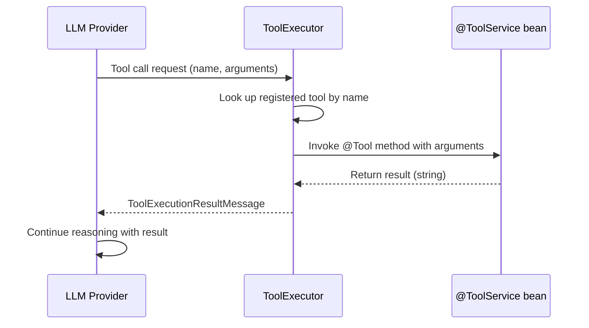

Tools are Java methods that the LLM can call during a conversation. When the LLM decides to use a tool, it emits a tool call request; uxopian-ai executes the corresponding method and returns the result to the LLM, which then incorporates it into its response.

## How tools work



*Figure: Tool execution sequence from LLM tool call to method invocation and result return.*

## Annotations

Tools are defined using three annotations — `@ToolService` is provided by uxopian-ai, `@Tool` and `@P` come from LangChain4J:

| Annotation | Target | Purpose |
|---|---|---|
| `@ToolService(tags = {...})` | Class | Marks the bean as a tool provider. `IntegrationLoader` uses this to register it. The optional `tags` array drives the tool whitelist — see [Filtering tools by tag](#filtering-tools-by-tag). |
| `@Tool` | Method | Marks a method as callable by the LLM. The annotation value is the description sent to the LLM. |
| `@P` | Parameter | Describes a parameter. The description is sent to the LLM so it knows what value to provide. |

Example:

```java
@Service
@ToolService(tags = "alfresco")
public class MySearchService {

    @Tool("Search for documents matching a query string. Returns a list of document titles.")
    public List<String> searchDocuments(
            @P("The search query string") String query,
            @P("Maximum number of results to return") int maxResults) {
        // implementation
    }
}
```

## Registration

`ToolExecutor` collects all beans annotated with `@ToolService` at `ContextRefreshedEvent`. For each bean, it scans public methods annotated with `@Tool` and registers them by name. The tool name defaults to the method name; it can be overridden with `@Tool(name = "...")`.

If tools are disabled via `tools.enabled=false` (or `TOOLS_ENABLED=false`), the `ToolExecutor` skips initialization and no tools are available.

## Filtering tools by tag

In 2026.0.0-ft3, `@ToolService.tags()` + `plugins.tools.enabled-tags` control which tool sets are registered at startup. This lets a single distribution ZIP ship several integrations (Alfresco, FlowerDocs, Files) while the deployer picks which ones the LLM actually sees.

- Default value in the shipped `application.yaml`: `flowerdocs,files` — Alfresco tools are *not* registered unless you opt in.
- Empty list = every `@ToolService` is registered.
- A `@ToolService` without any tag is *always* registered (backward compatible for custom in-tree tools).
- Multi-tagged tools are registered when *any* of their tags matches the whitelist.

See [Plugin system — Filtering tools by tag](./plugin_system.md#filtering-tools-by-tag) for the full mechanism and test-time usage.

## Function-calling model requirement

Tools require a model that supports function calling. If a prompt has `requiresFunctionCallingModel: true`, the LLM provider must have a model configured with `functionCallSupported: true`. If `reasoningDisabled: true` is set on a prompt, tool specifications are not sent to the LLM for that request.

## Built-in tools: FlowerDocs

The `flowerdocs/tool` plugin ships several tools that the LLM can use to search and operate on FlowerDocs documents:

| Tool name | Description |
|---|---|
| `getTaskClassAndTagClassesDescriptions` | Step 0 prerequisite: retrieves all document classes and tag classes with their IDs |
| `buildCriterionString` | Builds a search criterion for a text (String) tag |
| `buildCriterionNumber` | Builds a search criterion for a numeric (Long) tag |
| `buildCriterionDate` | Builds a search criterion for a date tag (format: `yyyy-MM-dd HH:mm:ss`) |
| `buildCriterionClass` | Builds a criterion to filter by document class |
| `buildAndClause` | Combines criteria with logical AND into a filter clause |
| `buildOrClause` | Combines criteria with logical OR into a filter clause |
| `buildAndClauseFromClauses` | Combines existing filter clauses with AND (for nested logic) |
| `buildOrClauseFromClauses` | Combines existing filter clauses with OR |
| `searchDocuments` | Executes the search and returns matching documents |

A typical LLM search session calls `getTaskClassAndTagClassesDescriptions` first, then builds criteria, wraps them in clauses, and calls `searchDocuments`.

## Built-in tools: Alfresco

Added in 2026.0.0-ft3 (tag `alfresco`). The `integrations/alfresco/tool` plugin ships three `@ToolService` beans covering 13 AFTS-backed tools:

### Search (`AlfrescoSearchToolService`)

| Tool name | Description |
|---|---|
| `getAlfrescoDataModel` | Step 0 prerequisite: returns the tenant's light data model (common system properties + optional CMM custom types/aspects) |
| `buildAlfrescoTypeFilter` | AFTS fragment to filter on node type (e.g. `cm:content`, `acme:invoice`) |
| `buildAlfrescoPropertyContainsFilter` | AFTS fragment for partial text match on a property |
| `buildAlfrescoPropertyEqualsFilter` | AFTS fragment for exact property match |
| `buildAlfrescoDateRangeFilter` | AFTS fragment for date ranges |
| `buildAlfrescoFullTextFilter` | AFTS fragment for full-text content search |
| `combineAlfrescoFilters` | Combines multiple AFTS fragments with AND or OR |
| `buildAlfrescoSort` | Builds a sort specification (property + direction) |
| `searchAlfrescoNodes` | Executes the assembled AFTS query |

### Documents (`AlfrescoDocumentToolService`)

| Tool name | Description |
|---|---|
| `getAlfrescoDocumentIdsByName` | Looks up document node IDs by name |
| `getAlfrescoDocumentContent` | Returns the textual content of a document |
| `listAlfrescoFolderContents` | Lists files in an Alfresco folder |

### Metadata (`AlfrescoMetadataToolService`)

| Tool name | Description |
|---|---|
| `getAlfrescoDocumentProperties` | Returns all metadata properties of a node |

A typical Alfresco search session calls `getAlfrescoDataModel` first to learn the correct qualified names, builds filters, optionally adds a sort, and finishes with `searchAlfrescoNodes`. See [Integrate with Alfresco](../how_to/integrate_with_alfresco.mdx) for deployment steps.

## Tools and MCP

`ToolExecutor` also exposes tools provided by external Model Context Protocol (MCP) servers. Starting with 2026.0.0-ft3, MCP connections are managed through the admin UI rather than through `mcp-server.yml`: administrators register MCP endpoints from the *MCP Servers* panel, connections are isolated per tenant when authenticated, and identical unauthenticated connections are pooled and shared across tenants. Tools discovered from an enabled MCP server are registered alongside local tools and are callable in the same way. See [Managing MCP servers in the admin UI](../admin/managing_mcp_servers.md).

## Related pages

- [Plugin system](./plugin_system.md)
- [Write and deploy custom tools](../extending/custom_tools.md)
- [LLM providers](./llm_providers.md)
- [Integrate with FlowerDocs](../how_to/integrate_with_flowerdocs.mdx)
- [Integrate with Alfresco](../how_to/integrate_with_alfresco.mdx)
- [Managing MCP servers in the admin UI](../admin/managing_mcp_servers.md)
