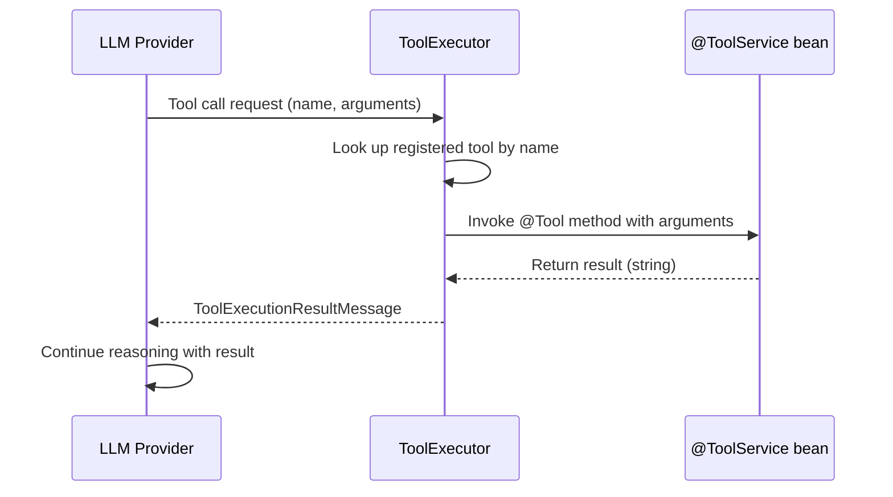

Tools are Java methods that the LLM can call during a conversation. When the LLM decides to use a tool, it emits a tool call request; uxopian-ai executes the corresponding method and returns the result to the LLM, which then incorporates it into its response.

## How tools work



*Figure: Tool execution sequence from LLM tool call to method invocation and result return.*

## Annotations

Tools are defined using three annotations from LangChain4J:

| Annotation | Target | Purpose |
|---|---|---|
| `@ToolService` | Class | Marks the bean as a tool provider. `IntegrationLoader` uses this to register it. |
| `@Tool` | Method | Marks a method as callable by the LLM. The annotation value is the description sent to the LLM. |
| `@P` | Parameter | Describes a parameter. The description is sent to the LLM so it knows what value to provide. |

Example:

```java
@Service
@ToolService
public class MySearchService {

    @Tool("Search for documents matching a query string. Returns a list of document titles.")
    public List<String> searchDocuments(
            @P("The search query string") String query,
            @P("Maximum number of results to return") int maxResults) {
        // implementation
    }
}
```

## Registration

`ToolExecutor` collects all beans annotated with `@ToolService` at `ContextRefreshedEvent`. For each bean, it scans public methods annotated with `@Tool` and registers them by name. The tool name defaults to the method name; it can be overridden with `@Tool(name = "...")`.

If tools are disabled via `tools.enabled=false` (or `TOOLS_ENABLED=false`), the `ToolExecutor` skips initialization and no tools are available.

## Function-calling model requirement

Tools require a model that supports function calling. If a prompt has `requiresFunctionCallingModel: true`, the LLM provider must have a model configured with `functionCallSupported: true`. If `reasoningDisabled: true` is set on a prompt, tool specifications are not sent to the LLM for that request.

## Built-in tools: FlowerDocs

The `flowerdocs/tool` plugin ships several tools that the LLM can use to search and operate on FlowerDocs documents:

| Tool name | Description |
|---|---|
| `getTaskClassAndTagClassesDescriptions` | Step 0 prerequisite: retrieves all document classes and tag classes with their IDs |
| `buildCriterionString` | Builds a search criterion for a text (String) tag |
| `buildCriterionNumber` | Builds a search criterion for a numeric (Long) tag |
| `buildCriterionDate` | Builds a search criterion for a date tag (format: `yyyy-MM-dd HH:mm:ss`) |
| `buildCriterionClass` | Builds a criterion to filter by document class |
| `buildAndClause` | Combines criteria with logical AND into a filter clause |
| `buildOrClause` | Combines criteria with logical OR into a filter clause |
| `buildAndClauseFromClauses` | Combines existing filter clauses with AND (for nested logic) |
| `buildOrClauseFromClauses` | Combines existing filter clauses with OR |
| `searchDocuments` | Executes the search and returns matching documents |

A typical LLM search session calls `getTaskClassAndTagClassesDescriptions` first, then builds criteria, wraps them in clauses, and calls `searchDocuments`.

## Tools and MCP

`ToolExecutor` also supports the Model Context Protocol (MCP) via a Server-Sent Events endpoint. When `mcp.sse.url` and `mcp.client.name` are set, the executor connects to an external MCP server at startup and registers its tools alongside local tools. MCP support is currently experimental and all related configuration in the shipped `mcp-server.yml` is commented out.

## Related pages

- [Plugin system](./plugin_system.md)
- [Write and deploy custom tools](../extending/custom_tools.md)
- [LLM providers](./llm_providers.md)
- [Integrate with FlowerDocs](../how_to/integrate_with_flowerdocs.mdx)
