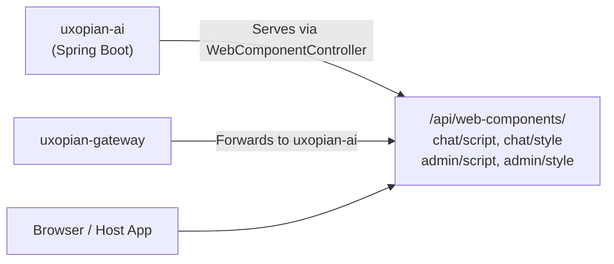

Uxopian AI ships two standard HTML custom elements: `<chat-element>` and `<admin-element>`. They are built with React 19 and wrapped using `@r2wc/react-to-web-component`. They are self-contained and require no build step on the consuming application side.

## How the bundle is served



*Figure: The browser loads web component bundles from the gateway, which forwards to the WebComponentController in uxopian-ai.*

The web component bundles are compiled and embedded in the `uxopian-ai` image. They are served by `WebComponentController` under `/api/web-components/`. The gateway forwards these paths as public (no authentication required for static assets).

The served endpoints are:

| Asset | Endpoint |
|---|---|
| Chat JavaScript | `/api/web-components/chat/script` |
| Chat CSS | `/api/web-components/chat/style` |
| Admin JavaScript | `/api/web-components/admin/script` |
| Admin CSS | `/api/web-components/admin/style` |

To load the chat component, add these tags to the host application:

```html
<link rel="stylesheet" href="https://your-gateway/api/web-components/chat/style" />
<script src="https://your-gateway/api/web-components/chat/script"></script>
```

## chat-element

The chat interface custom element. Registered as `<chat-element>`. Accepts these attributes:

| Attribute | Type | Description |
|---|---|---|
| `endpoint` | string | Base URL for the uxopian-ai REST API (e.g., `https://gateway-host/api/v1`) |
| `wsendpoint` | string | WebSocket base URL (e.g., `wss://gateway-host/ws`) |
| `conversationid` | string | Conversation ID to open (for `openChat`) |
| `request` | string | JSON-serialized `Request` object (for `createChat`) |
| `promptid` | string | Prompt ID to pre-load when creating a new conversation |

## admin-element

The admin interface custom element. Registered as `<admin-element>`. Uses React Router internally with these routes:

| Route | Content |
|---|---|
| `/` | Dashboard |
| `/prompts` | Prompt list |
| `/prompts/:id` | Prompt detail and editor |
| `/llm-providers` | LLM provider list |
| `/llm-providers/:id` | LLM provider configuration |
| `/users` | User list with conversation statistics |
| `/users/:id` | User detail |
| `/statistics` | Usage statistics and charts |

## Global window API

The bundle exposes these functions on the `window` object:

### `window.openChat(params)`

Reopens an existing conversation.

```javascript
window.openChat({
  endpoint: 'https://gateway/api/v1',
  wsEndpoint: 'wss://gateway/ws',
  conversationId: 'existing-conv-id'
});
```

### `window.createChat(params)`

Creates a new conversation, optionally with an initial request.

```javascript
window.createChat({
  endpoint: 'https://gateway/api/v1',
  wsEndpoint: 'wss://gateway/ws',
  promptId: 'arenderContext',         // optional: pre-load a prompt
  request: requestObject              // optional: send an initial request
});
```

### `window.connectWebSocket(wsEndpoint, userId)`

Opens a WebSocket connection to the streaming endpoint. Returns a cleanup function.

```javascript
const disconnect = window.connectWebSocket('wss://gateway/ws', 'user-123');
// later:
disconnect();
```

## Builder classes

Three fluent builder classes are exposed on `window` for constructing request payloads:

### `RequestBuilder`

```javascript
const request = new window.RequestBuilder()
  .addInput(inputObject)
  .build();
```

### `InputBuilder`

```javascript
const input = new window.InputBuilder()
  .role('USER')
  .addContent(contentObject)
  .build();
```

### `ContentBuilder`

```javascript
const content = new window.ContentBuilder()
  .type('prompt')
  .value('arenderContext')
  .payload({ documentId: 'doc-123' })
  .build();

const textContent = new window.ContentBuilder()
  .type('text')
  .value('Summarize this document.')
  .build();
```

Content types: `text`, `prompt`, `goal`, `image`.

## Related pages

- [Embed in a web application](../how_to/embed_in_web_application.md)
- [Conversations and requests](./conversations_and_requests.md)
- [Integrate with ARender](../how_to/integrate_with_arender.md)
